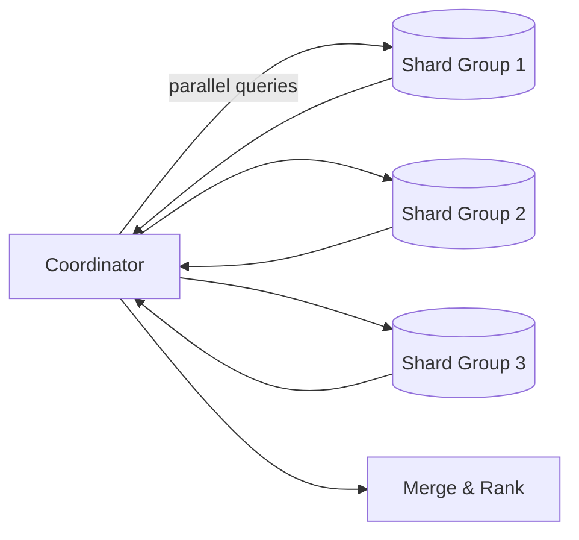

## Overview
Indexes accelerate reads, but in a sharded topology they must respect the routing model. Favor local (per‑shard) indexes; introduce small global directories sparingly; use external search for global discovery.

## Indexing models
- Per‑shard secondary indexes (default)
  - Pros: fast writes and local lookups; no cross‑shard coordination.
  - Cons: global queries require scatter‑gather.
- Global/covering index
  - A compact structure mapping attribute → (shard, key) for selective reads.
  - Pros: avoids full fan‑out; Cons: write amplification, consistency coupling, and failure blast radius.
- External search/index services
  - Push denormalized documents to Elasticsearch/OpenSearch.
  - Pros: rich query; Cons: eventual consistency and dual‑write complexity.

## Scatter‑gather playbook
- Cap fan‑out (e.g., ≤ 16–32 shards per request); sample or page through shard groups when wider.
- Issue shard queries in parallel with per‑shard timeouts; drop slow stragglers if user experience allows.
- Merge results server‑side; return partial with warnings when degraded.

Mermaid: Scatter‑gather with capped fan‑out


## Pagination across shards
- Prefer keyset pagination per shard, then k‑way merge.
- Maintain a cursor per shard (last seen key); on the coordinator, merge by sort key and emit the next page plus opaque cursors.

Pseudocode: k‑way merge of shard pages (≤ 30 lines)
```pseudo
def merged_page(shard_clients, cursors, page_size):
  heap = []  # (sort_key, shard_id, row, next_cursor)
  for sid, c in cursors.items():
    row, next_c = shard_clients[sid].next(c)
    if row: push(heap, (row.sort_key, sid, row, next_c))
  out = []
  next_cursors = {}
  while heap and len(out) < page_size:
    _, sid, row, next_c = pop_min(heap)
    out.append(row)
    if next_c:
      row2, next2 = shard_clients[sid].next(next_c)
      if row2: push(heap, (row2.sort_key, sid, row2, next2))
      next_cursors[sid] = next2
  return out, next_cursors
```

## Production checklist
- Keep secondary indexes local by default; document scatter‑gather SLOs and caps.
- Define global directories only for routing or highly selective lookups.
- Standardize keyset pagination and shard cursors; avoid global OFFSET.
- Instrument per‑shard timeout rates and coordinator merge latency.
