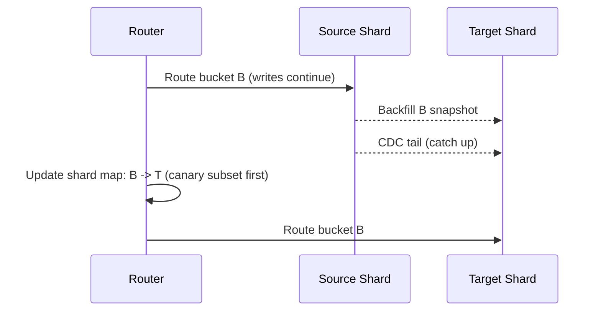

## Overview
Rebalancing changes shard ownership to restore headroom or replace nodes—without significant downtime. The control plane, backfill pipeline, and routers must coordinate.

## Strategies
- Move‑partition
  - Copy a bucket/range to a target, tail with CDC, then atomically switch routing.
- Split/Merge (range policies)
  - Split hot ranges; merge cold neighbors to control partition count.
- Vnode remap (consistent hashing)
  - Reassign a subset of virtual nodes to new physical nodes; only a slice of keys move.
- Dual‑writes + CDC
  - Temporarily write both old and new owners; reconcile before cutover.

Mermaid: Move‑partition flow

## Throttling and timing math
- Let D be data to move (GB), A aggregate copy rate (GB/s). Copy time ≈ D / A; add catch‑up margin based on peak write rate.
- Example: D=3 TB, A=0.48 GB/s → ≈ 1.7 h copy + catch‑up ⇒ plan 3–4 h window.

## Safety controls
- Priority to serving traffic; throttle movers (MB/s, IOPS).
- Progressive cutovers: canary a few buckets; expand on stable metrics.
- Rollback: keep source writable until verification passes; revert map on errors.

## Production checklist
- Define target shard size and remap policies (buckets/vnodes).
- Implement backfill with validation and checksums; monitor copy and lag.
- Canary and staged cutovers with automated rollback.
- Instrument route misses, error budgets, and p95/p99 during moves.
