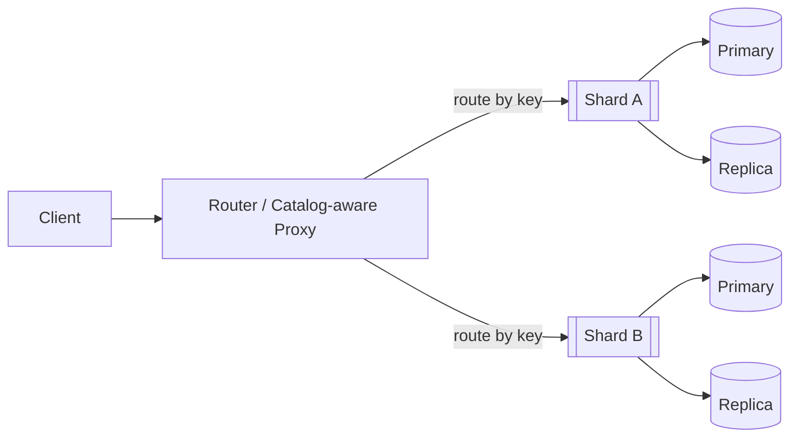

# Data Partitioning (Sharding)

## Overview
Data partitioning (sharding) splits a large logical dataset into smaller, independent pieces to scale reads/writes, reduce latency, and isolate failures. Good sharding keeps hot traffic balanced, supports online growth and rebalancing, and works hand‑in‑hand with replication and indexing.

## What, Why, When (and when‑not)
What
- Partition a logical table/collection into multiple shards by a routing key and policy (range/hash/list/composite). A router maps each request to exactly one shard whenever possible.

Why
- Scale throughput and capacity horizontally; reduce tail latency by limiting per‑node working set; enable parallelism for maintenance/backfills.

When
- Dataset outgrows single‑node CPU/RAM/IO; p95 latency/CPU saturate despite indexing and caching; replication alone cannot scale writes; tenant isolation is required.

When‑not
- Small datasets fit in memory with comfortable growth; analytics-only workloads can be batched to warehousing systems; strict cross‑row ACID/foreign keys across the whole dataset are mandatory and cannot be decomposed.

## Core partitioning models and variants
Vertical vs horizontal
- Vertical: split columns across services/tables (e.g., profile vs analytics). Reduces coupling but not row count; primarily a service boundary decision.
- Horizontal (sharding): split rows by key/range; the topic of this guide.

Entity vs functional
- Entity sharding: by a single entity key (user_id, tenant_id). Maximizes single‑shard operations and isolation.
- Functional sharding: by feature/data domain (orders vs catalog), often alongside entity sharding.

Partitioning policies
- Range: contiguous key ranges (A–F, 0–99). Pros: efficient range scans/time‑series; Cons: monotonic keys create hotspots; needs split/merge.
- Hash: hash(key) → bucket. Pros: uniform distribution and simple routing; Cons: poor locality; range queries fan out.
- List/set: explicit groups (region in `{NA, EU, APAC}`). Pros: policy‑driven affinity/compliance; Cons: manual balancing.
- Composite: combine dimensions (time window + hash(user_id)); often the most practical.

Consistent hashing and virtual nodes (vnodes)
- Place many small virtual nodes around a hash ring; each physical node owns multiple vnodes. On membership change, only ~1/(N±1) of keys move, improving rebalancing smoothness.

## Key design and hot‑spot mitigation
Routing key vs primary key
- Routing key: field(s) used to decide the shard. Primary key: unique identifier within a shard (may include the routing key). Keep routing keys stable and deterministic.

Choosing a key
- Prefer high‑cardinality, uniformly distributed keys used by the most frequent access patterns. For multi‑tenant SaaS, tenant_id is common; for user‑centric workloads, user_id.

Detecting skew
- Track per‑shard RPS, write bytes/s, storage size growth, and top‑K hot keys. Define skew budget (e.g., no shard > 2× median RPS for >10 minutes).

Mitigations
- Salting/bucketing: route by hash(key) % K, keep K moderately high (e.g., 64–512 logical buckets) then map K→physical shards to enable smooth rebalancing.
- Time windowing: add time to composite key (month/week buckets) to avoid perpetual hotspot on “latest”.
- Key randomization: add suffix/prefix from an independent counter or random bits when natural keys are monotonic.
- Hot key replication: read‑replicate a single logical key across shards and route reads by a hash‑with‑replicas policy (advanced; increases write cost).

Example pseudocode: choose shard by salted hash (≤10 lines)
```pseudo
function shardFor(key, bucketCount, ring):
  h = hash(key)
  bucket = h % bucketCount
  return ring.successor(bucket).node  # map logical bucket → physical shard via ring
```

## Placement and routing
Architectures
- Client library: callers embed routing logic and shard map. Low latency, fewer hops; requires disciplined rollout of map updates.
- Router/gateway: stateless middle tier performs routing by key and forwards to shards. Centralized control, simpler clients.
- Coordinator: stateful router maintains leases, transactions, or distributed locks; typical in systems needing multi‑shard coordination.

Directory/catalog service
- Stores shard map: keyspace → shard → replicas, health, capacity, locality hints. Exposed via RPC/HTTP/xDS; versioned with TTLs.
- Clients/routers cache maps and subscribe to updates. Use ETags/versions; apply backoff on thrash.

Mermaid: Router → Shard flow


## Indexing strategies
Per‑shard secondary indexes
- Fast local lookups and writes; no global coordination. But cross‑shard queries require scatter‑gather.

Global/covering indexes
- Maintain a global index (e.g., key → shard, or attribute → (shard, key)). Pros: selective reads without fan‑out. Cons: write amplification, index consistency challenges, and failure coupling.

Practical guidance
- Keep secondary indexes local by default. Add a small global directory for routing (e.g., tenant_id → shard) when necessary. For truly global search, integrate with search systems (Elasticsearch/OpenSearch) rather than forcing global DB indexes.

Example SQL DDL (generic, doc‑only)
```sql
-- Logical shard key: tenant_id; route by hash(tenant_id) → shard
CREATE TABLE orders (
  tenant_id    BIGINT NOT NULL,
  order_id     BIGINT NOT NULL,
  created_at   TIMESTAMP NOT NULL,
  status       TEXT,
  amount_cents BIGINT,
  PRIMARY KEY (tenant_id, order_id)  -- composite keeps routing key in PK
);

-- Local secondary index to serve time-ordered queries within a tenant
CREATE INDEX orders_tenant_created_at ON orders(tenant_id, created_at DESC);
```

## Cross‑shard reads and writes
Reads
- Scatter‑gather for range/attribute queries; cap fan‑out (e.g., ≤ 16–32 shards) and degrade gracefully (sample or timebox per‑shard).
- Pagination pitfalls: stable sort keys per shard; use keyset pagination, then merge results; avoid global OFFSET which becomes O(total_rows).

Writes
- Route single‑shard writes by routing key; ensure idempotency using natural keys or idempotency tokens. For multi‑entity writes, prefer co‑locating by same routing key when possible.

Retries/idempotency
- Use at‑least‑once semantics with idempotent upserts or dedupe tables; bound retry budgets and timeouts to avoid retry storms during partial outages.

## Cross‑shard transactions
Single‑shard transactions
- Full ACID within one shard is straightforward with most databases.

Multi‑shard transactions
- Two‑phase commit (2PC): coordinator prepares then commits. Provides atomicity but is sensitive to coordinator failure, increases latency and lock times.
- Sagas: sequence of local transactions with compensating steps. Better for long‑running, user‑visible workflows.
- Constraints: avoid hard foreign keys across shards; enforce via application checks, unique namespaces (e.g., per‑tenant uniqueness), or background reconciliation.

## Rebalancing and resharding
Triggers
- Growth (storage/throughput), skewed traffic, or node failures.

Strategies (online)
- Move‑partition: copy data for a range/bucket to a new shard, catch up via CDC, then switch routing.
- Split/merge: split hot ranges; merge cold ones to reduce overhead.
- Dual‑writes + CDC: temporarily write both old and new shards; reconcile deltas before cutover.
- Vnode remap (consistent hashing): reassign a subset of virtual nodes to new physical nodes; small, evenly distributed remaps.

Safety and throttling
- Throttle backfills (MB/s, rows/s); prioritize serving traffic; monitor replication/backfill lag and error budgets.
- Use progressive cutovers: canary some buckets; expand once metrics are stable.

## Fault tolerance and consistency
Replication interplay
- Each shard is typically replicated (e.g., primary + followers). Partitioning handles scale; replication handles durability and availability.

Consistency levels
- Strong (per‑shard) vs eventual; reads from followers need staleness budgets. For cross‑shard workflows, document consistency expectations explicitly.

CAP and failure modes
- Network partitions can isolate shards or the directory. Prefer local write availability per shard; degrade global queries. Ensure routers fail closed on stale maps when safety requires.

## Operations and SRE
Capacity modeling
- Define target shard size (e.g., 200–400 GB hot data) and per‑shard RPS/throughput limits. Start with more logical buckets than physical shards to ease growth.

Observability
- Metrics: per‑shard RPS, p95/p99 latency, bytes in/out, storage growth, replication lag, backfill throughput, shard‑map staleness TTL, skew ratio (max/median), top‑K hot keys.
- Dashboards: heatmap of shard load; rebalancing progress; error budgets and retry rates.

Runbooks
- Hot range split; tenant move; node add/remove; backfill throttle adjust; directory rollback on bad map; shard drain and cutover.

## Examples

Example A (quantitative): 12 TB orders table, composite key
- Inputs
  - Current logical size: 12 TB hot data, growth 2×/year; replication factor: 3; target hot shard size: 300 GB primary.
  - Write rate: 25k writes/s peak; read:write ≈ 3:1; main access patterns: by tenant and by recent time windows.
- Design
  - Composite routing key: (month_bucket, hash(customer_id) % 16).
  - Logical buckets: 12 months × 16 = 192 buckets; map to 48 physical shards initially (4 buckets/shard), leave headroom to 96 shards.
- Shard count math
  - Effective primary data today: 12 TB.
  - With 300 GB/shard target → 12,000 GB / 300 ≈ 40 shards; round up to 48 for growth and balancing across AZs.
  - With replication factor 3, total storage ≈ 36 TB (excludes indexes/compression).
- Backfill budget (adding 16 more shards next quarter)
  - Data to move ≈ 16/64 ≈ 25% of primaries ≈ 3 TB.
  - If each donor throttles at 30 MB/s net and 16 donors run in parallel → ~480 MB/s aggregate.
  - 3 TB / 0.48 GB/s ≈ 6,250 s ≈ 1.7 hours of copy time + catch‑up; plan 3–4 hours with safety.
- Benefits
  - Time‑bounded hotspots (latest month) spread across 16 buckets; older months can be merged or tiered to cold storage.

Example B (architectural): SaaS multitenant with consistent hashing (256 vnodes)
- Setup
  - Routing key: tenant_id. Hash ring with 256 vnodes per node across 6 nodes → 1,536 vnodes total.
  - Directory publishes (vnodes → physical node) map to clients/routers.
- Node add
  - Add a 7th node with 256 vnodes. Expected remap ≈ 1/(6+1) ≈ 14.3% of keys, spread evenly.
  - Steps: place new vnodes; begin replica seeding; mark ready; gradually move primaries for affected vnodes; monitor p95, replication lag, and skew.
- Node loss
  - Temporarily remap affected vnodes to remaining nodes; serve reads from replicas; trigger replacement capacity and gradual rebalance.

Optional Example C: IoT time‑series
- Routing key: (device_id hash bucket, day). Hot “today” traffic fans out across many buckets; older days compacted and tiered to cheaper storage; global queries offloaded to analytics/search.

Mermaid: Consistent hashing ring with vnodes
```mermaid
graph LR
  A[Node A (256 vnodes)] --- B[Node B (256)] --- C[Node C (256)] --- D[Node D (256)] --- A
  subgraph Hash space 0..2^m
  K1((Key k))
  end
  K1 --> B
  %% On adding a new Node E, only a slice near E's vnodes remaps (~1/(N+1))
```

## Edge cases and anti‑patterns
- Monotonic keys (auto‑increment, timestamp only) on range shards → perpetual hotspot; fix with composite (time window + hash) or randomized suffix.
- Global counters requiring strict total order across shards; avoid or centralize with bounded QPS and caching.
- Cross‑shard joins in OLTP path; push to materialized views/search or redesign data ownership.
- Over‑sharding to tiny partitions (operational overhead, many files/FDs); prefer logical buckets mapped to fewer physical shards.

## Interactions with adjacent topics
- [Replication](../04-replication/): required for durability/HA; influences write cost and failover.
- [Consistency & CAP](../05-consistency-and-cap/): choose per‑shard guarantees and global read semantics.
- [Load balancing](../02-load-balancing/): routers distribute by key; protect against skew with backpressure and budgets.
- [Search and indexing](../14-search-and-indexing/): global discovery/lookup often delegated to search systems rather than global DB indexes.

## Production checklist
- Choose routing key(s) aligned to top access patterns; validate cardinality and skew.
- Select policy (range/hash/composite); define hot‑spot mitigations (salting, time windows).
- Establish shard map source of truth (catalog), TTLs, and update path.
- Define target shard size and per‑shard SLOs (RPS, latency, storage).
- Plan rebalancing strategy (buckets/vnodes, split/merge) and throttles.
- Add observability: per‑shard metrics, hot key detection, map staleness, replication/backfill lag.
- Document cross‑shard read/write rules, pagination, and transaction patterns.
- Create runbooks for tenant move, hot range split, node add/remove, and bad map rollback.

## Interview framing checklist
- What is the routing key and why? How does it mitigate hotspots?
- Range vs hash vs composite: which and why for the workload?
- How are shard maps distributed and cached? Failure story when stale.
- Cross‑shard reads/pagination: approach and fan‑out limits.
- Rebalancing plan: strategy, safety, and expected remap %.
- Interplay with replication and consistency; failure handling.

## References
- Designing Data‑Intensive Applications (Kleppmann), Ch. 6–7
- Dynamo (Amazon), Cassandra, and Riak consistent hashing papers
- Spanner, Vitess, and CockroachDB architecture docs (sharding, rebalancing, transactions)
- Google SRE Book (overload, backpressure, and budgets)
- Postgres partitioning and Citus (distributed) guides; MySQL/Vitess sharding docs
