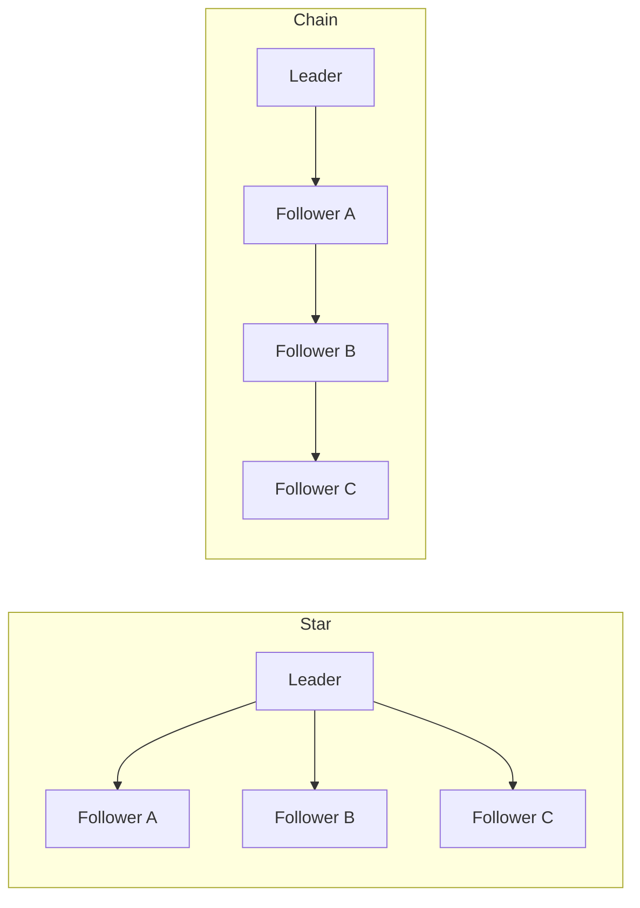

## Overview
Replication topology defines who can accept writes and how updates flow between replicas. Propagation mode defines when a write is considered committed relative to replicas. Together they determine latency, availability, and data safety.

## What, Why, When (and when-not)
What
- Topology (primary/replica, multi-primary, leaderless) and propagation (sync/async/semi-sync) shape commit behavior and failure handling.

Why
- Choose a topology that meets write locality, durability, and simplicity goals; choose propagation to balance latency and RPO.

When
- Use leader/follower for OLTP with strict per-shard ordering and simpler operations. Use multi-primary for multi-region low-latency writes with acceptable conflict model. Use leaderless for elastic KV workloads prioritizing availability.

When-not
- Avoid multi-primary without clear conflict resolution semantics. Avoid chain replication if tail latency and blast radius from a single slow follower are unacceptable.

## Core concepts and variants
Leader/follower (primary/replica)
- One primary orders writes; followers replicate from the primary (or from an upstream follower in a chain). Simplifies correctness and transactional semantics.

Multi-primary (active-active)
- Multiple primaries accept writes and replicate to each other. Requires conflict detection/resolution (LWW, versions, CRDTs) and careful schema/operation design.

Leaderless (Dynamo-style)
- Any replica can accept writes/reads with quorum guarantees (R/W quorums) and background repair (read repair, anti-entropy, hinted handoff).

Star vs chain replication
- Star: followers pull/push directly with the leader (fan-out). Lower lag variance, simpler failure domains.
- Chain: follower A→B→C; improves durability per ack hop but adds tail latency and lag coupling; failure at any hop can stall downstream.

Physical vs logical replication
- Physical (byte/block/WAL shipping): exact log stream; lower CPU, tight coupling to engine version and storage layout.
- Logical (row/statement/CDC): engine-agnostic stream with schema/row changes; enables selective replication, downstream pipelines, and transformations.

## Design decisions and trade-offs
- Write locality vs global order: multi-primary/leaderless improve local write latency but complicate ordering/conflicts.
- Fan-out vs chain: star reduces coupling and is easier to fail over; chain can reduce leader bandwidth at cost of latency sensitivity.
- Physical vs logical: physical is faster and simpler intra-engine; logical increases flexibility but can introduce write amplification and requires idempotent appliers.

## Architecture and components
- Leader, followers, log/WAL, stream transport (TCP, gRPC, binlog), appliers, conflict resolvers, and a directory/catalog for topology and health.

Mermaid: Star vs chain

## Operational considerations
- Keep follower apply throughput > leader commit rate with headroom; parallelize by key or transaction groups when engine allows.
- Avoid deep chains; limit to 1 hop if necessary for bandwidth constraints; prefer cascading only across regions with strict budgets.
- Version/compatibility: physical replication often ties versions; logical replication needs schema evolution contracts.

## Examples
Example A (quantitative): Chain vs star bandwidth
- Leader produces 120 MB/s WAL at peak.
- Star with 3 followers: leader egress = 3 x 120 = 360 MB/s; if NIC is 25 Gbps (~3.125 GB/s), comfortable.
- Chain: leader egress = 120 MB/s; but tail follower experiences sum of upstream latency and stalls if any hop slows; choose star unless egress is the bottleneck.

Example B (architectural): Logical CDC for downstream analytics
- OLTP leader/followers use physical replication for HA.
- Parallel logical CDC stream (row-based) fans out to Kafka for search/analytics; consumers are isolated from OLTP topology changes.

## Edge cases and anti-patterns
- Mixing logical and physical streams without clear ordering guarantees can cause duplicate or out-of-order application downstream.
- Deep follower chains across WAN create opaque lag and fragile failovers.

## Interactions with adjacent topics
- See [Quorums & Consensus](./02-quorums-and-consensus.md) for R/W quorum math.
- See [Geo-replication](./04-geo-replication-and-conflict-resolution.md) for cross-region chains and conflict models.

## Production checklist
- Pick topology per shard/service; document write acceptance nodes.
- Choose physical vs logical per use case; validate version/compatibility.
- Set max chain depth; prefer star within a region.
- Monitor leader egress, follower apply throughput, and per-hop lag.

## Interview framing checklist
- When do you choose multi-primary vs leader/follower?
- Why star vs chain; what are the bandwidth and latency trade-offs?

## References
- Facebook MySQL chain vs star discussions; PostgreSQL streaming replication docs; Kafka Connect CDC patterns
