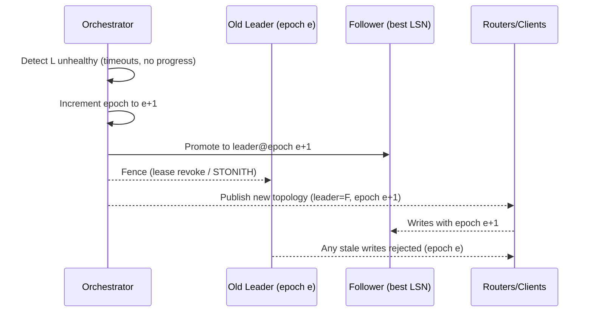

## Overview
Failover transfers write leadership to a healthy replica when the current leader becomes unavailable. Safe failover requires accurate failure detection, promotion of the best candidate, and fencing to ensure the old leader cannot accept writes (avoiding split brain).

## What, Why, When (and when-not)
What
- The procedures and mechanisms to detect leader failure, promote a follower, fence the old leader, and reparent other replicas.

Why
- Meet RTO objectives, preserve consistency, and avoid diverging histories. Automate recovery from node/AZ/region failures with minimal operator intervention.

When
- Production systems with availability SLOs and any leader-based replication. Even leaderless systems need coordinator failover for membership/metadata.

When-not
- Prototype systems without HA needs; single-node deployments where manual recovery is acceptable.

## Core concepts and variants
Detection
- Health signals: liveness checks, replication position progress, quorum votes, and application-level SLOs.

Candidate selection
- Pick the follower with the highest durable log position (LSN/GTID/index) and good health in the preferred failure domain.

Promotion
- Elevate the candidate to leader, advertise new epoch/term, and start accepting writes after fencing completes.

Fencing and epochs
- Epoch/term increments invalidate old leases; external fencing (STONITH) powers off or isolates the old leader. Admission control rejects writes from stale-epoch leaders.

Reparenting
- Point remaining followers to the new leader and reconcile any gaps via WAL/apply or incremental snapshot.

Planned vs unplanned
- Planned: drain and checkpoint old leader; zero RPO with orderly handoff. Unplanned: best-effort RPO≃replication gap, favor fast recovery while preventing split brain.

## Design decisions and trade-offs
- Detection sensitivity: aggressive timeouts improve RTO but risk false positives; use multi-signal and quorum decisions.
- Fencing rigor: stronger fencing (STONITH, network isolation) reduces split-brain risk but is operationally heavier.
- Promotion speed vs consistency: wait for confirmation from a majority that the candidate is indeed most advanced vs promote fastest plausible node.

## Algorithms/policies (conceptual)
Leader election with epochs (simplified)
```pseudo
onTimeout():
  epoch = epoch + 1
  votes = requestVotes(epoch, lastLogIndex, lastLogTerm)
  if votes >= majority:
    becomeLeader(epoch)

onClientWrite(req):
  if req.epoch < currentEpoch: reject(FENCED)
  else appendAndReplicate(req)
```

Promotion runbook (planned)
```pseudo
1) Mark old leader as read-only; drain inflight writes.
2) Wait until followers applied >= leader LSN.
3) Pick candidate follower; verify health and position.
4) Bump epoch; advertise new leader; switch clients/routers.
5) Reparent other followers to new leader.
6) Uncordon new leader for writes; monitor lag and error rates.
```

## Architecture and components
- Orchestrator/controller (e.g., Orchestrator for MySQL, Patroni for Postgres, Vitess topo for MySQL at scale) performs detection and promotion.
- Fencing subsystem: epochs/leases in consensus store (Raft/etcd/ZK) and optional power fencing for bare-metal/VMs.
- Routers/clients consume topology updates and enforce epoch checks on write path.

Mermaid: Unplanned failover with fencing


## Operational considerations
- Staged thresholds: warn at short timeout, failover at longer with additional signals (quorum votes, packet loss).
- Blackhole protection: disable VIPs and drain load balancers on old leader; ensure iptables/firewalls block lingering traffic.
- Read-only mode during failover: temporarily pin reads to followers with bounded staleness; reject writes until new leader ready.
- Post-failover reconciliation: repair any divergent logs using majority source of truth.

## Examples
Example A (quantitative): RTO budget
- Health check every 1s with 3 misses to trigger → 3s detection.
- Election and fencing 2s; reparent and router propagation 3s.
- Total expected RTO ≈ 8s p95; set SLO accordingly and test drills.

Example B (architectural): Postgres with Patroni
- Patroni uses etcd for leader key with TTL; on leader failure, TTL expires and a follower with highest LSN acquires leadership. Applications use HAProxy with a leader service and follower service for read splitting.

## Edge cases and anti-patterns
- Dual leaders due to clock skew with lease-based fencing; mitigate with monotonic clocks and conservative TTLs.
- Promoting a laggy follower causes long catch-up and potential RYW violations; always choose the most advanced replica.
- Orchestrator flapping on intermittent network issues; implement dampening and health hysteresis.

## Interactions with adjacent topics
- [Quorums & Consensus](./02-quorums-and-consensus.md): elections, epochs, and majority rules.
- [Availability & Fault Tolerance](../09-availability-and-fault-tolerance/): failure domains and redundancy planning.
- [Load Balancing](../02-load-balancing/): traffic switching and connection draining during failover.

## Production checklist
- Define detection thresholds and multi-signal criteria; avoid single-signal failover.
- Implement fencing (epochs/leases, optional STONITH) and enforce epoch on write path.
- Automate reparenting and client/router topology update.
- Drill planned/unplanned failover quarterly; measure RTO/RPO.

## Interview framing checklist
- How do you prevent split brain during failover?
- What signals do you use for safe automatic promotion?
- How do you minimize RTO without increasing false failovers?

## References
- Etcd/Patroni/Orchestrator docs; Raft paper (leadership, terms); Pacemaker/STONITH best practices
