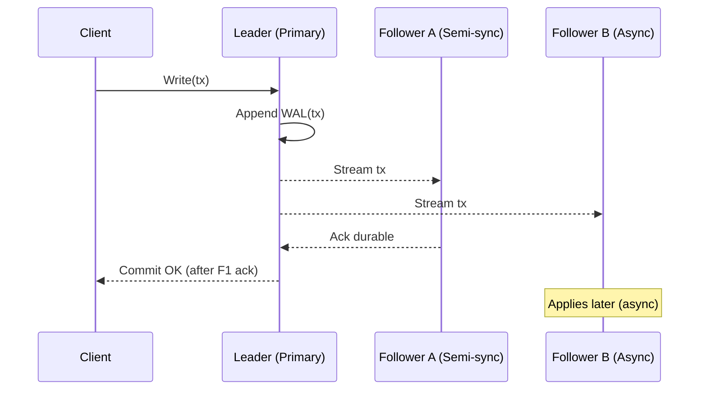

# Replication

## Overview
Replication creates and maintains redundant copies of data across nodes or regions to improve durability, availability, read scalability, and recovery time. It is complementary to partitioning: sharding scales breadth; replication deepens resilience and read capacity per shard.

### Subpages and deep dives
- [Topologies and Propagation Modes](./01-topologies-and-propagation.md)
- [Quorums and Consensus](./02-quorums-and-consensus.md)
- [Read Policies and Staleness Control](./03-read-policies-and-staleness.md)
- [Geo-Replication and Conflict Resolution](./04-geo-replication-and-conflict-resolution.md)
- [Failover, Promotion, and Fencing](./05-failover-promotion-and-fencing.md)
- [Operations, Observability, and Runbooks](./06-operations-observability-runbooks.md)
- [Replication Case Studies](./07-case-studies.md)

## What, Why, When (and when-not)
What
- Keep N copies (replication factor, RF) of each data item synchronized via a write-ahead log (WAL)/replication stream and appliers; optionally require acknowledgements from a subset (quorum) before committing.

Why
- Increase durability (survive disk/node/AZ/region loss), availability (serve reads/writes during faults), read throughput (followers serve reads), and enable maintenance (rolling upgrades, reparenting) and disaster recovery.

When
- Single-node durability is insufficient; SLOs require fast failover; geo-latency is material; reads dominate writes and benefit from follower offload.

When-not
- Tiny datasets with frequent full backups suffice; strict global ordering without consensus tolerance; cost/complexity outweighs benefits (early-stage prototypes).

## Core concepts and variants
Topologies
- Primary/replica (leader/follower): one primary accepts writes; followers replicate. Simple mental model; consistent per-shard ordering via the primary.
- Multi-primary (active-active): multiple primaries accept writes; conflicts must be detected/resolved. Better multi-region write latency; higher complexity.
- Leaderless (Dynamo-style): no fixed leader; any replica can accept writes with quorum-based read/write and background repair.

Propagation modes
- Synchronous: commit waits for replicas to durably acknowledge. Stronger guarantees; higher latency and write unavailability when replicas are slow.
- Asynchronous: primary commits locally, replicas catch up later. Lower write latency; risk of data loss on primary failure (RPO > 0).
- Semi-synchronous: require ack from at least one (or k) replica before commit. Reduces loss window while bounding latency.

Quorums (R/W)
- For RF = N, choose write quorum W and read quorum R such that R + W > N to ensure overlap and read-after-write visibility. Common: majority (ceil(N/2)+1), or tuned (e.g., N=3, W=2, R=2).

Consistency side-effects
- Read replicas introduce staleness. Policies like read-your-writes, monotonic reads, or bounded staleness may be required at the session or request level.

## Design decisions and trade-offs
Dimensions
- Latency vs safety: synchronous/quorum acks increase tail latency; async lowers latency but increases RPO/staleness.
- Availability vs consistency (CAP/PACELC): under partition, you trade write availability against cross-replica consistency. PACELC: in absence of partition, consistency trades off with latency.
- Complexity vs operability: multi-primary/leaderless improve locality but require conflict detection/resolution, repair, and rigorous observability.

Common choices
- OLTP per-shard leader with semi-sync to one follower and async to others (N=3) balances safety and latency.
- Global low-latency writes use consensus (Raft/Paxos) within a region or bounded-staleness/TrueTime-like models across regions.
- Leaderless with R/W quorums is suitable for write-available key-value stores with per-key conflict tolerance.

## Algorithms and policies (conceptual)
- Quorum write/read selection
  - Choose minimal healthy set to satisfy W/R; prefer locality (same AZ/region) while meeting failure-domain diversity.
- Conflict resolution (multi-primary/leaderless)
  - Last-write-wins (LWW) with hybrid clocks, vector clocks for causality, CRDTs for mergeable data types, or application-specific resolution.
- Anti-entropy and repair
  - Merkle-tree based comparisons, read repair on reads, hinted handoff for temporarily unavailable replicas.
- Fencing and epochs
  - Use monotonically increasing term/epoch and lease timeouts to prevent split-brain writers after failover.

Example pseudocode: quorum write (≤ 20 lines)
```pseudo
function quorumWrite(key, value, replicas, W, timeout):
  acks = 0
  for r in selectPreferred(replicas, W*2):  # over-send to hedge
    async sendWrite(r, key, value)
  deadline = now() + timeout
  while now() < deadline:
    ev = waitEvent(deadline)
    if ev.type == ACK and ev.status == DURABLE:
      acks += 1
      if acks >= W:
        return COMMITTED
  return TIMEOUT  # caller may retry with idempotency key
```

## Architecture and components
- Log/WAL producer: orders writes and persists locally.
- Replication stream: ships log entries (logical or physical) with sequence numbers/GTIDs.
- Applier: replays on followers; may parallelize by key/transaction group.
- Coordinator/election: assigns primaries (consensus/leases), manages epochs and fencing.
- Directory/catalog: topology and health used by routers/clients to select R/W replicas.

Mermaid: Leader-based write path with semi-sync


## Operational considerations
Capacity and placement
- Choose RF and failure domains (AZ/region) to meet durability targets; ensure quorum placement spans failure domains.

Lag and backpressure
- Track replication/applier lag, WAL queue depth, and apply throughput. Throttle producers or switch to primary reads when staleness budgets are exceeded.

Failover and promotion
- Automate detection (health, replication position), election, fencing of old leader, and reparenting of followers. Prefer deterministic, operator-auditable workflows.

Observability and runbooks
- Dashboards: R/W latency, ack distribution, replication lag, apply errors, elections/epochs, RPO estimate, DR drill status.
- Runbooks: planned failover, emergency promotion with fencing, replica rebuild from snapshot + WAL, reparenting, geo cutover, backpressure tuning.

## Examples

Example A (quantitative): Choosing R/W quorums for N=5
- Goal: tolerate loss of 2 replicas and still serve reads and writes while ensuring read-after-write consistency.
- Choose majority quorums: W=3, R=3 ⇒ R+W=6>5. Availability under failures:
  - With 5→3 healthy, both reads and writes proceed (3-of-5 reachable).
  - With only 2 healthy, neither reads nor writes can meet quorum (consistent by failing closed).
- Latency: tail is governed by the 3rd fastest replica in the chosen set; use hedged writes and local-first selection.

Example B (architectural): Multi-region semi-sync primary with async global replicas
- Setup: RF=5 per shard—3 in Region A (1 leader + 1 semi-sync follower + 1 async), 2 async in Region B.
- Writes: leader commits after semi-sync follower in Region A acks durable; async replicas catch up.
- Reads: local primary/follower in Region A serve strong reads; Region B serves bounded-staleness reads with staleness budget = max observed lag.
- Failover: on Region A loss, promote Region B replica with highest log position; fence old leader via expired lease/epoch; accept RPO ≤ last async gap.

## Edge cases and anti-patterns
- Dual primaries without fencing (split brain) cause divergent histories; always use epochs/leases and crash-only old leader.
- Cascading replication trees can amplify lag and failure blast radius; prefer star topologies or well-bounded tiers.
- Acking before durable persist on followers (fsync disabled) voids sync guarantees.
- Blindly reading from followers without staleness budgets breaks read-your-writes and monotonicity guarantees.

## Interactions with adjacent topics
- [Data Partitioning](../03-data-partitioning/): replication per shard; placement affects rebalancing and skew mitigation.
- [Consistency & CAP](../05-consistency-and-cap/): define R/W quorums, staleness policies, and session guarantees.
- [Availability & Fault Tolerance](../09-availability-and-fault-tolerance/): failure domains, elections, and recovery strategies.
- [Messaging & Streaming](../07-messaging-and-streaming/): CDC streams, backfill, and fan-out to downstream systems.
- [Databases & Storage](../06-databases-and-storage/): engine-specific replication (Postgres WAL, MySQL binlog, Raft groups, LSM compaction nuances).

## Production checklist
- Choose topology (leader, multi-primary, or leaderless) and RF per failure domain.
- Define write ack policy (sync/semi/async) and read policy (primary/follower, session guarantees).
- Set R/W quorums with R+W>N when using quorum models; validate latency SLOs and placement.
- Implement fencing (epochs/leases) and deterministic failover/promotion workflows.
- Establish staleness budget and automatic rerouting to primaries when exceeded.
- Monitor replication lag, apply throughput, error rates, and RPO estimator; alert on thresholds.
- Document rebuild/reparent procedures; test DR at least quarterly.

## Interview framing checklist
- What replication topology and RF would you choose and why for given latency/availability goals?
- How do you set W and R quorums; what is the impact on tail latency and availability?
- How do you guarantee read-your-writes and monotonic reads with replicas and caches?
- Describe your failover process and how you prevent split brain (fencing/epochs).
- How do you measure and control replication lag; what is your RPO/RTO?

## References
- Designing Data-Intensive Applications (Kleppmann), Ch. 5–9
- Dynamo, Cassandra, and Riak papers (quorums, anti-entropy)
- Raft and Paxos literature (consensus, leader election)
- Spanner/CockroachDB multi-region docs (TrueTime/bounded staleness, per-range consensus)
- PostgreSQL streaming replication; MySQL replication and semi-sync; Vitess reparenting runbooks
