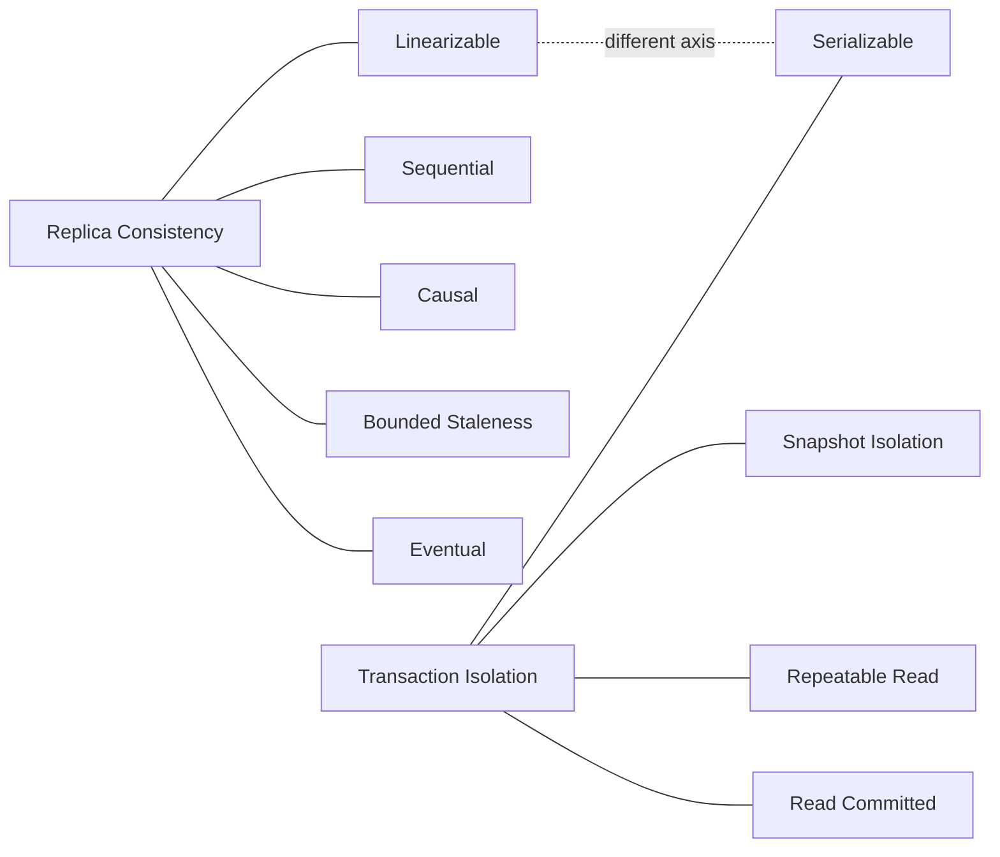

# Models and Definitions

## Overview
This page defines the primary consistency models used in distributed systems and contrasts them with database transaction isolation. It equips you to select the minimal guarantees that keep invariants safe while meeting latency and availability goals.

## What, Why, When (and when‑not)
What
- Formal guarantees describing what values reads may return relative to concurrent writes across replicas and clients.

Why
- Ensure correctness (no double‑spend, unique usernames), predictable UX (read‑your‑writes), and reasoning simplicity for developers.

When
- Strengthen guarantees on critical invariants; relax elsewhere to reduce latency and improve availability, especially across regions.

When‑not
- Don’t default to global linearizability—latency and availability penalties are significant. Prefer targeted strong paths and otherwise weaker but safe semantics.

## Core concepts and variants (precise definitions)
- Linearizability (aka strong consistency)
  - Each operation appears to take effect at a single instant between invocation and response, preserving real‑time order across clients.
- Sequential consistency
  - All clients see operations in the same order, but that order need not respect real‑time. Weaker than linearizability.
- Causal consistency
  - If operation B depends on A (program order, reads‑from, messaging), every observer sees A before B. Independent operations may be observed in different orders.
- Eventual consistency
  - In the absence of new writes, all replicas converge to the same value. During convergence, reads may return stale or divergent values.
- Bounded staleness
  - Reads may lag the most recent write by no more than Δ time or K versions.
- Session guarantees (scoped to a client session)
  - Read‑your‑writes, monotonic reads, monotonic writes, writes‑follow‑reads.

Related but different: transaction isolation
- Serializability: committed transactions behave as if executed one‑at‑a‑time in some order (global schedule). Isolation property inside a DB, not replica consistency per se.
- Snapshot isolation (SI): reads from a stable snapshot; disallows many anomalies but can allow write skew.
- Repeatable read, read committed: progressively weaker; address phenomena like non‑repeatable reads and dirty reads.

Mermaid: Relationship map (consistency vs isolation)

## Design decisions and trade‑offs
- Latency: stronger models (linearizable) require synchronous coordination; weaker models allow local reads and write buffering.
- Availability: under partition, you must choose between rejecting ops (CP) or allowing potentially divergent histories (AP) and repairing later.
- Developer ergonomics: stronger models simplify reasoning but may hide scalability issues; weaker models demand explicit session and reconciliation logic.

## Algorithms/policies (conceptual)
- Achieving linearizability
  - Single‑leader + majority quorum or per‑key consensus (Raft/Paxos). Linearizable reads require leader leases or read barriers.
- Achieving causal consistency
  - Vector clocks or dotted version vectors; propagate causal metadata in client tokens or headers.
- Achieving bounded staleness
  - TrueTime‑like intervals or commit timestamps with uncertainty; route reads to replicas at/after a target timestamp.

## Architecture and components
- Consensus/leader groups per shard; follower read capability with read fences.
- Client/session state: last seen commit timestamp or LSN to enforce RYW/monotonicity.
- Repair subsystems (read repair, anti‑entropy) to converge replicas for eventual models.

## Operational considerations
- Track and alert on staleness budgets, replica lag, and violation counters (e.g., non‑monotonic read detections).
- Publish per‑API guarantees in service catalogs; instrument fallback rates (follower→leader promotions).

## Examples

Example A (quantitative): Bounded staleness budget
- Target Δ = 300 ms for product reads. Observed follower lag p99 = 180 ms, p99.9 = 420 ms.
- Policy: serve follower reads by default; promote to leader if lag > 300 ms. Expect ~0.1% promotions. Validate that added leader load fits capacity headroom.

Example B (architectural): Linearizable writes with monotonic reads
- Cart updates go to leader with majority quorum. Read path uses follower reads with min_commit_ts from session. Client library stores last_commit_ts after each write to guarantee RYW; monotonic reads achieved with min_commit_ts fences.

## Edge cases and anti‑patterns
- Treating follower reads as strong without fencing.
- Depending on wall‑clock ordering across nodes without clock discipline.
- Mixing isolation guarantees (e.g., SI) with assumptions about replica freshness.

## Interactions with adjacent topics
- See [Replication](../04-replication/) for propagation modes and quorums.
- See [Caching](../01-caching/) for cache coherence strategies and RYW.

## Production checklist
- Define per‑API guarantees explicitly and document fallbacks.
- Ensure client/session tokens track last seen commit position.
- Monitor and alert on staleness violations and promotion rates.

## Interview framing checklist
- Differentiate linearizability vs serializability with concrete examples.
- Explain causal vs sequential vs eventual and when you’d choose each.
- Describe how to implement RYW over follower reads.

## References
- Kleppmann, DDIA (Ch. 5–9)
- Gilbert & Lynch (CAP), Bailis et al. (Highly Available Transactions)
- Jepsen analyses for anomaly detection
