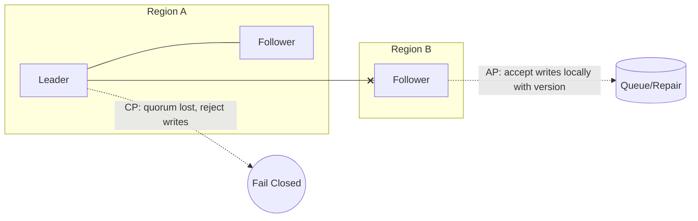

# CAP and PACELC

## Overview
CAP characterizes what must be sacrificed under a network partition: linearizable Consistency or Availability. PACELC extends this by stating that Else (no partition), systems trade Latency against Consistency. This page clarifies terms, dispels common myths, and gives practical guidance for choosing CP vs AP behaviors per operation.

## What, Why, When (and when‑not)
What
- CAP: In the presence of a partition, a system cannot provide both linearizable consistency and 100% availability.
- PACELC: Else (no partition), higher Consistency often increases Latency; under Partition, choose Availability or Consistency.

Why
- Make deliberate choices for user‑facing behaviors during faults, and for steady‑state latency in geo‑distributed systems.

When
- Choose CP for operations that must never observe conflicting state (payments, inventory decrement, ACL changes).
- Choose AP for operations where temporary divergence is acceptable and can be reconciled (news feeds, likes, analytics writes).

When‑not
- Don’t label whole systems CP or AP. Apply CP/AP at the operation or data‑domain level; many production systems are mixed.

## Core concepts and variants
- Partition tolerance is not optional: real systems experience partitions; CAP assumes P is required.
- Consistency in CAP means linearizability, not serializability or eventual convergence.
- Availability means every non‑failing node responds to requests (may be with older data if AP choice is made).
- PACELC variants: EL (optimize for lower latency) vs EC (optimize for stronger consistency) in the partition‑free case.

## Design decisions and trade‑offs
- CP design: majority quorum writes and reads; reject requests when quorum cannot be met. Strong invariants; higher write/read latency and lower availability under partition.
- AP design: accept writes locally with timestamps or version vectors; reconcile with CRDTs/LWW/merge logic. Higher availability; resolve conflicts later; clients may observe anomalies.
- Mixed design: CP for checkout/payment writes, AP for browsing and feeds. Declare and document per‑API behaviors and fallbacks.

## Algorithms and policies (conceptual)
- Partition detection: health checks across failure domains, quorum loss detection via consensus terms/epochs.
- Degradation modes: 
  - CP: fail closed on quorum loss; expose clear error codes and user messaging.
  - AP: accept locally; attach causal/clock metadata; buffer replication and schedule repair.
- Read policies: 
  - CP: linearizable reads via leader lease or majority.
  - AP: follower/local reads with staleness budgets; session fences to preserve RYW.

## Architecture and components
- CP: per‑shard consensus groups (Raft/Paxos), leader election with fencing, read/write quorums across AZs/regions.
- AP: leaderless replica sets (Dynamo‑style), version vectors or HLC, background anti‑entropy (Merkle trees), read repair and hinted handoff.

Mermaid: CP vs AP during partition

## Operational considerations
- SLOs: define per‑API behavior under partition (fail closed vs eventually consistent). Ensure UX patterns (retry with backoff, idempotency) match.
- Observability: partition detection, quorum health, divergence counters (conflict rates), repair backlog depth, staleness budgets.
- Drills: simulate AZ/region partitions; verify CP endpoints fail closed and AP endpoints continue with expected degradation.

## Examples

Example A (quantitative): Availability vs quorum math
- RF=N=3 across 3 AZs. Majority quorum requires 2 AZs. With independent AZ failure probability p=0.01, availability for majority quorum ≈ 1 − [C(3,2)p^2(1−p) + p^3] ≈ 1 − (3×1e−4×0.99 + 1e−6) ≈ 0.9997 (99.97%). AP local writes remain available as long as any AZ is reachable but risk divergence.

Example B (architectural): E‑commerce
- Checkout/payment: CP. Majority writes; if quorum lost, surface “cannot process now” with hold/reservation tokens.
- Product browsing and reviews: AP with bounded staleness reads; reconcile likes with CRDT counters; show “syncing” badges for recent updates.

## Edge cases and anti‑patterns
- “CP systems are always unavailable” or “AP systems have no correctness.” Reality: choose per operation; design reconciliation and UX.
- Ignoring read semantics: AP writes with unfenced follower reads may violate RYW unless sessions are enforced.
- Global CP across regions without need leads to unnecessary multi‑RTT latency.

## Interactions with adjacent topics
- [Replication](../04-replication/): dictates propagation/repair mechanics.
- [Availability & Fault Tolerance](../09-availability-and-fault-tolerance/): failure domains, quorum placement, and elections.
- [Caching](../01-caching/): AP reads often leverage caches with TTL/invalidation.

## Production checklist
- Declare CP/AP choice per API and what clients should do on partition.
- Place replicas across failure domains; validate majority availability targets.
- Implement fencing/epochs for CP; conflict resolution for AP (CRDT/LWW). 
- Monitor partition detectors, quorum health, divergence/repair metrics.
- Run partition drills and document user‑visible behavior.

## Interview framing checklist
- Explain CAP with precise “C” definition and give an operation‑level CP/AP split for a product.
- Describe PACELC and how it influences cross‑region design.
- Calculate availability for majority quorums with given AZ failure probabilities.

## References
- Gilbert & Lynch (CAP)
- Abadi (PACELC)
- Dynamo paper, Cassandra documentation (AP patterns)
- Raft/Paxos literature (CP patterns)
