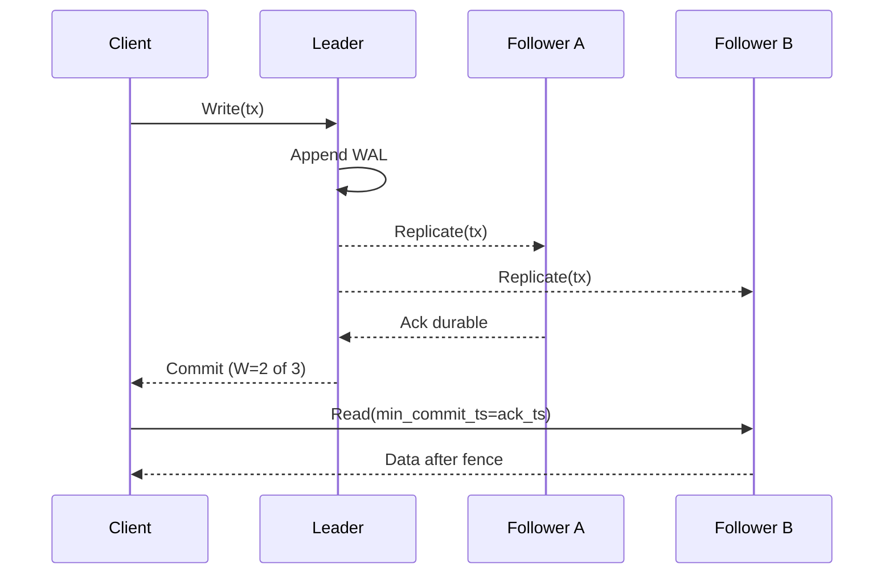

# Quorums and Read Policies

## Overview
Quorums determine how many replicas must participate in a read or write to provide a target consistency and availability profile. Read policies choose which replica(s) to serve a read from and how to control staleness. Together they shape latency, safety, and behavior under failures.

## What, Why, When (and when‑not)
What
- For replication factor N, choose write quorum W and read quorum R. If R + W > N, a read quorum is guaranteed to overlap the latest successful write quorum, enabling read‑after‑write visibility.
- Read policies select leader vs follower, and whether to require fences (barriers) to meet session guarantees.

Why
- Tune safety and latency by adjusting quorum sizes and replica placement; achieve predictable staleness envelopes.

When
- Majority quorums (W = R = ceil(N/2)+1) for simple strong behavior per shard.
- Tuned quorums (e.g., W=2, R=2 for N=3; W=2, R=1 for N=3) when optimizing specific latency/availability goals—paired with staleness budgets.

When‑not
- Avoid R + W ≤ N if you require strict read‑after‑write guarantees in the face of failures; this permits stale reads.

## Core concepts and variants
- Quorum overlap: R + W > N ⇒ every successful write is visible to some replica in every successful read quorum.
- Fast reads vs safe reads: leader reads can be linearizable; follower reads are cheaper but may be stale without fences.
- Tunable consistency: per‑request selection of consistency (e.g., strong, bounded staleness Δ, eventual) based on access path.
- Hedging: over‑sending to more replicas than strictly necessary and racing the fastest responders to reduce tail latency.

## Design decisions and trade‑offs
- Latency: larger quorums increase the kth‑fastest ack needed; follower reads are typically faster but risk staleness.
- Availability: majority quorums degrade under multiple failures; R or W = 1 keeps some ops available but weakens guarantees.
- Placement: distribute replicas across failure domains while keeping at least a majority within low‑latency proximity when strong guarantees are needed.

## Algorithms and policies (conceptual)
- Quorum write selection
  - Prefer local AZ first; include cross‑AZ/region to meet failure domain diversity; over‑send to W+K for hedging.
- Read fences (barriers)
  - Require follower/applier to be at ≥ target LSN/commit_ts; otherwise route to leader or wait with a bounded timeout.
- Read repair/anti‑entropy
  - On quorum reads, if divergent versions are detected, trigger background repair to converge replicas.

Example pseudocode: quorum read with fence (≤ 25 lines)
```pseudo
function quorumRead(key, replicas, R, minCommitTs, timeout):
  candidates = selectPreferred(replicas, R*2)
  sendRead(candidates, key)
  results = []
  deadline = now()+timeout
  while now()<deadline and len(results)<R:
    ev = waitEvent(deadline)
    if ev.type == READ_RESULT and ev.commitTs >= minCommitTs:
      results.append(ev)
  if len(results) < R:
    return readFromLeader(key)  # fence unmet; promote
  return merge(results)  # resolve ties by commitTs/version
```

## Architecture and components
- Replica set and router: router tracks health, placement, and last seen commit positions to pick R and W sets.
- Leader services: provide read leases and safe read RPCs to ensure linearizable reads when required.

Mermaid: Quorum write and follower read


## Operational considerations
- Monitor p95/p99 R and W quorum completion times, per‑replica latency, and hedging effectiveness.
- Track staleness budget violations and follower→leader read promotion rates.
- Alert on `R+W<=N` misconfigurations and on insufficient diversity (e.g., all quorum members in one AZ).

## Examples

Example A (quantitative): Tuned quorum latency
- N=3 across 3 AZs. Per‑replica p95=8 ms; p99=15 ms. Majority W=2 yields 2nd‑fastest ack ≈ 9–12 ms. If tuned to W=1 (dangerous), write latency ≈ fastest replica ~ 6–8 ms, but last write visibility on R=2 reads is not guaranteed under failures.

Example B (architectural): Read policy with Δ=250 ms budget
- Default follower reads with fence at min_commit_ts and allowed max lag Δ. If follower lag > Δ or cannot reach fence within 50 ms, router promotes to leader. Observed leader promotion rate ~0.2%; capacity headroom on leaders sized accordingly.

## Edge cases and anti‑patterns
- Assuming R+W>N alone guarantees linearizable reads—leader leases/fences still needed for read linearizability.
- All quorum members in the same failure domain: quorum collapses under a single AZ outage.
- Unbounded waiting for fences: causes head‑of‑line blocking; prefer bounded waits then promote.

## Interactions with adjacent topics
- [Replication](../04-replication/): propagation modes determine achievable W and R.
- [Consistency models](./01-models-and-definitions.md): defines semantics provided by chosen quorums and policies.
- [Caching](../01-caching/): caches often bypass quorums; pair with invalidation and RYW tokens.

## Production checklist
- Set N, W, R with documented goals (e.g., majority for per‑shard strong semantics).
- Place replicas across failure domains; validate quorum availability math.
- Implement read fences and promotion logic with SLOs and metrics.
- Enable hedged reads/writes; monitor tail improvements and extra load cost.

## Interview framing checklist
- Explain why R+W>N ensures read‑after‑write visibility and how latency scales with N.
- Describe follower read fences and promotion logic.
- Tune quorums for a given failure domain layout and SLOs.

## References
- Dynamo/Cassandra papers (R/W quorums, read repair, anti‑entropy)
- DDIA (Quorums and read policies)
