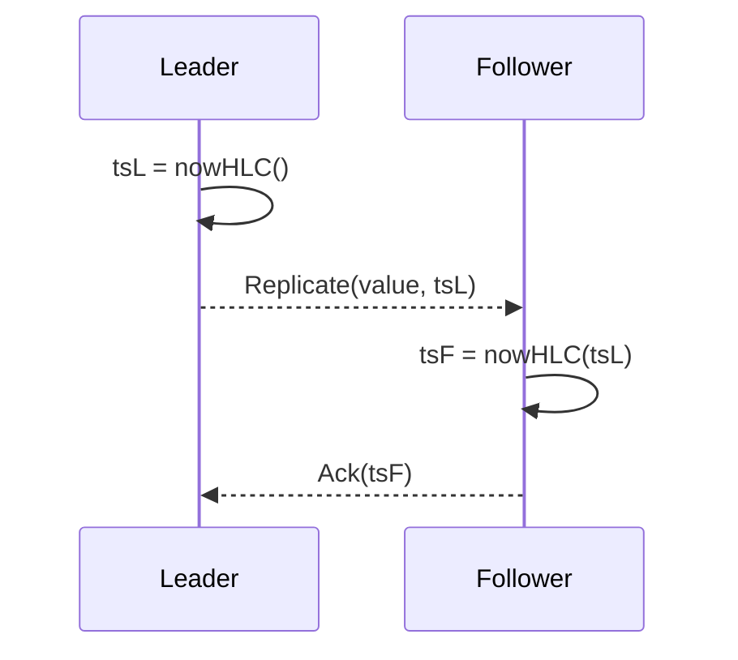

# Clocks and Ordering

## Overview
Clocks and ordering mechanisms determine how a distributed system reasons about “before/after.” Because physical clocks drift and messages reorder, systems rely on logical clocks, hybrid logical clocks (HLC), or externally bounded time (TrueTime‑like) to implement causal, bounded‑staleness, and linearizable semantics efficiently.

## What, Why, When (and when‑not)
What
- Tools to assign order to events: physical time (wall/monotonic), logical clocks (Lamport, vector), hybrid logical clocks (HLC), and TrueTime‑style intervals.

Why
- Enable causality tracking, conflict resolution, bounded staleness reads, and safe linearizable reads without serializing all operations through a single node.

When
- Use HLC for low‑overhead last‑write‑wins and causal hints. Use TrueTime‑like uncertainty bounds for externally consistent transactions across regions. Use vectors in systems requiring explicit causality with concurrent branching/merges.

When‑not
- Don’t depend on wall‑clock order across machines without synchronization bounds; skew creates anomalies. Avoid vector clocks if token size growth is prohibitive.

## Core concepts and variants
- Physical clocks
  - Wall time (UTC) can jump (NTP adjustments, leap seconds), monotonic clocks don’t go backward but drift. Typical drift ~10–500 ppm; NTP targets `<10` ms within a DC; PTP can do sub‑millisecond.
- Lamport clocks
  - Scalar logical clock; increments on local events; on message receipt, set L = max(L_local, L_remote) + 1. Captures happens‑before, but not concurrency.
- Vector clocks
  - Per‑node counters; detect concurrency (incomparable vectors). Metadata grows with node count; prune/compact strategies required.
- Hybrid Logical Clocks (HLC)
  - Pair of (physical time, logical counter). Lets timestamps reflect physical time while ensuring monotonicity under skew. Great for LWW and ordering across replicas.
- TrueTime‑style intervals
  - Provide [earliest, latest] time interval with bounded uncertainty ε. Linearizable reads/writes can wait out ε to ensure external consistency.

## Design decisions and trade‑offs
- Metadata overhead vs power
  - Vectors are precise about concurrency but large; HLCs are compact and practical; TrueTime requires specialized infra.
- Latency vs certainty
  - Waiting out uncertainty (ε) adds latency but buys linearizability; HLC avoids waits but provides partial order.
- Clock discipline
  - Poor NTP sync increases anomalies and staleness. Enforce drift/offset budgets and alert on violations.

## Algorithms and policies (conceptual)
HLC update rules (≤ 20 lines)
```pseudo
state HLC { pt, lc }  # physical time (ms), logical counter

function nowHLC(remote=None):
  pt_new = physicalTime()
  if remote == None:  # local event
    if pt_new > HLC.pt:
      HLC.pt = pt_new; HLC.lc = 0
    else:
      HLC.lc += 1
  else:  # message from remote (rt, rc)
    (rt, rc) = remote
    if pt_new > max(HLC.pt, rt):
      HLC.pt = pt_new; HLC.lc = 0
    else if HLC.pt == rt:
      HLC.lc = max(HLC.lc, rc) + 1
    else:  # rt > HLC.pt
      HLC.pt = rt; HLC.lc = rc + 1
  return (HLC.pt, HLC.lc)
```

Linearizable read with TrueTime (conceptual)
- If commit_ts uses TT.now().latest + ε, a read at t can be made external‑consistent by waiting until TT.after(commit_ts).

## Architecture and components
- Time sync layer: NTP/PTP and monotonic clock sources; monitoring for offset/drift.
- Timestamp service: embeds HLC or TrueTime API; propagates via RPC headers or WAL.
- Storage/replication: persists commit_ts/LSN; enforces fences relative to timestamps for reads.

Mermaid: HLC propagation on write/replicate


## Operational considerations
- Metrics: NTP offset/drift histograms; HLC monotonicity violations (should be zero); TrueTime ε distribution; commit_ts vs apply_ts skew.
- Alerts: offset > budget (e.g., 10 ms DC, 1 ms rack PTP), ε spikes, non‑monotonic timestamp detections.
- Drills: clock step/slew simulations; verify RYW/monotonic reads remain intact; ensure linearizable read wait logic doesn’t starve.

## Examples

Example A (quantitative): Uncertainty wait budgeting
- Cross‑region RTT p95 = 140 ms; time sync yields ε p99 = 7 ms. To ensure external consistency for a read after a write at t_w, wait until TT.after(t_w + ε). Added tail latency ≤ 7 ms—acceptable vs cross‑region RTT.

Example B (architectural): LWW with HLC for conflict resolution
- Multi‑primary accepts concurrent writes; each stamped with HLC. On conflict, choose max(HLC).pt, then max lc if pt ties. Propagate winners via anti‑entropy; maintain causality hints without large vectors.

## Edge cases and anti‑patterns
- Using wall‑clock timestamps for uniqueness/order without synchronization → reorderings and duplicate keys.
- Ignoring leap seconds/clock steps in schedulers; prefer monotonic clocks for timeouts and backoff.
- Allowing NTP to slew too aggressively during incident, breaking SLOs for wait‑out‑ε logic.

## Interactions with adjacent topics
- [CAP and PACELC](./02-cap-and-pacelc.md): latency trade‑offs when waiting out ε.
- [Session guarantees](./04-session-guarantees-and-client-techniques.md): commit_ts tokens typically use HLC/LSN.
- [Replication](../04-replication/): commit order and read fences.

## Production checklist
- Enforce and alert on time sync budgets; document ε and its SLO.
- Standardize on timestamp format (HLC or commit_ts) in headers and logs.
- Implement read fences that compare against commit_ts and bound wait.

## Interview framing checklist
- Compare Lamport, vector, HLC, and TrueTime: metadata, guarantees, and costs.
- Design LWW conflict resolution with HLC; discuss anomalies it cannot prevent.
- Explain how to implement linearizable reads using TrueTime uncertainty.

## References
- Google Spanner (TrueTime), CockroachDB timestamp docs
- HLC: Kulkarni et al., “Logical Physical Clocks and Consistent Snapshots”
- DDIA (ordering and clocks)
