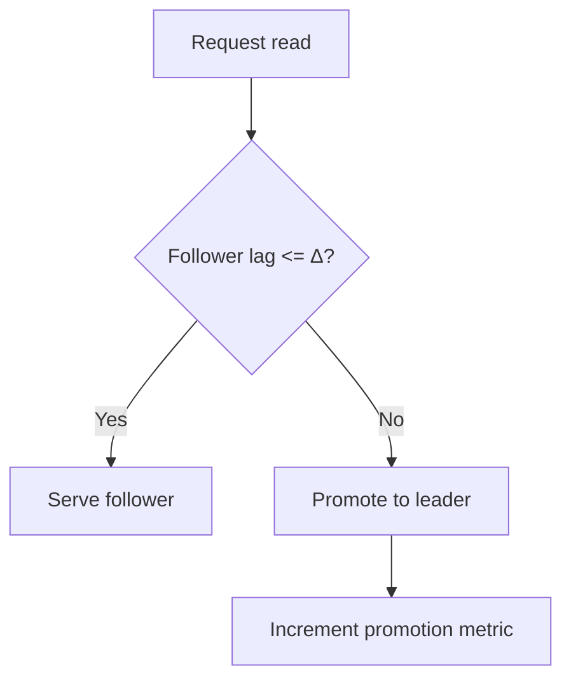

# Operations, Observability, and Runbooks

## Overview
Consistency is an operational property: you must measure staleness, audit guarantees, and practice failure modes. This page lists key metrics, dashboards, alerts, and incident/runbook procedures to keep guarantees honest in production.

## What, Why, When (and when‑not)
What
- Metrics, probes, dashboards, and playbooks to operate consistency policies (bounded staleness, RYW, quorums) day‑to‑day and during incidents.

Why
- Detect and cap staleness; prevent silent regression of guarantees; provide deterministic operator actions.

When
- Always for systems with replicas/caches; especially important for geo‑distributed and high‑SLA services.

When‑not
- N/A; observability is universally required.

## Core concepts and variants
- Staleness measurement
  - Commit position lag (LSN/GTID), time lag, read freshness distribution; synthetic RYW/monotonic probes.
- Quorum and election health
  - R/W quorum success, election churn, lease/epoch violations, fenced‑write counters.
- Cache/derived store health
  - Hit rates, dogpile rate, invalidation delay, CDC backlog and apply error budgets.

## Design decisions and trade‑offs
- Probe frequency vs overhead: light probes every few seconds per shard; heavier Jepsen‑style tests in staging and during drills.
- Alerting: symptom‑based (user staleness) vs cause‑based (lag/ε). Prefer multi‑signal with urgency tiers.

## Dashboards and alerts (starter set)
- Replication: lag (p50/p95/p99), WAL queue depth, apply throughput, follower freshness vs fences.
- Consistency: RYW probe failure count, monotonic read violations, promotion rate, staleness SLO violations.
- Quorums: R/W quorum latency distributions, failure rate, minority/majority availability.
- Clocks: NTP offset/drift, ε (if TrueTime), HLC monotonicity anomalies.
- Cache/CDC: hit ratio, invalidation latency, CDC backlog, error rate, backfill progress.

## Runbooks (common scenarios)
- Staleness budget exceeded
  - Action: raise promotion threshold (more leader reads), throttle producers, investigate slow appliers; rollback recent topology changes.
- Partition/AZ outage detected
  - CP endpoints: fail closed; verify client messaging, reduce retry budgets to avoid storms.
  - AP endpoints: continue with local writes; ensure conflict resolution queues healthy; increase reconciliation workers.
- Leader lagging and tail latency spike
  - Hedge to additional replicas, consider reparenting; verify storage IO; enable short‑term write admission control.
- Cache stampede on hot key
  - Enable single‑flight; temporarily lower TTL; warm key proactively; consider per‑key rate limiting.
- Follower rebuild
  - Snapshot + WAL catch‑up; cap backfill throughput; remove from R sets until within lag budget; validate before re‑adding.

Mermaid: Auto‑promotion on staleness exceed

## Examples

Example A (quantitative): Alert thresholds
- If Δ=300 ms and follower p99 lag is 220 ms with σ≈40 ms, set warning at 260 ms for 5 min and critical at 320 ms for 1 min. Correlate with promotion rate > 1%.

Example B (architectural): DR drill for cross‑region cutover
- Simulate region loss; promote remote follower with highest LSN; fence old leader; update routers; measure RPO; compare to policy; restore normal after verification.

## Edge cases and anti‑patterns
- Only measuring average lag; tails break guarantees.
- Unbounded retries during partition leading to meltdown; enforce budgets and jitter.
- Reintroducing rebuilt followers without verifying fences, causing non‑monotonic reads.

## Interactions with adjacent topics
- [Availability & Fault Tolerance](../09-availability-and-fault-tolerance/)
- [Replication](../04-replication/)
- [Consistency models](./01-models-and-definitions.md)

## Production checklist
- Define SLOs and budgets (Δ, promotion rate) and wire alerts.
- Implement synthetic RYW/monotonic probes and record to time series.
- Document and rehearse runbooks quarterly; keep operator UI/audits.

## Interview framing checklist
- Propose an observability plan to enforce bounded staleness.
- Define runbook steps for AZ partition for CP vs AP endpoints.
- Choose alert thresholds from a given lag distribution.

## References
- Google SRE (monitoring, overload)
- DDIA (operations of distributed data systems)
