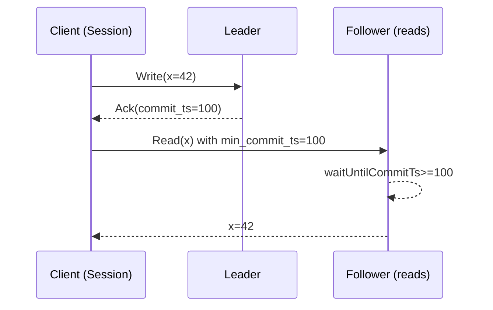
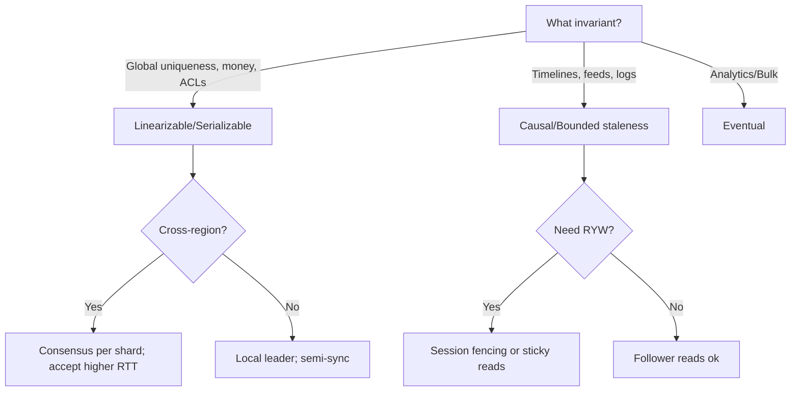

# Consistency Models & CAP

## Overview
Consistency describes what values reads may return after writes in distributed systems. Under faults and network partitions, systems trade off availability and latency against strong guarantees. This guide defines core models (linearizable, sequential, causal, eventual, bounded staleness, and session guarantees), clarifies CAP vs database isolation, and shows how quorums, clocks, and caches shape real‑world behavior.

### Subpages and deep dives
- [Models and Definitions](./01-models-and-definitions.md)
- [CAP and PACELC](./02-cap-and-pacelc.md)
- [Quorums and Read Policies](./03-quorums-and-read-policies.md)
- [Session Guarantees and Client Techniques](./04-session-guarantees-and-client-techniques.md)
- [Clocks and Ordering](./05-clocks-and-ordering.md)
- [Caches and Derived Stores](./06-caches-and-derived-stores.md)
- [Operations, Observability, and Runbooks](./07-operations-observability-runbooks.md)
- [Consistency Case Studies](./08-case-studies.md)

## What, Why, When (and when‑not)
What
- A set of guarantees about visibility and ordering of writes across replicas, clients, and time. Implemented by leader/consensus protocols, quorum reads/writes, clocks, or app‑level rules.

Why
- Correctness: preserve invariants (no double‑spend, unique usernames) and user expectations (read‑your‑writes).
- Predictability: simplify application logic by avoiding surprise anomalies.
- Performance and availability: tune guarantees to match workload and fault model, especially across regions.

When
- Choose stronger guarantees when violating invariants is costly or unrecoverable (payments, inventory, ACLs).
- Choose weaker guarantees when latency/locality dominates and anomalies are tolerable or reconcilable (feeds, counters, analytics ingestion).

When‑not
- Do not default to global linearizability for all access paths—costs in latency and availability are high. Apply targeted strong operations and keep most flows weaker but safe.

## Core concepts and variants
- Linearizability (strong consistency): operations behave as if applied atomically at a single point in time between invocation and response; real‑time order across clients is preserved.
- Sequential consistency: all clients see the same order of operations, but not necessarily real‑time order; weaker than linearizability.
- Causal consistency: if op B is causally dependent on op A, all clients see A before B. Independent operations may be seen in different orders.
- Eventual consistency: with no new writes, all replicas converge; interim reads may return stale or divergent values.
- Bounded staleness: reads may lag writes by ≤ Δ time or ≤ K versions; stronger than eventual, weaker than linearizable.
- Session guarantees (per client/session): read‑your‑writes, monotonic reads/writes, writes‑follow‑reads.

Related but different: database isolation levels
- Serializability: transactions behave as if executed one‑at‑a‑time (global schedule). This is an isolation property within a database engine, not replica consistency per se.
- Snapshot isolation (SI): each transaction reads from a consistent snapshot; may allow write skew. Repeatable read and read committed are weaker still.
- Note: you can have serializable transactions on a single shard with only eventual consistency across replicas; and vice versa.

## Design decisions and trade‑offs
- CAP under partition: during a network partition, you must sacrifice either availability (reject some ops) or linearizable consistency across the partition. “C” in CAP refers to linearizability, not serializability.
- PACELC: Else (no partition), you trade latency (L) against consistency (C). Cross‑region linearizability adds RTT to quorum/consensus; bounded staleness or causal can cut latency.
- Quorum math: for replication factor N, choose W (write quorum) and R (read quorum) with R + W > N to overlap and ensure latest write visibility on quorum reads. Majority (ceil(N/2)+1) is common; tuned quorums shift latency/availability.
- Clocks and ordering: physical clocks drift; logical/Hybrid clocks (Lamport, vector, HLC) and external references (TrueTime) enable causal/bounded‑staleness ordering and conflict resolution.
- Caches and derived stores: caches default to eventual; add invalidation, TTLs, or write‑through/write‑behind to shape guarantees; session pinning for RYW.

## Algorithms and policies (conceptual)
- Quorum read/write selection
  - Prefer local replicas to minimize latency while meeting quorum and failure‑domain diversity. Hedge extra replicas to reduce tails.
- Read barriers and read fences
  - Ensure a follower read is at/after a known log position or timestamp (e.g., follower read at >= commit_ts) to satisfy RYW/monotonic reads.
- Conflict handling (multi‑primary/leaderless)
  - Last‑write‑wins with HLC; vector clocks for causality; CRDTs for commutative/mergeable types; or app‑specific resolvers.
- Cache coherence patterns
  - Cache‑aside with explicit invalidation on write; write‑through to keep cache hot; versioned keys to avoid stale reads.

Example pseudocode: follower read with staleness budget (≤ 20 lines)
```pseudo
function readWithBudget(key, follower, maxLagMs, minCommitTs):
  if follower.appliedLagMs() > maxLagMs:
    return readFromLeader(key)  # exceed budget → promote to strong read
  # Fence to ensure monotonicity (>= last seen)
  follower.waitUntilCommitTsAtLeast(minCommitTs, maxWait=maxLagMs)
  return follower.read(key)
```

## Architecture and components
- Replica set or consensus group: maintains ordering and replication stream.
- Read routers/clients: select replicas, track per‑session state (last seen LSN/commit_ts) to enforce session guarantees.
- Clock/ordering service: HLC/TrueTime or vector timestamp propagation to encode causality.
- Cache tier: may sit before/alongside replicas; interacts via invalidation, TTL, or write‑through policies.

Mermaid: Read‑your‑writes via session fencing


## Operational considerations
- Metrics: replication lag (time, LSN/GTID distance), staleness distribution, R/W quorum success rate, read promotion rate (follower→leader), anomaly detectors (non‑monotonic read occurrences), clock uncertainty bounds.
- SLOs: define per‑path guarantees (e.g., “timeline read `<= 500` ms bounded staleness”, “checkout writes linearizable”). Track budget exceedances and automatic fallback rates.
- Failure modes: under partition, document which operations fail closed (CP) vs remain available but weaker (AP). Ensure fencing to avoid divergent writers.
- Testing: Jepsen‑style fault injection; consistency checkers (RYW/monotonicity probes); clock skew/suspension drills.

## Examples

Example A (quantitative): Choosing quorums and latency for N=3 vs N=5
- Suppose per‑replica p95 = 8 ms intra‑AZ, 30 ms cross‑region. Majority quorum latency ~ kth‑order statistic: for N=3, W=2 requires 2nd fastest ack. With 2 local + 1 remote: expect ~ max(local1, local2) ≈ 8–10 ms; reads R=2 similar. For N=5 across 2 regions (3+2), W=3 makes tail bound by 3rd fastest—often includes one remote → ~30–40 ms. Trade: N=3 gives lower latency but less failure tolerance; N=5 tolerates 2 failures, higher latency/cost.

Example B (architectural): Product catalog with bounded staleness and RYW
- Writes go to per‑shard leaders (CP for writes). Regional read APIs default to follower reads with staleness budget Δ=500 ms. Clients track last_commit_ts per session; if a user updated a product, subsequent reads pass min_commit_ts to ensure RYW. If follower cannot meet fence or lag > Δ, router promotes to leader read. Most reads stay low‑latency; critical flows remain correct.

Mermaid: Decision guide (simplified)


## Edge cases and anti‑patterns
- Assuming follower reads are linearizable without read fences or staleness budgets.
- Relying on physical timestamps for ordering across nodes without clock discipline → anomalies under skew.
- Dual‑primary without fencing/epochs → split brain and divergent histories.
- Cache invalidation races: write DB then cache without atomicity/versioning; prefer write‑through or versioned keys/invalidation.

## Interactions with adjacent topics
- [Replication](../04-replication/): propagation modes determine achievable read policies and staleness.
- [Data Partitioning](../03-data-partitioning/): per‑shard consistency vs cross‑shard semantics; transactions and sagas.
- [Availability & Fault Tolerance](../09-availability-and-fault-tolerance/): partition behavior, failover, fencing.
- [Databases & Storage](../06-databases-and-storage/): isolation levels, MVCC, index consistency.
- [Caching](../01-caching/): cache coherence, invalidation, and RYW strategies.

## Production checklist
- Declare per‑API guarantees (linearizable, bounded Δ, causal, eventual) and fallback rules.
- Choose RF, R/W quorums, and placement; validate latency SLOs including tails.
- Implement session guarantees where needed (min_commit_ts, sticky sessions, or tokens).
- Add read fences/barriers for follower reads; promote to leader when budgets are exceeded.
- Define cache consistency policy (invalidate, TTL, write‑through/behind) and versioning.
- Monitor lag, staleness, quorum success, clock bounds; alert on policy violations.
- Run partition and clock‑skew drills; document CP/AP behavior per operation.

## Interview framing checklist
- Differentiate linearizability, sequential, causal, eventual, and bounded staleness. Give an example each.
- Explain CAP vs database isolation; what does “C” mean in CAP?
- How do R/W quorums ensure read‑after‑write? Trade‑offs as N changes.
- How to guarantee read‑your‑writes with replicas and caches?
- Describe bounded‑staleness implementation and promotion logic when budgets are exceeded.

## References
- Gilbert & Lynch: Brewer’s Conjecture and the Feasibility of Consistent, Available, Partition‑tolerant Web Services (CAP)
- Bailis et al.: Highly Available Transactions and Read‑Atomic isolation
- Kleppmann: Designing Data‑Intensive Applications (Ch. 5–9)
- Spanner/CockroachDB docs (TrueTime, bounded staleness, per‑range consensus)
- Dynamo/Cassandra/Riak papers (quorums, anti‑entropy, hinted handoff)
- Jepsen analyses of consistency in distributed systems

