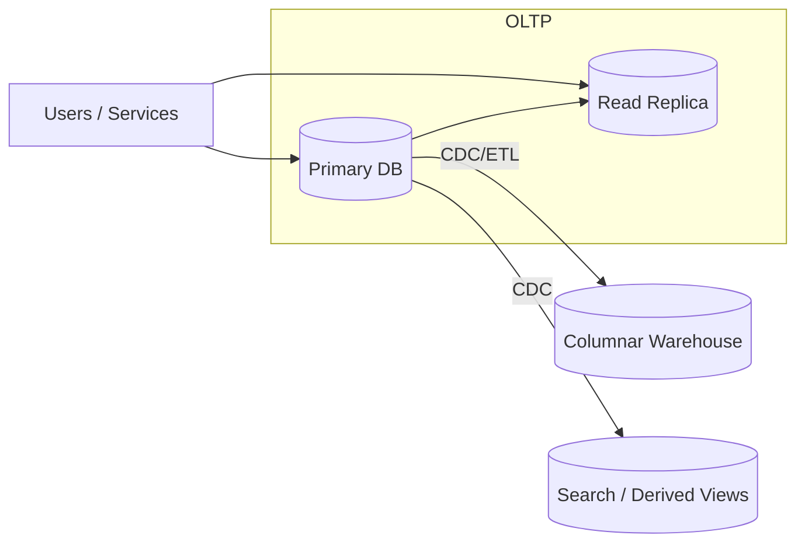

## Overview
Data model and workload shape drive database choice. This page defines the main families (SQL, NoSQL, NewSQL/Distributed SQL), clarifies OLTP vs OLAP, and shows how access patterns map to engines in production.

## What, Why, When (and when-not)
What
- Families: relational (SQL), document, key-value, wide-column, time-series, graph, distributed SQL (NewSQL).
- Workloads: OLTP (latency-sensitive, row-level writes/reads) vs OLAP (scan/aggregate-heavy analytics).

Why
- The underlying model and engine influence consistency guarantees, query expressiveness, latency profiles, scaling paths, and operational complexity.

When
- OLTP for user-facing flows (orders, payments, identity) → row-oriented relational or KV/doc with strong per-entity semantics.
- OLAP for reporting, ML features, experimentation → columnar warehouses/lakes on object storage.
- Hybrid needs split across systems; avoid one-size-fits-all.

When-not
- Don’t force analytical joins into OLTP stores; don’t push strict multi-entity ACID into eventually-consistent KV without careful design.

## Core concepts and variants
Relational (SQL, row-oriented)
- Fixed schema, ACID transactions, rich joins and indexes. Engines: PostgreSQL, MySQL, SQL Server, Oracle.
- Strengths: integrity, predictable point/range lookups, mature tooling. Limits: single-node scale-up unless sharded/clustered.

Document (JSON/BSON)
- Semi-structured aggregates per document, flexible schema, secondary indexes. Engines: MongoDB, Couchbase, DocumentDB.
- Strengths: developer agility, co-located aggregates. Limits: cross-document joins, transactional semantics vary.

Key-Value (KV)
- Opaque value by key; often LSM-based, tunable R/W quorums. Engines: DynamoDB, FoundationDB (layers), RocksDB-backed stores, Riak.
- Strengths: massive write throughput, elastic scale. Limits: queries beyond primary key require secondary systems.

Wide-column (tabular over KV)
- Column families; partition and clustering keys. Engines: Cassandra, HBase, Bigtable.
- Strengths: write availability, time-series/range patterns. Limits: limited joins/transactions; data modeling is critical.

Time-series
- Append-optimized for metrics/events with downsampling/retention. Engines: InfluxDB, TimescaleDB, Prometheus (TSDB), ClickHouse (also columnar).
- Strengths: high-ingest, partitioning by time. Limits: complex joins; storage/retention planning needed.

Graph
- Nodes/edges/properties with traversals. Engines: Neo4j, JanusGraph, Amazon Neptune.
- Strengths: relationship-first queries (recommendations, fraud). Limits: global traversals are hard to shard.

Distributed SQL (NewSQL)
- Relational semantics over a distributed cluster; automatic sharding/replication with consensus. Engines: CockroachDB, YugabyteDB, Google Spanner.
- Strengths: SQL + transactions + scale-out. Limits: latency floors due to consensus/TrueTime-like constraints; operational complexity.

OLTP vs OLAP
- OLTP: small, selective queries, low latency (p95 < 10–50 ms), high QPS, transactional integrity.
- OLAP: large scans/aggregations, throughput over latency, columnar compression/vectorization on object storage.

## Design decisions and trade-offs
- Expressiveness vs scalability: richer queries often reduce horizontal scalability without sharding/indices/materialization.
- Consistency vs availability: R/W quorums, leader election, and multi-region add latency but improve durability.
- Operational complexity: managed services reduce toil; self-managed clusters require backups, upgrades, and tuning.

## Architecture and components
- OLTP tier: primary store (RDBMS/Distributed SQL/KV), read replicas, connection pools.
- OLAP tier: columnar warehouse (ClickHouse/Snowflake/BigQuery), ETL/CDC pipes from OLTP, object storage lake.
- Search/derived views: indexing/search systems for global discovery; materialized views for hot aggregates.

## Operational considerations
- Capacity: plan peak QPS, write amplification (compaction/vacuum), and replica lag budgets.
- Schema governance: migrations, validation, and compatibility with CDC pipelines.
- Data lifecycle: retention, tiering (hot vs cold), and privacy (deletion/TTL).

## Examples
Example A (quantitative): OLTP vs OLAP split sizing
- OLTP writes: 8k/s, avg row 1 KB → ~8 MB/s WAL. With RF=3, storage growth ~20.7 TB/year (including 1.1× index overhead).
- OLAP scans: 2 TB/day analytical reads; move via nightly 2-hour ETL → required throughput ≈ 2 TB / 7,200 s ≈ 285 MB/s aggregate.
- Conclusion: keep OLTP row store lean; push scans to columnar warehouse.

Example B (architectural): Product catalog + search
- Catalog stored in document DB (document per product with variants). OLTP writes via API. CDC to search index for text queries and facets. Read replicas handle read spikes; admin analytics land in warehouse.

## Edge cases and anti-patterns
- Forcing global text search into OLTP indexes—use dedicated search. Mixing transactional writes with long analytical scans on the same cluster without workload isolation.

## Interactions with adjacent topics
- [Partitioning](../03-data-partitioning/) for scale-out and tenant isolation.
- [Replication](../04-replication/) for durability and read scaling.
- [Consistency & CAP](../05-consistency-and-cap/) for guarantees.
- [Search & Indexing](../14-search-and-indexing/) for global discovery.

## Production checklist
- Define workload SLOs and access patterns.
- Choose model/engine per entity (don’t overfit one engine to all needs).
- Plan OLTP→OLAP CDC; define freshness and failure behavior.
- Set retention/tiering policies.

## Interview framing checklist
- When do you split OLTP from OLAP and how?
- Document vs relational for a given entity—trade-offs?
- How to avoid cross-entity transactions at scale?

## References
- Kleppmann, Designing Data-Intensive Applications (Ch. 2–3)
- Google Spanner, CockroachDB, YugabyteDB architecture whitepapers
- DynamoDB and Cassandra data modeling guides; MongoDB schema design best practices
