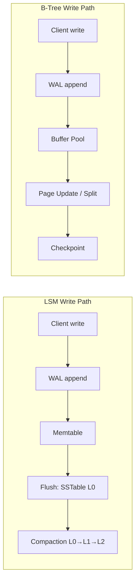

## Overview
Storage engines determine how bytes are written, indexed, and retrieved. B-Tree, LSM, and columnar engines optimize for different workloads, shaping latency distributions, space overhead, and operational knobs (vacuum, compaction, checkpointing).

## What, Why, When (and when-not)
What
- Engine types: B-Tree (page-oriented), LSM (log-structured merge), and columnar (column-wise). Common components: WAL, caches, background maintenance.

Why
- Engine mechanics directly impact write amplification (WA), read amplification (RA), space amplification (SA), tail latencies, and failure recovery.

When
- B-Tree: read-heavy OLTP with frequent point/range lookups; moderate write rates; predictable latency.
- LSM: high-ingest writes/updates with batched, sequential IO; KV/time-series/event workloads.
- Columnar: analytical scans/aggregations; low update frequency; high compression.

When-not
- Avoid B-Tree for extreme write bursts with limited IO; avoid LSM for mostly random point reads at low write rates; avoid columnar for hot OLTP updates.

## Core concepts and variants
B-Tree (page-oriented, in-place-ish updates)
- Fixed-size pages (e.g., 8–16 KB) form a tree; leaf pages contain sorted keys/rows or row pointers. Updates modify pages (copy-on-write or in-place with MVCC pointers).
- Pros: excellent point/range reads; stable latency; simple vacuum compared to LSM compactions.
- Cons: random IO for writes; page splits; write amplification under hot updates; needs careful fillfactor.

LSM (log-structured merge)
- Append to WAL, buffer writes in a memtable (skiplist/B-Tree), flush immutable SSTables to disk, compact across levels (L0→L1→...). Bloom filters and fence pointers avoid unnecessary IO.
- Pros: sequential writes, high ingest; tunable compaction; good for KV/time-series.
- Cons: read amplification across levels; background compaction can steal IO; tail latencies during stalls.

Columnar (segment/stripe-based)
- Store columns separately, compress by type, vectorize scans. Great for scans/aggregations with predicate pushdown.
- Pros: high compression, fast aggregates; cheap cold storage on object stores.
- Cons: updates are expensive; small random reads are inefficient; typically append-only with late compaction.

Bloom filters & indexes
- Probabilistic membership test (few bytes/key) to skip SSTables; reduce read IO in LSM.

## Design decisions and trade-offs
- WA/RA/SA triangle: reducing one typically increases others (e.g., LSM lowers WA for ingest but increases RA; aggressive compaction reduces RA at cost of WA).
- Caches: page cache/buffer pool hide IO; but cold-start behavior differs (LSM may need multiple table touches; B-Tree benefits from locality).
- Crash recovery: WAL replay; LSM also needs manifest rebuild; columnar often uses checkpointed metadata + append-only segments.

## Architecture and components
- WAL (write-ahead log): fsync on commit; guarantees durability.
- In-memory structures: buffer pool (B-Tree), memtable (LSM), vector cache (columnar).
- On-disk layout: pages (B-Tree), SSTables/levels (LSM), stripes/segments (columnar).
- Background tasks: vacuum (dead tuples), compaction/merge, checkpointing, statistics analyze.

## Operational considerations
- LSM knobs: level sizes, compaction concurrency, write stall thresholds, Bloom filter bits/key.
- B-Tree knobs: page size, fillfactor, autovacuum/vacuum scheduling, HOT updates.
- Columnar knobs: segment size, compression codecs, merge/out-of-place compaction windows.
- IO isolation: reserve bandwidth for background tasks to avoid fore/back-ground starvation.

## Examples
Example A (quantitative): Write amplification comparison
- Workload: 50k writes/s, 1 KB per write, sustained 1 hour → raw 180 GB.
- LSM (leveled, 10× fanout): expected WA ≈ 10–15× under sustained churn → 1.8–2.7 TB write IO; RA moderate with good Bloom.
- B-Tree: random page updates yield WA ≈ 3–5× due to page rewrites and WAL → 540–900 GB IO; but write latency higher without battery-backed cache; choose based on IO budget and read profile.

Example B (architectural): Hot range handling
- LSM KV for time-series: partition by day; ingest to L0 at high speed; background compaction prefers newest levels; Bloom filters sized at 10 bits/key to cap FP rate ~0.8%. Older days compacted aggressively and tiered to object storage.

## Edge cases and anti-patterns
- Over-aggressive LSM compaction causing write stalls and cache churn; under-sized Bloom filters spiking read IO.
- B-Tree with high-churn hot rows without HOT updates → page splitting storms; missing autovacuum leads to bloat.

## Interactions with adjacent topics
- [Partitioning](../03-data-partitioning/) affects compaction domains and vacuum windows.
- [Replication](../04-replication/) interacts with WAL volume and apply throughput.
- [Consistency & CAP](../05-consistency-and-cap/) determines acceptable staleness across replicas.

## Production checklist
- Pick engine per workload; validate WA/RA/SA budgets.
- Size caches and Bloom filters; set compaction/vacuum IO ceilings.
- Monitor: compaction backlog, flushed levels, page split rate, cache hit ratio, WAL bytes/s.

## Interview framing checklist
- B-Tree vs LSM for a given workload—trade-offs and expected WA/RA.
- How to tune compaction/vacuum to hit p99 SLOs?

## References
- PebblesDB, RocksDB, LevelDB papers/docs; PostgreSQL storage internals; ClickHouse architecture notes; WiredTiger/LMDB docs
