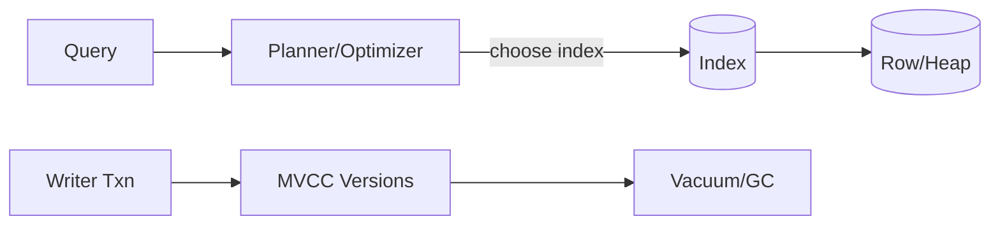

## Overview
Indexes accelerate reads by providing alternate key orders; transactions provide atomicity and isolation; MVCC enables concurrent readers/writers. Correct index design and isolation choices determine latency, throughput, and correctness.

## What, Why, When (and when-not)
What
- Indexes: data structures that map search predicates to row locations. MVCC: multi-version concurrency control via snapshots.

Why
- Right index set reduces IO and CPU; wrong or excessive indexes increase write amplification and storage. Isolation levels balance anomalies vs throughput.

When
- Add indexes for high-frequency predicates with selectivity > 95% and stable usage. Use MVCC defaults (e.g., Read Committed/Repeatable Read) for OLTP; Serializable when invariants require it.

When-not
- Avoid indexing low-selectivity columns with many updates; avoid Serializable by default in high-throughput paths due to aborts and contention.

## Core concepts and variants
Index types
- B-Tree: general-purpose; supports equality, range, prefix. Most common.
- Hash: equality-only; niche when engine’s hash index is mature and hot path is equality.
- Inverted/GIN: token-to-document mapping for text/JSON arrays; powers search-like predicates.
- Covering (include columns): store additional columns in index leaf to avoid table lookup.
- Composite: multi-column with leftmost-prefix rules.
- Partial/filtered: only store rows matching a predicate to shrink size and improve selectivity.

MVCC and snapshots
- Writers create new row versions; readers see a consistent snapshot based on transaction start. Garbage collection (vacuum) prunes old versions after they become invisible.

Isolation levels and anomalies
- Read Uncommitted: allows dirty reads (rare in modern engines).
- Read Committed: no dirty reads; non-repeatable reads and phantoms possible.
- Repeatable Read/Snapshot: stable view of rows read; phantoms may remain.
- Serializable: prevents all anomalies via strict two-phase locking or SSI; may abort conflicting transactions.

Locking
- Row/page locks for writes; predicate/index-range locks at higher isolation; DDL locks for schema changes.

## Design decisions and trade-offs
- Write cost vs read latency: each additional index adds write amplification (update/delete must touch all affected indexes).
- Covering vs storage: covering indexes reduce reads but increase index size and maintenance.
- Isolation vs throughput: higher isolation increases contention/aborts; prefer idempotent retries and narrow critical sections.

## Architecture and components
- Planner/optimizer chooses index paths using statistics (histograms, MCV lists). Autovacuum/analyze maintains stats and cleans dead tuples.

## Operational considerations
- Maintain stats: schedule analyze after bulk changes. Monitor bloat and rebuild when necessary.
- Connection pooling: avoid long-idle transactions that pin snapshots and block vacuum.
- DDL safety: create index concurrently (when supported) to avoid table locks.

## Examples
Example A (quantitative): Index ROI
- Table: 200M rows; predicate on status='OPEN' (10%) and created_at > 7d (1%).
- Without index: scan 200M rows. With composite index (status, created_at DESC), estimated selectivity ~1% → ~2M rows touched vs 200M; on spinning disks/sequential IO this is massive saving; on SSD still significant CPU/IO cut. Write overhead: each insert/update touches the index—measure before enabling on hot write paths.

Example B (architectural): Preventing double-spend
- Payments service requires uniqueness on (account_id, transfer_id). Use unique composite index and Serializable only around the critical insert; broader workflow remains at Read Committed with idempotent retries to limit aborts.

## Edge cases and anti-patterns
- Over-indexing causing slow writes and large replicas. Unused indexes lingering after feature deprecation. Long transactions blocking vacuum and inflating table size.

## Interactions with adjacent topics
- [Partitioning](../03-data-partitioning/04-indexing-and-querying.md) for local vs global indexes.
- [Replication](../04-replication/) because indexes amplify WAL volume and apply time on replicas.
- [Consistency & CAP](../05-consistency-and-cap/) for choosing follower-read staleness with MVCC.

## Production checklist
- Create indexes for top-N predicates; validate via query plans and before/after latency.
- Keep transactions short; set sane statement and idle-in-transaction timeouts.
- Enable autovacuum/compaction; monitor bloat and dead tuples.

## Interview framing checklist
- How to choose composite index order? When to use covering or partial indexes?
- Explain MVCC and how it avoids read-write blocking. When would you use Serializable?

## References
- PostgreSQL and MySQL index/MVCC docs; PostgreSQL SSI; InnoDB locking; GIN/GIST references; academic texts on MVCC
