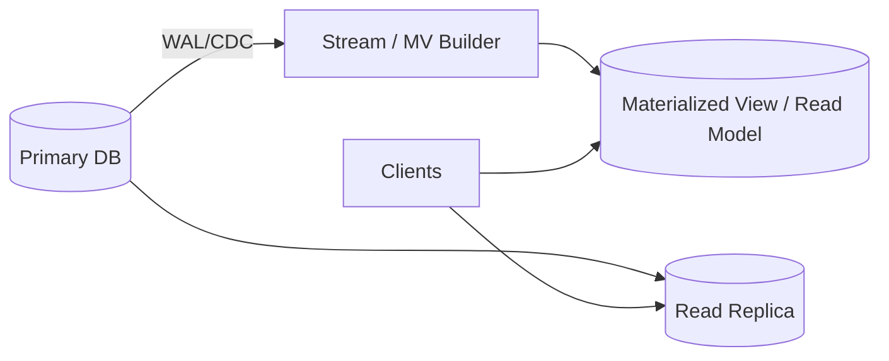

## Overview
Materialized views (MVs) precompute query results; read replicas copy primary data for read scaling and HA; CQRS separates write and read models. These techniques improve read latency and throughput at the cost of freshness and additional write/operational complexity.

## What, Why, When (and when-not)
What
- Materialized views: persisted results of a query maintained via refresh or incremental update.
- Read replicas: follower nodes applying WAL/CDC from primaries.
- CQRS: distinct write model (normalized) and read model (denormalized/views).

Why
- Reduce CPU/IO for hot queries; isolate reads from write contention; enable specialized schemas for fast reads.

When
- High read-to-write ratios; expensive aggregations or joins; global read distribution; multi-tenant hotspots.

When-not
- Latency-critical reads requiring strict read-after-write on the primary entity; complex multi-source consistency constraints where dual-write risks dominate.

## Core concepts and variants
Materialized view maintenance
- Full refresh on schedule; incremental refresh via logs/CDC; trigger-based or background jobs.
- Freshness: TTR (time-to-reflect) budget defines acceptable lag between source update and MV visibility.

Read replicas
- Physical replication (byte/WAL shipping) vs logical (row/statement/CDC). Sync/async/semi-sync options affect latency and durability; see [Replication](../04-replication/).

CQRS
- Write model normalized for consistency; read model denormalized for specific queries. Updates propagate via events/CDC to rebuild read models.

Invalidation and cache
- Combine MV/replicas with caches; cache invalidation ties to MV refresh events or WAL LSNs.

## Design decisions and trade-offs
- Freshness vs performance: tighter freshness increases write cost and complexity.
- Promotion/failover of replicas: role changes should not corrupt MV state; decouple MV pipelines from primary identity.
- Conflict handling in multi-writer or multi-region scenarios: choose idempotent updates and monotonic sequences.

## Architecture and components
- Primary DB emits WAL/CDC → MV builder/stream processor updates views/read models → readers served from views/replicas.

## Operational considerations
- MV backfill and reindex windows; throttling to avoid impacting OLTP.
- Replica lag SLOs; query routing policies (read-your-writes exceptions).
- Schema evolution: versioned views and shadow tables; backfill before cutover.

## Examples
Example A (quantitative): Staleness budget to hit p95
- Source update rate: 5k/s; MV refresh job applies 50k rows/s → 10× headroom. Target TTR ≤ 60 s → bounded MV lag backlog ≤ 300k rows. Alert if backlog > 300k for > 5 minutes.

Example B (architectural): CQRS for orders dashboard
- Writes land in normalized orders/payments tables. CDC to a stream updates a denormalized read model (order with last payment status, totals). Dashboard reads only the read model; read-your-writes exceptions go to primary with feature-flagged routes.

## Edge cases and anti-patterns
- Trigger-based MV refresh on hot tables creating lock contention. Cross-region replicas used for writes by mistake. Hidden dependencies between MV pipelines and leader identity.

## Interactions with adjacent topics
- [Partitioning](../03-data-partitioning/) affects MV sharding and refresh parallelism.
- [Replication](../04-replication/) defines replica staleness and failover.
- [Consistency & CAP](../05-consistency-and-cap/) for read staleness guarantees.
- [Search & Indexing](../14-search-and-indexing/) as an alternative to global MVs.

## Production checklist
- Define freshness (TTR) and routing policies for read-after-write.
- Decide MV maintenance: schedule vs incremental; backfill plan.
- Monitor replica lag, MV backlog, and rebuild durations; rehearse failover.

## Interview framing checklist
- When to choose MV vs secondary index vs search? How to offer read-your-writes?
- How would you rebuild and cut over a large MV without downtime?

## References
- PostgreSQL materialized views and logical decoding; MySQL read replicas; Event sourcing/CQRS patterns; Debezium/CDC best practices
