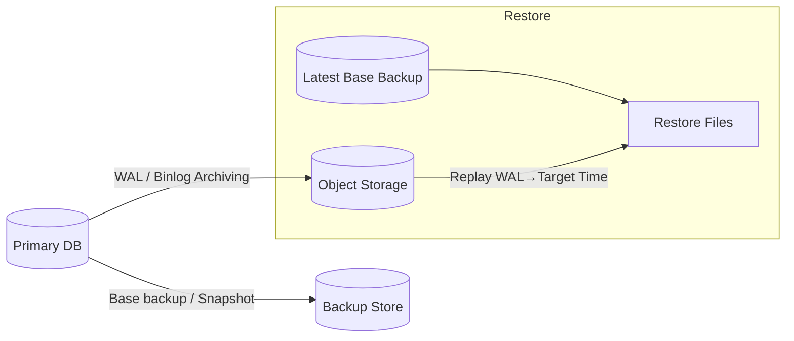

## Overview
Backups protect against data loss from operator error, bugs, and disasters. Point-in-time recovery (PITR) combines a base backup with a change stream (WAL/binlog/redo logs) to restore the database to any timestamp within retention. Successful programs automate, verify, and regularly rehearse restores.

## What, Why, When (and when-not)
What
- Backup types: physical (file/page-level), logical (dump/restore), volume snapshots, incremental/differential, WAL/binlog archiving for PITR.

Why
- Meet business recovery objectives: Recovery Point Objective (RPO) and Recovery Time Objective (RTO). Enable safe rollbacks from bad deploys and corrupt writes.

When
- Always for production data. Choose PITR when RPO < full-backup cadence. Cross-region copies when region failure is in scope.

When-not
- Logical-only backups for multi-terabyte OLTP without partitioning lead to long RTO; prefer physical/snapshots with WAL.

## Core concepts and variants
Physical vs logical
- Physical: copies engine files/pages; fast and space-efficient; engine/version-coupled.
- Logical: exports rows/schema; portable across versions/engines; slower and larger.

Snapshots
- Volume/ZFS snapshots are crash-consistent; pair with WAL position (LSN) to guarantee consistency and enable PITR from that point.

Incremental
- Page-level or block-change tracking reduces backup size/time. WAL/binlog archiving continuously ships changes to object storage.

Encryption & compression
- Encrypt backups at rest and in transit (KMS-managed). Compress to cut storage/egress; test CPU implications on restore speed.

RPO/RTO
- RPO: max acceptable data loss window (e.g., 5 minutes). RTO: max acceptable downtime to restore (e.g., 30 minutes). Drive cadence and tooling.

## Design decisions and trade-offs
- Physical+WAL vs logical+WAL: physical minimizes RTO; logical improves portability but increases RTO.
- Snapshot coordination: quiesce or ensure checkpoint alignment to avoid long crash recovery on restore.
- Retention and cost: object storage lifecycle policies; legal/PII deletion requirements.
- Geo-resilience: asynchronous cross-region copies add egress but limit blast radius.

## Architecture and components
- Backup orchestrator coordinates base backups/snapshots, WAL/binlog archiving, verification, and catalog/manifest tracking.

## Operational considerations
- Consistency markers: record WAL LSN at backup start/end. Store manifests with checksums.
- Verification: nightly restore to a disposable environment; checksum, run sanity queries.
- Throttling: cap backup IO to protect OLTP; schedule during low-traffic windows.
- Catalog: index backups by time, LSN, region, and encryption key IDs.

## Examples
Example A (quantitative): Sizing PITR storage
- WAL rate: 10 MB/s peak, 3 MB/s average. Retention goal: 7 days.
- Storage for WAL: 3 MB/s × 86,400 s/day × 7 ≈ 1.8 TB. With 2× safety and compression 0.6× → provision ~2.2 TB in object storage.
- Base backups: 2 TB logical dataset; weekly full with 0.5× compression → ~1 TB/week. Retain 4 weeks → ~4 TB.

Example B (architectural): Region DR
- Region A: primaries + local backups + WAL to regional object store. Cross-region replicate backups and WAL to Region B bucket.
- DR test monthly: restore latest base in Region B, replay WAL to T-5m, promote read-only for validation, then destroy.

## Edge cases and anti-patterns
- Backups on the same failure domain (same volume or AZ). Unverified backups (no restore drills). WAL archiving gaps due to credential expiry. Encryption keys rotated without re-encrypt procedure.

## Interactions with adjacent topics
- [Storage Tiers](./04-storage-tiers-and-durability.md) for snapshot semantics and IO.
- [Replication](../04-replication/) for failover interplay; backups complement replicas.
- [Consistency & CAP](../05-consistency-and-cap/) for acceptable staleness during DR.

## Production checklist
- Automate base backups and continuous WAL/binlog archiving; store manifests + checksums.
- Define RPO/RTO; verify via scheduled restore drills; track actuals.
- Encrypt backups; enforce lifecycle/retention; replicate off-region.
- Monitor backup success, WAL gap alarms, restore duration, and checksum mismatches.

## Interview framing checklist
- How to design PITR for a 5-minute RPO? What would you monitor?
- Snapshot vs logical backup trade-offs at multi-terabyte scale?

## References
- PostgreSQL basebackup/PITR docs; MySQL/XtraBackup and binlog; Oracle RMAN; cloud provider snapshot/DR guidance; ZFS send/receive
