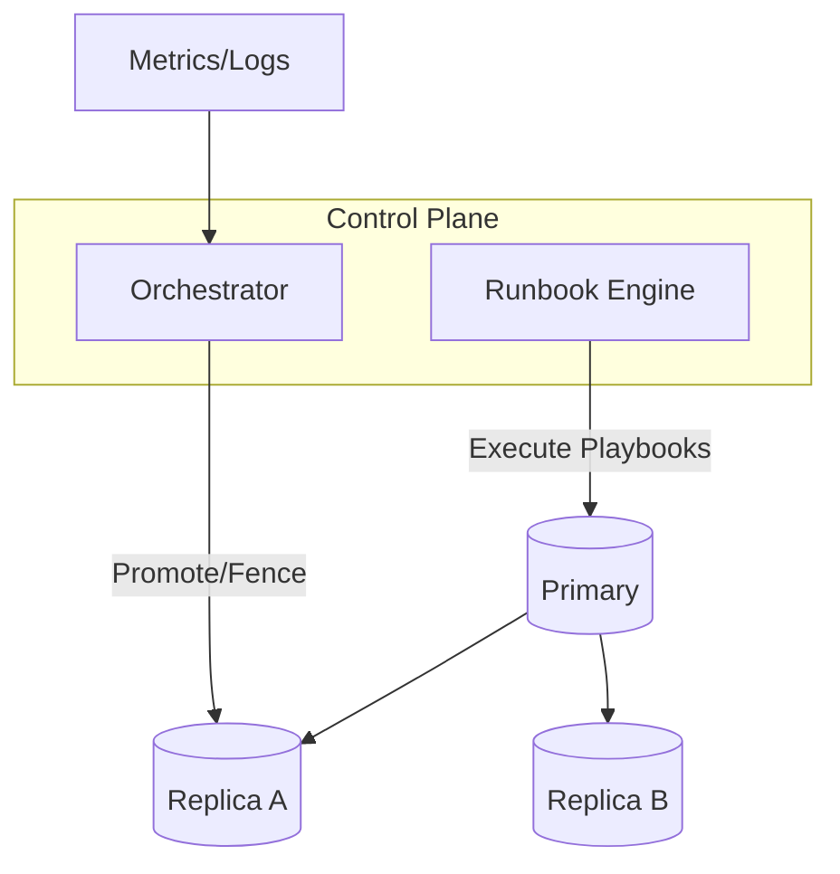

## Overview
Operational excellence keeps databases reliable and predictable under change. This page provides concrete guidance for capacity planning, tuning, observability, and runbooks to handle failures and maintenance with minimal user impact.

## What, Why, When (and when-not)
What
- Daily operations: capacity/SLOs, connection pools, maintenance (vacuum/compaction), schema changes, failover drills, backups, and incident response.

Why
- Databases fail subtly (lag, stalls, hotspots) before they fail hard. Observability and disciplined runbooks reduce MTTR and protect consistency.

When
- From first production deployment; continuously evolve with workload and topology changes.

When-not
- Don’t over-automate critical cutovers without guardrails and manual approval. Avoid ad-hoc schema changes in peak hours.

## Core concepts and variants
Capacity and SLOs
- Define per-tier SLOs: p95/99 read/write latency, error rates, replica lag, WAL throughput, cache hit rate.
- Headroom: maintain 30–50% headroom for CPU/IO/memory and compaction/vacuum.

Connection management
- Use connection pooling (e.g., PgBouncer) to cap backend connections; prefer transaction pooling for chatty microservices.
- Circuit breakers/backpressure to avoid stampedes during failover or maintenance.

Schema evolution
- Backward-compatible migrations: additive first; dual-write/read; remove later. Use online index builds.

Maintenance
- Schedule vacuum/compaction and analyze. Throttle to protect p95; separate IO classes where possible.

Failover
- Health-based promotion with fencing; validate replicas are caught up; re-point writers; rebuild old primary as replica.

## Design decisions and trade-offs
- Aggressive pooling reduces context switching but can queue requests; tune based on latency SLOs and worker counts.
- Online vs offline maintenance: online reduces downtime but may extend maintenance windows and increase write cost.
- Auto vs manual failover: auto reduces RTO but risks split-brain without solid fencing/quorum.

## Architecture and components
- Control plane (orchestration/automation), observability stack (metrics/logs/traces), connection pools, routers, backup/PITR services.

## Operational considerations
Alerts (examples)
- p95 write > target for 5m; replica lag > budget; WAL fsync p99 > threshold; compaction backlog above ceiling; connection saturation; error spikes.

Dashboards
- Throughput (reads/writes/s), latency percentiles, cache hit ratio, WAL bytes/s, replica lag, compaction/vacuum progress, top queries, skew heatmaps.

Runbooks
- Hotspot mitigation: identify key/shard; apply throttles; enable temporary salting/traffic shaping; plan re-shard.
- Failover: fence old primary; promote best replica; verify read/write health; repair topology; run consistency checks.
- Schema migration: deploy additive changes; backfill; switch reads; remove old path; rollback plan.

## Examples
Example A (quantitative): Pool sizing
- Backend workers: 64. Safe concurrent queries per core ~2–4 depending on query mix. Start with pool size ~2× workers (≈128), cap client connections to pool 4–8× pool size with queueing. Measure p95 latency under open-loop load; adjust.

Example B (architectural): Controlled failover
- Orchestrator monitors leader health and replica lag. On failure, it fences leader (STONITH/lease revoke), promotes the least-lag replica, updates router/catalog, warms caches with critical queries, and runs canary checks before opening write traffic.

## Edge cases and anti-patterns
- Unbounded client connections causing context-switch storms. Vacuum disabled leading to bloat. Promotion without fencing → split-brain and divergence.

## Interactions with adjacent topics
- [Replication](../04-replication/) for promotion and lag budgets.
- [Consistency & CAP](../05-consistency-and-cap/) for read staleness and quorum.
- [Partitioning](../03-data-partitioning/) for hotspot response and rebalancing.
- [Backup & PITR](./06-backup-restore-and-pitr.md) for restore procedures.

## Production checklist
- Define and monitor SLOs; maintain 30–50% headroom for IO/CPU.
- Enforce connection pooling and backpressure; set timeouts.
- Automate backups, failover with fencing, and schema migration pipelines.
- Maintain dashboards and on-call runbooks; rehearse quarterly.

## Interview framing checklist
- How to size connection pools and protect the DB during incidents?
- What is your failover runbook and how do you prevent split-brain?

## References
- PostgreSQL/MySQL operations guides; Orchestrator/Patroni docs; PgBouncer; Google SRE book; RocksDB/LSM compaction tuning notes
