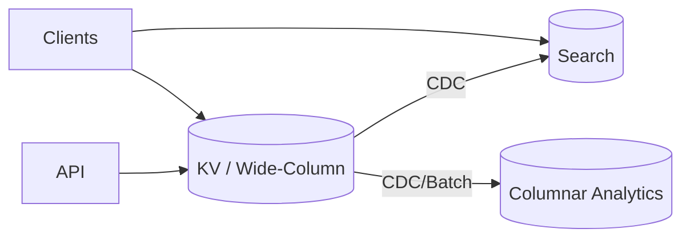

## Overview
These case studies illustrate pragmatic engine selections and the operational realities that followed. Each example highlights trade-offs, quantitative sizing, and lessons learned across OLTP, analytics, and multi-region deployments.

## What, Why, When (and when-not)
What
- Concrete end-to-end designs combining primary stores with derived systems (search, analytics) and operational patterns (replication, backups).

Why
- Bridge theory to practice; expose hidden costs (write amplification, lag, hotspots) and the mitigations that worked.

When
- Use as templates when designing similar workloads; adapt numbers to your traffic and SLOs.

When-not
- Don’t cargo-cult; validate assumptions (SLOs, growth, team capabilities) before adopting.

## Case study A: Social feed (write-heavy, read-fanout)
Context
- Write path: posts, reactions, follows (append-heavy). Read path: home timeline, user timeline, search.

Design
- Primary: KV/LSM store for posts and timelines (partition by user_id bucket and time window).
- Derived: search index for text and hashtag queries; columnar store for analytics (engagement stats).
- Read replicas: follower reads for timelines with bounded staleness.

Numbers (example)
- Peak writes: 40k/s, 1.2 KB average → 48 MB/s ingest. LSM compaction budget 6× → plan ~288 MB/s background IO.
- Read SLO: p95 < 60 ms for timelines; allow follower staleness ≤ 2 s; cache hit rate target 90%.

Lessons
- Composite partition (time window + user hash) avoids hot shards. Bloom filter sizing reduced read IO ~30%. Search offload removed global text filters from KV.

## Case study B: Payments (strict integrity, audit, PITR)
Context
- Money movements with invariants (no double-spend), full audit, regulatory retention, strict RPO/RTO.

Design
- Primary: relational row store (PostgreSQL/MySQL) with unique constraints and Serializable only in critical sections.
- Read replicas for reporting; CDC to immutable ledger store and warehouse; frequent base backups + continuous WAL archiving for PITR.

Numbers (example)
- p95 write SLO < 20 ms; pool size ~2× worker threads; WAL avg 5 MB/s, retention 14 days → ~6 TB of WAL (before compression); weekly full base backups 1.5 TB compressed, 4 copies retained.

Lessons
- Keep transactions short; avoid Serializable across entire workflow—use idempotency and dedupe tables. Quarterly restore drills caught a missing WAL upload IAM rotation.

## Case study C: IoT time-series (high-ingest, tiering)
Context
- Millions of devices emitting metrics every few seconds; queries primarily recent time windows and periodic rollups.

Design
- Primary: time-series/LSM engine partitioned by day and device hash; retention tiers (hot NVMe 7 days, warm 90 days, cold object storage 1 year).
- Derived: columnar aggregates for dashboards; downsampling jobs roll up 1m→5m→1h.

Numbers (example)
- Ingest: 150k/s @ 200 B → 30 MB/s raw; with WAL and compaction WA ≈ 12× → provision ~360 MB/s IO headroom.
- Storage: hot 7 days ≈ 18 TB raw; compression 0.5× → 9 TB; replicas RF=2 → 18 TB hot tier.

Lessons
- Prioritize compaction on newest partitions; throttle backfills; object storage for cold segments slashed costs with acceptable query latency via prefetch.

## Case study D: Multi-region e-commerce (inventory and orders)
Context
- Global storefront; regional inventory updates; strict per-item consistency during checkout; low-latency reads worldwide.

Design options
1) Distributed SQL across 3 regions: strong consistency, higher write latency floors (consensus).
2) Regional primaries with async replication; cart/checkout use regional inventory shard; compensations for rare conflict; catalog/search served from CDNs and search index.

Numbers (example)
- Option 1 adds ~40–70 ms cross-region write latency; Option 2 keeps local p95 < 20 ms but risks oversell without careful reservation logic.

Lessons
- If 95% of checkouts are regional, Option 2 with reservations + compensations often wins on UX and cost. Use sagas and clear RPO docs.

## Edge cases and anti-patterns
- Forcing heavy analytics into OLTP cluster; using cross-region replicas for writes; skipping restore drills; underestimating compaction IO.

## Interactions with adjacent topics
- [Families & Workloads](./01-families-and-workloads.md), [Storage Engines](./02-storage-engines-and-data-structures.md)
- [Replication](../04-replication/) and [Consistency & CAP](../05-consistency-and-cap/)
- [Partitioning](../03-data-partitioning/) and [Search & Indexing](../14-search-and-indexing/)

## Production checklist
- Validate SLOs against realistic latency floors (fsync/consensus).
- Budget IO for compaction/vacuum and CDC; size WAL/archive retention.
- Define staleness and freshness budgets per derived store; monitor continuously.

## Interview framing checklist
- Given a workload, justify engine mix and failure handling. How do you ensure data integrity under regional outages?

## References
- DDIA case discussions; Spanner/Cockroach/Yugabyte multi-region docs; Dynamo/Cassandra modeling guides; large-scale social feed engineering blogs; fintech audit/ledger patterns
