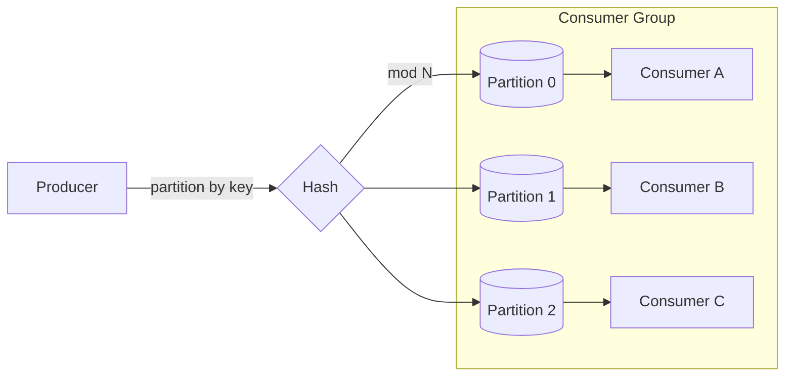

## Overview
Topic and partition design determines ordering scope, parallelism, and scalability. Choose keys and counts to balance throughput, skew, and consumer concurrency while preserving the ordering guarantees your business needs.

## What, Why, When (and when-not)
What
- Topics/queues group related messages; partitions shard a topic for parallelism. Ordering is guaranteed within a partition, not across the topic.

Why
- Right-sized partitions maximize throughput and elasticity while constraining ordering only where required. Poor key choice creates hotspots and lag.

When
- Use partitioned topics for high throughput and consumer group scaling. Use single-partition FIFO only when strict total order is necessary and load is modest.

When-not
- Avoid global-total-order topics for high-QPS event streams; they cap throughput by a single partition’s p99 write/flush latency.

## Core concepts and variants
- Partition key: function of message attributes that maps to a partition (e.g., hash(user_id)).
- Sticky partitioning: short-term stickiness to a partition to improve batching while retaining distribution.
- Routing catalogs: centralized hash range or consistent hash ring for custom brokers.
- Rebalancing: changing partition ownership across consumers; cooperative vs eager rebalancing.
- Key evolution: introducing composite keys (tenant_id, entity_id) to avoid cross-tenant ordering coupling.

## Design decisions and trade-offs
- Ordering scope: per-entity ordering (order_id) vs per-tenant ordering (tenant_id) vs best-effort.
- Partition count: more partitions increase parallelism but add coordination overhead and open files; retention cost scales with partitions.
- Hotspots: skewed keys cause uneven lag. Mitigations: add a salt (key||bucket), time-bucketed keys, or move to two-phase aggregation (local then global).
- Repartitioning: increasing partitions breaks global key→partition mapping unless using consistent hashing and consumer-side routing.

## Algorithms/policies (conceptual)
Partition count sizing (throughput-driven)
```pseudo
input_throughput_msgs_s
consumer_capacity_msgs_s_per_thread
target_parallelism = ceil(input_throughput_msgs_s / consumer_capacity_msgs_s_per_thread)
partitions = roundUpToNearest(target_parallelism, 3..5 headroom)
```

Skew detection
```pseudo
for each partition p:
  skew_ratio = p.lag / median(lag)
  if skew_ratio > 3x for 5m:
    alert("hot partition: " + p.id)
```

## Architecture and components
- Producer partitioner, broker partition storage (segments), controller for leader election, consumer assignor (range, round-robin, sticky).



## Operational considerations
- Plan partitions with 25–50% headroom; resizing is operationally heavy.
- Monitor per-partition produce/consume rates, lag, and p99 latencies; skew alarms trigger mitigation.
- Document partition assignment strategy and rebalance behavior during deploys.

## Examples
Example A (quantitative): compute partitions
- Peak 60k msgs/s; each consumer thread handles ~4k msgs/s → base parallelism = 15.
- Add 40% headroom → 21 partitions. With 3 consumers per instance and 3 instances, each handles ~2–3 partitions.

Example B (architectural): multi-tenant topic design
- Partition key = hash(tenant_id, entity_id). Tenant-level ordering is not required; per-entity ordering is. Use sticky partitioning at producer to batch. Introduce salted keys for top 1% hot tenants.

## Edge cases and anti-patterns
- Using random keys when per-entity ordering is necessary → reordering bugs.
- Single hot key without salting → perpetual lag on one partition and uneven consumer utilization.
- Blindly increasing partitions post-factum without idempotent consumers → duplicates during reprocessing.

## Interactions with adjacent topics
- See [Data Partitioning](../03-data-partitioning/) for range/hash policies and hotspot mitigation.
- See [Rate Limiting & Backpressure](../08-rate-limiting-and-backpressure/) for shaping intake by partition.

## Production checklist
- Define ordering scope and partition key; quantify expected skew.
- Size partitions for peak with headroom; document rebalance policy.
- Implement hot-key detection and salting/rebucketing procedure.

## Interview framing checklist
- How would you pick a partition key for an orders topic and why?
- What happens when you double partitions—how do you preserve idempotency and ordering?

## References
- Kafka Partitioning and Consumer Rebalancing; Pulsar Key_Shared; NATS JetStream partitioning notes
