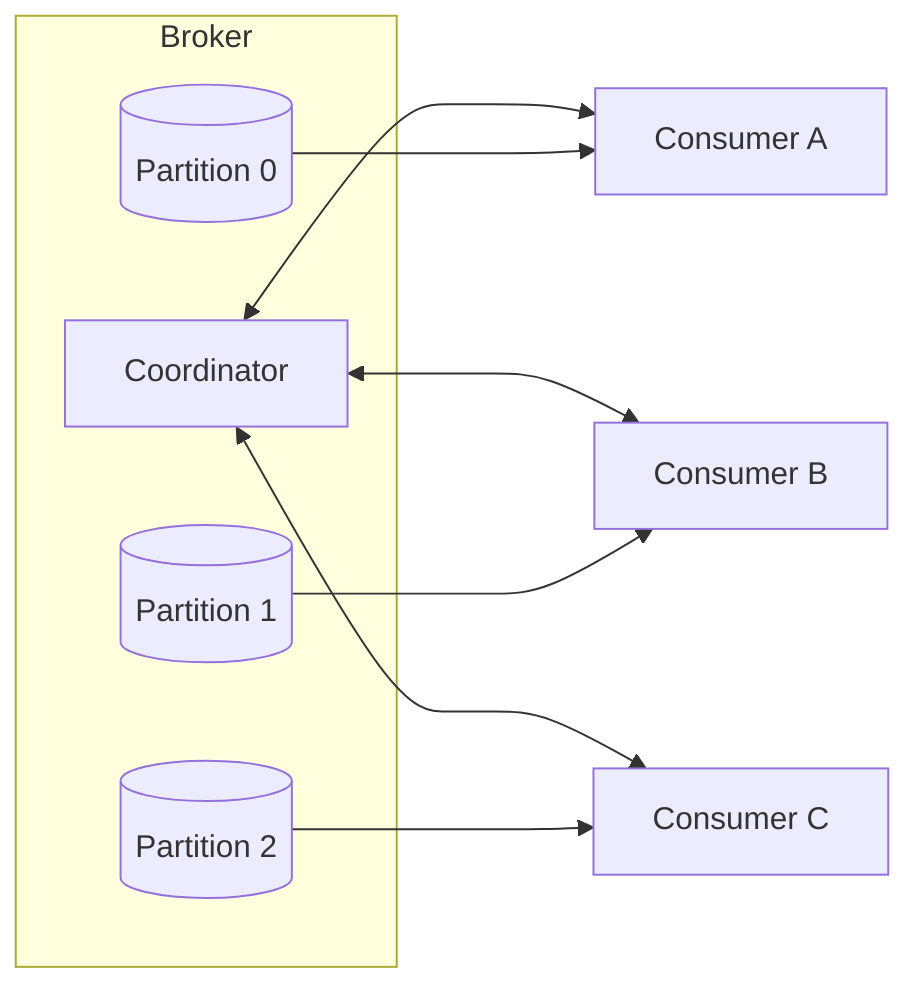

## Overview
Pub/sub decouples producers from multiple consumers by broadcasting messages or events to topics. Consumer groups provide horizontal scaling and fault tolerance by partition ownership. Effective operation requires clear group semantics, sizing math, and predictable rebalancing.

## What, Why, When (and when-not)
What
- Pub/sub topics with multiple independent subscribers; consumer groups shard work across instances while preserving per-partition order.

Why
- Enable fan-out to heterogeneous systems (OLTP updates, analytics, ML features) and scale consumers elastically while keeping ordering guarantees limited in scope.

When
- Use consumer groups when parallelizing processing of a partitioned topic. Use multiple topics when different retention or schemas are needed per downstream.

When-not
- Avoid a single group handling disparate SLAs—split groups or topics. Avoid frequent deploy-triggered rebalances in latency-critical paths; prefer cooperative rebalancing.

## Core concepts and variants
- Broadcast vs work-sharing: pub/sub fans out to multiple groups (broadcast); within a group, messages are work-shared among members.
- Group membership: heartbeats to a coordinator; assignment strategies (range, round-robin, sticky, cooperative).
- Offset ownership: each group maintains its own offsets; multiple groups can read at different rates.
- Delivery models across tech:
  - Kafka/Pulsar: partition ownership per group; offset commits; rebalances on membership/topology change.
  - RabbitMQ: competing consumers on queues; acks; queue bindings for pub/sub via exchanges.
  - NATS JetStream: consumer durable cursors; pull/push; subject wildcards.

## Design decisions and trade-offs
- Assignment strategy: sticky/cooperative reduce churn and processing duplication; range/round-robin are simpler but can thrash.
- Commit frequency: commit often to minimize replay on failure vs batch commits for throughput; use idempotency to allow larger batches.
- Group scaling limits: max effective parallelism is partitions_per_topic; extra consumers sit idle.
- Multi-tenancy: per-tenant groups isolate offsets/SLOs; shared groups reduce cost but couple performance.

## Algorithms/policies (conceptual)
Throughput-driven autoscaling
```pseudo
target_lag_seconds = 30
required_consume_rate = incoming_rate_msgs_s + lag/backlog_msgs / target_lag_seconds
needed_threads = ceil(required_consume_rate / capacity_per_thread_msgs_s)
instances = ceil(needed_threads / threads_per_instance)
instances = clamp(instances, 1, partitions)
```

Cooperative rebalance guard
```pseudo
onMembershipChange():
  pausePartitions(currentlyOwned)
  commitOffsets()
  revokeSubset()
  resumeRemaining()
```

## Architecture and components
- Coordinator (group membership), assignor, heartbeat session, offset store, consumers with local concurrency (threads/async), and backpressure signaling to producers.



## Operational considerations
- Rebalance storms: stagger deploys; use cooperative/sticky assignors; increase session timeouts prudently.
- Offset management: externalize critical offsets alongside sink commits in transactional pipelines.
- Warmup and graceful shutdown: drain in-flight work; commit; relinquish partitions to avoid duplicate processing.

## Examples
Example A (quantitative): right-size a group
- Peak input 40k msgs/s; capacity/thread 2k msgs/s; 2 threads/instance.
- Needed threads = ceil(40k/2k)=20; instances = ceil(20/2)=10. With 12 partitions, only 12 threads are active at once; scale partitions or instance threads if needed.

Example B (architectural): broadcast vs work-sharing
- A metrics topic is consumed by two groups: “alerts” and “storage”. Each group maintains independent offsets. Within “alerts”, 6 instances share 12 partitions; within “storage”, 3 larger instances handle all partitions with batch writes.

## Edge cases and anti-patterns
- Sharing a single group between latency-critical and batch consumers → head-of-line blocking and missed SLOs.
- Excess consumers beyond partition count → wasted resources and churn during rebalances.
- Synchronous RPC in consumer loop → stalls partition; use async IO with bounded concurrency.

## Interactions with adjacent topics
- See [Rate Limiting & Backpressure](../08-rate-limiting-and-backpressure/) for shaping intake.
- See [Consistency & CAP](../05-consistency-and-cap/) for client-side read policies and ordering.

## Production checklist
- Pick assignor and rebalance strategy; tune session/heartbeat timeouts.
- Define autoscaling math and alarms for lag, processing rate, and rebalance churn.
- Implement graceful shutdown and offset commit on revoke.

## Interview framing checklist
- How do you scale a consumer group when partitions are the limiting factor?
- How do you avoid duplicate processing during rebalances?

## References
- Kafka group management and cooperative rebalancing; RabbitMQ competing consumers; NATS JetStream consumers
