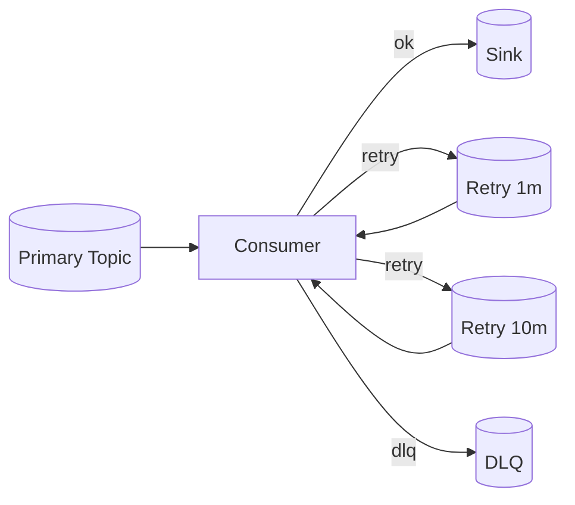

## Overview
Delivery semantics determine how your system behaves under failure and congestion. Reliable systems embrace at-least-once delivery with idempotent processing, well-tuned retries, and a clear DLQ strategy for unprocessable messages.

## What, Why, When (and when-not)
What
- Delivery modes: at-most-once (no retries), at-least-once (retries may duplicate), exactly-once (end-to-end transactional or effectively idempotent).
- Retry strategies: exponential backoff with jitter, limited attempts, circuit breakers.
- DLQ: a quarantine for messages that repeatedly fail processing.

Why
- Transient faults are common; retries recover without operator intervention. DLQs prevent stuck progress on poison pills and enable targeted remediation.

When
- Use at-least-once + idempotency for most business flows. Use at-most-once only for metrics/telemetry where duplicates are worse than loss. Use exactly-once where platforms provide it end-to-end (with cost/complexity trade-offs).

When-not
- Avoid unbounded retries on hot partitions; they amplify congestion. Avoid DLQ-less designs; a single poison pill can block progress.

## Core concepts and variants
- Exponential backoff with jitter: spreads retry load and reduces thundering herds.
- Retry tiers: immediate retry (same partition), deferred retry (delay queue/topic), DLQ after N attempts.
- Poison pill detection: schema invalid, missing referenced state, non-idempotent side-effects risk.
- Idempotent sinks: upsert-by-key, dedupe tables, transactional outbox/inbox patterns.

## Design decisions and trade-offs
- Retry locality: same topic/partition keeps ordering but may block; offloading to a retry topic prevents head-of-line blocking at the cost of cross-partition reordering.
- Backoff parameters: larger base and jitter reduce contention but increase latency; keep total retry budget within business SLOs.
- DLQ handling: manual triage vs automated remediation pipelines; ensure traceability (original offset, headers, error context).

## Algorithms/policies (conceptual)
Exponential backoff with jitter
```pseudo
max_attempts = 5
base = 500ms
for attempt in 1..max_attempts:
  try process(msg)
    commit
    break
  catch e:
    if attempt == max_attempts:
      sendToDLQ(msg, error=e)
      break
    sleep(random(0, base * 2^(attempt-1)))
```

Retry topic pattern
```pseudo
onFailure(msg, attempt):
  if attempt < N:
    publish(retry_topic_for_delay(attempt), msg.withHeader("attempt", attempt+1))
  else:
    publish(dlq_topic, msg.withHeader("error", last_error))
```

Idempotent sink upsert
```pseudo
begin txn
  if dedup.exists(msg.id):
    commit; return
  upsert(target_table, key=msg.key, value=msg.payload)
  dedup.insert(msg.id)
commit
```

## Architecture and components
- Primary topic/queue, retry topics/queues (multiple delays), DLQ; consumer with retry policy, error classifier, and idempotent sink.



## Operational considerations
- Track per-attempt metrics, retry volume, and DLQ rate; alert on spikes.
- Cap in-flight retries to protect primaries; enforce max retry age to prevent infinite loops.
- DLQ retention and PII: ensure appropriate data handling; prefer error context in headers vs duplicating payload.

## Examples
Example A (quantitative): retry amplification
- Base error rate = 0.5% at 50k msgs/s → 250 msgs/s failures.
- With 3 retry attempts, expected retry traffic ≈ 250 + 0.5%*250 + 0.5%*… ≈ ~253 msgs/s plus delayed spikes. Plan capacity +10–20% for retries and bursts.

Example B (architectural): tiered retries to avoid HOL blocking
- Primary topic consumed with no per-message sleep.
- Failures published to retry-5m and retry-30m topics with DLQ after 5 attempts.
- Separate consumer groups drain retries with low concurrency; DLQ viewer supports replay after fixes.

## Edge cases and anti-patterns
- Retrying non-transient errors (e.g., schema mismatch) → DLQ immediately after 1 attempt.
- Coupling retries with synchronous external calls without timeouts → cascading stalls.
- Dropping DLQ context (original offset/partition) → irreproducible bugs.

## Interactions with adjacent topics
- See [Rate Limiting & Backpressure](../08-rate-limiting-and-backpressure/) for controlling retry pressure.
- See [Consistency & CAP](../05-consistency-and-cap/) for idempotency and read-modify-write patterns.

## Production checklist
- Define retry tiers and max attempts; add jitter; enforce total SLO budget.
- Implement idempotent sink writes with dedupe.
- Capture error context and original position; build DLQ tooling and replay procedure.
- Create alarms on retry volume, DLQ rate, and age.

## Interview framing checklist
- How do you design retries that avoid head-of-line blocking and retry storms?
- How do you implement idempotency for side-effecting operations (email, payments)?

## References
- AWS Architecture Blog: Exponential Backoff and Jitter; Kafka EOS; RabbitMQ DLX pattern; SQS/SNS redrive policies
