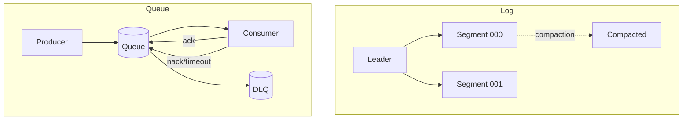

## Overview
Logs are durable, append-only streams optimized for ordered replay and multi-subscriber fan-out. Queues are work-distribution structures optimized for one-time processing with acknowledgements and optional FIFO. Storage characteristics—retention, compaction, replication, and tiering—drive durability, cost, and performance.

## What, Why, When (and when-not)
What
- Log: append-only segments with offsets; consumers track positions independently; supports replay and time travel.
- Queue: message visibility with ack/nack; typically one consumer processes each message; limited or best-effort ordering.

Why
- Use logs to feed multiple downstreams, reprocess history, and maintain ordered per-key sequences. Use queues to reliably distribute discrete tasks with per-message success/failure.

When
- Log with long retention for CDC, audit, analytics, ML features, and cache rebuilds.
- Queue with bounded visibility timeout for background jobs, webhooks, and workflow steps.

When-not
- Avoid queues when you need replay or multiple independent consumers over history. Avoid logs when strict single-consumer semantics and minimal storage footprint are priorities.

## Core concepts and variants
- Retention: time/size-based deletion of old segments (log) or message expiry (queue).
- Compaction (logs): keep only the latest value per key; tombstones mark deletions until cleaned.
- Offsets vs acks: logs use offsets/commits; queues rely on ack/nack with visibility timeouts.
- Durability & replication: replication factor (RF) with leader–follower; quorum acks (acks=all) vs acks=1.
- Tiered storage: spill cold segments to object storage to extend retention at lower cost.
- FIFO queues: total order at low scale; often single shard/partition limits throughput.

## Design decisions and trade-offs
- Retention vs cost: long retention enables replay but increases disk/object storage and compaction IO.
- acks=all vs acks=1: stronger durability and ordering guarantees vs lower latency and higher risk of loss on leader failure.
- Compaction vs full retention: compaction reduces space for key-latest use cases but adds CPU/IO and retention of tombstones.
- Queue visibility timeout: too short → duplicate processing; too long → slow recovery on crash.
- Tiered storage: cheaper long-term retention at the cost of slower historical reads and operational complexity.

## Algorithms/policies (conceptual)
Retention sizing (logs)
```pseudo
bytes_per_day = incoming_msgs_per_s * avg_msg_bytes * 86400
effective_bytes_per_day = bytes_per_day * replication_factor * (1 + overhead_idx)
required_storage = effective_bytes_per_day * retention_days
```

Kafka acks and timeouts (heuristic)
```pseudo
if business_requires_no_data_loss:
  producer.acks = all
  min_insync_replicas >= 2
  request_timeout_ms tuned to 2x p99 produce latency
else:
  producer.acks = 1
```

Queue visibility timeout
```pseudo
visibility_timeout = max(2 * p99_processing_time, base_min)
redrive_policy = { maxReceiveCount: N, deadLetterTargetArn: DLQ }
```

## Architecture and components
- Logs: partitions, leaders/followers, segment files, index files, compaction, tiered storage, offset stores.
- Queues: exchanges/bindings (AMQP), queues, in-memory + disk stores, visibility timers, DLX (dead-letter exchanges).



## Operational considerations
- Disk headroom: maintain ≥ 30–40% free for segment churn and compaction.
- Segment size: larger segments improve sequential IO but slow deletion/compaction granularity; 256–1024 MB common.
- Monitoring: under-replicated partitions, ISR size, page cache hit rate, broker disk usage, queue ready/unacked counts.
- Tiered storage: test rehydrate performance and failure modes; verify object store consistency guarantees.

## Examples
Example A (quantitative): retention capacity
- 25k msgs/s, 1.5 KB avg → ~37.5 MB/s ≈ 3.24 TB/day.
- With RF=3 and 10% index/overhead → 3.24 * 3 * 1.1 ≈ 10.7 TB/day.
- For 14 days retention → ~150 TB raw; with tiered storage, keep 2 days hot (~21 TB) and 12 days cold (~129 TB object).

Example B (architectural): compaction for latest state
- Topic with key=user_id uses log compaction to maintain latest profile state for fast bootstrap of caches.
- Tombstones expire after cleanup policy delay to ensure deletion propagates to consumers.

## Edge cases and anti-patterns
- Assuming compaction guarantees de-dup across all time; it only keeps latest per key, not unique events.
- Using FIFO queues for high-throughput workloads → single-shard bottlenecks and timeouts.
- Setting visibility timeout below p99 processing → duplicate floods.

## Interactions with adjacent topics
- See [Databases & Storage](../06-databases-and-storage/) for durability and tiering strategies.
- See [Consistency & CAP](../05-consistency-and-cap/) for quorum acks and ordering.
- See [Rate Limiting & Backpressure](../08-rate-limiting-and-backpressure/) for producer throttling.

## Production checklist
- Choose retention and compaction policy; size storage with replication overhead.
- Set producer acks/min.insync.replicas to meet loss tolerance; tune timeouts.
- Configure DLQ/redrive for queues; set visibility timeout with safety margin.
- Validate tiered storage restore and historical replay performance.

## Interview framing checklist
- When would you choose compaction vs full retention?
- How do you set visibility timeouts and DLQ policies for a flaky downstream?

## References
- Kafka: Retention, Compaction, Tiered Storage; RabbitMQ: Queues, DLX; AWS SQS: Visibility/Redrive; Pulsar: Tiered Storage
