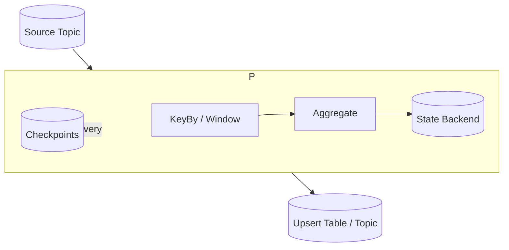

## Overview
Stream processors transform and aggregate unbounded event streams with low latency. Correctness depends on time semantics (event-time), handling out-of-order data (watermarks), and managing operator state with durable checkpoints.

## What, Why, When (and when-not)
What
- Stateful stream processing with windows (tumbling, sliding, session), joins, aggregations; event-time and watermarks; checkpointing and recovery.

Why
- Real-time analytics, fraud detection, ML features, materialized views, and CDC transformations benefit from continuous, low-latency computation without batch orchestration overhead.

When
- Use stream processors when latency SLOs are seconds to minutes, inputs are continuous, and results must update incrementally.

When-not
- Pure batch or ad-hoc analytics with hour/day latency targets may be simpler in a warehouse. Heavy global shuffles with strict total order may be cost-prohibitive in streaming.

## Core concepts and variants
- Time domains: processing-time (when observed) vs event-time (when produced). Prefer event-time for correctness under delays.
- Watermarks: lower bounds on event-time progress used to trigger window completions; late data handling via allowed_lateness.
- Windows: tumbling (fixed, non-overlapping), sliding (overlapping), session (gaps). Triggers determine early/on-time/late firings.
- State: keyed state (per key aggregates), operator state; backends (in-memory + RocksDB spill), TTL and compaction.
- Checkpoints: periodic snapshots of state and positions; exactly-once recovery via barrier alignment.
- Exactly-once: two-phase commit or transactional writes tying source offsets and sink commits atomically (e.g., Kafka EOS, Flink 2PC sinks).

## Design decisions and trade-offs
- Watermark strategy: conservative (higher latency, fewer late updates) vs aggressive (lower latency, more late arrivals and rewrites).
- State backend: in-memory fast but limited; embedded KV (RocksDB) scales but adds IO and compaction costs.
- Windowing vs tables: continuous upserts into a table (materialized view) simplify reads vs emitting windowed aggregates for time-bucketed analysis.
- Checkpoint interval: shorter reduces redo on failure but increases overhead; align with input rate and state churn.

## Algorithms/policies (conceptual)
Heuristic watermarking with percentile delay
```pseudo
// Track distribution of (processing_time - event_time)
delay_p99 = percentile(delay_histogram, 99)
watermark = now_event_time - delay_p99
```

Two-phase commit to sink with exactly-once
```pseudo
onCheckpointStart(id):
  sink.beginTransaction(id)

process(record):
  state.update(record)
  sink.buffer(record)

onCheckpointCommit(id):
  sink.preCommit(id)
  commitOffsets() // source positions included in checkpoint
  sink.commit(id)
```

Join with grace period (late data)
```pseudo
streamA.join(streamB)
  .onKey(k)
  .within(window=10m, grace=2m)
  .emitOnWatermark()
```

## Architecture and components
- Sources (logs/queues/CDC), processing runtime (operators, state backend, scheduler), checkpoints, and sinks (tables, topics, caches).



## Operational considerations
- Size state: estimate keys × bytes_per_key × window count; plan disk for RocksDB + compaction headroom (≥30%).
- Backpressure: bound per-key concurrency; spill to disk predictably; monitor busy time and checkpoint durations.
- Upgrades: use savepoints/snapshots for rolling upgrades; validate state schema compatibility.
- Reprocessing: design deterministic functions; keep code versioned alongside offsets to reproduce results.

## Examples
Example A (quantitative): state sizing
- 5M active keys, 200 bytes/key (count, last_ts, watermark metadata) → ~1 GB state.
- With RocksDB and compaction overhead ~2.5× → plan ~2.5 GB + 30% free → ~3.25 GB per shard; with RF=3 nodes, distribute accordingly.

Example B (architectural): real-time feature table
- Events from orders topic keyed by user_id.
- Stream app computes rolling 7-day spend and emits upserts into a “user_features” table via an idempotent sink.
- Late events (≤ 10 minutes) update aggregates; beyond grace, routed to correction topic for batch reconciliation.

## Edge cases and anti-patterns
- Using processing-time windows where event-time skew is large → incorrect aggregates.
- Disabling backpressure while external sink slows → unbounded memory; use bounded queues and async IO.
- Large joins without partition alignment → excessive shuffles and stragglers.

## Interactions with adjacent topics
- See [Consistency & CAP](../05-consistency-and-cap/) for ordering and session guarantees.
- See [Databases & Storage](../06-databases-and-storage/) for upsert tables and materialized views.
- See [Rate Limiting & Backpressure](../08-rate-limiting-and-backpressure/) for flow control.

## Production checklist
- Define event-time policy, watermarks, allowed lateness, and triggers.
- Choose state backend and checkpoint interval; test recovery time.
- Ensure exactly-once or idempotent sink semantics; version schemas.
- Monitor checkpoint sizes/durations, busy time, backpressure, and sink latencies.

## Interview framing checklist
- How do you handle late events and out-of-order data?
- Explain exactly-once in streaming with a transactional sink.

## References
- Flink: Watermarks/Windows/Checkpointing; Kafka Streams: EOS and state stores; Spark Structured Streaming: event-time and watermarks
