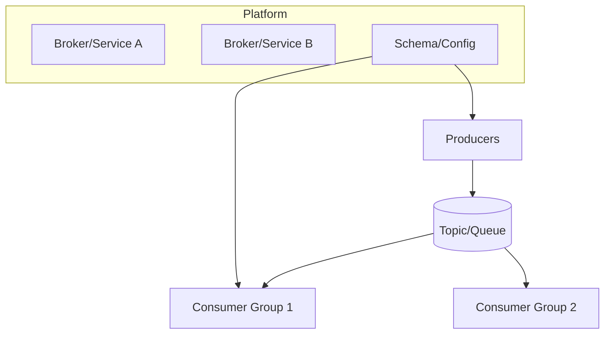

## Overview
Choose the right messaging/streaming technology by matching delivery semantics, ordering scope, throughput/latency needs, retention model, and operational appetite. This guide contrasts log-centric platforms (Kafka/Pulsar), brokered queues (RabbitMQ/NATS JetStream), and managed cloud services (SQS/SNS, Kinesis, Pub/Sub).

## What, Why, When (and when-not)
What
- Technology families: append-only logs with partitions (Kafka/Pulsar), AMQP-style queues/exchanges (RabbitMQ), streaming with lightweight subjects (NATS JetStream), and cloud-managed services (SQS/SNS/Kinesis; Google Pub/Sub).

Why
- Platform behaviors differ materially in ordering guarantees, scaling, persistence, and ops burden. Align choice with business SLOs and team capabilities.

When
- Log-centric (Kafka/Pulsar): high-throughput event streams, long retention/replay, multiple consumer groups, CDC, stream processing.
- Queue-centric (RabbitMQ/NATS): task distribution, request buffering, lower-latency fanout, simpler ops, shorter retention.
- Managed (SQS/SNS/Kinesis, Pub/Sub): prefer when ops capacity is limited, multi-AZ/region HA is desired, and integration with cloud IAM/observability matters.

When-not
- Don’t choose a log when you strictly need one-time task processing with minimal storage. Don’t choose a queue when multiple independent replays and long retention are needed. Avoid self-managing if team lacks ops bandwidth for 24/7 support.

## Core concepts and variants
- Kafka: partitioned logs, consumer groups, compaction & retention, EOS transactions, Connect ecosystem.
- Pulsar: segment storage + BookKeeper, per-subscription cursors, tiered storage, geo-replication.
- RabbitMQ: exchanges (direct/topic/fanout), queues, acks/NACKs, quorum streams plugin.
- NATS JetStream: subjects with wildcards, lightweight server, streams/consumers with pull/push.
- AWS SQS/SNS: queues and pub/sub topics; SQS standard vs FIFO; visibility timeouts and redrive.
- AWS Kinesis: shard-based streams, retention up to 365d (extended), enhanced fanout.
- Google Pub/Sub: partitioned topics with message ordering keys, per-subscription retention, exactly-once delivery to acks (Lite for on-prem-like usage).

## Design decisions and trade-offs
- Ordering: partition-key order (Kafka/Pulsar/Kinesis/PubSub ordering keys) vs best-effort (SQS standard, RabbitMQ with multiple consumers). FIFO (SQS FIFO) reduces throughput.
- Retention: long-lived logs (Kafka/Pulsar/Kinesis/PubSub) vs short-lived queues (RabbitMQ/SQS); compaction (Kafka) reduces storage for key-latest.
- Throughput/Latency: Kafka/Pulsar excel at high throughput; NATS/RabbitMQ excel at low-latency small messages; managed services add network hops but offload ops.
- Ops model: self-managed flexibility vs managed simplicity/cost; Pulsar’s separation of compute/storage eases tiering but adds complexity.
- Ecosystem: Kafka Connect, Streams, Flink integrations vs AMQP toolchains vs cloud-native glue (Lambdas/Step Functions/Dataflow/Firehose).

## Algorithms/policies (conceptual)
Quick selector heuristic
```pseudo
if need_long_retention_and_replay and need_multiple_independent_consumers:
  choose Kafka or Pulsar (managed variants preferred if ops-light)
elif need_simple_task_queueing_with_DLQ and minimal ops:
  choose SQS (FIFO if strict order, else Standard) or RabbitMQ for on-prem
elif need cloud-native streaming with serverless integrations:
  choose Kinesis (AWS) or Pub/Sub (GCP)
elif need ultra-low-latency pub/sub with lightweight footprint:
  choose NATS JetStream
```

Throughput sizing sanity checks
```pseudo
// Kafka/Pulsar partitions
required_partitions >= ceil(total_msgs_s / msgs_s_per_consumer_thread)

// Kinesis shards
shards >= max( ceil(write_MB_s / 1), ceil(write_records_s / 1000) )
```

## Architecture and components
- Self-managed clusters: brokers + controllers (Kafka), brokers + BookKeeper (Pulsar); schema registries; Connectors.
- Managed: cloud endpoints with per-resource IAM, autoscaling limits (shards/partitions), server-side encryption, regional replication options.



## Operational considerations
- Self-managed: plan for broker upgrades, ISR/under-replicated partitions, disk tiering, partition reassignments.
- Managed: enforce quotas/limits (Kinesis shard limits, Pub/Sub ordering key partitions), monitor per-subscription backlog/ack latency.
- Cost modeling: include egress, storage replication, API request costs; compaction/tiered storage impacts.

## Examples
Example A (quantitative): AWS choice for event ingestion
- Ingest: 30 MB/s peak, 25k msgs/s, 2 consumers, 7-day retention.
- Kinesis shards: max(ceil(30/1), ceil(25k/1000)) = max(30, 25) = 30 shards. With on-demand, costs scale automatically; enhanced fan-out for 2 groups optional.
- SQS would not fit replay/retention requirement; Kafka on EC2 adds ops burden.

Example B (architectural): on-prem task processing
- RabbitMQ with quorum queues and DLX for retries; web app publishes jobs; workers pull with prefetch=10; DLQ viewer supports triage. No replay requirement; latency-sensitive.

## Edge cases and anti-patterns
- Using SQS Standard when strict ordering is required → surprises; use FIFO.
- Choosing Kafka solely for a simple work queue of a few hundred msgs/s → unnecessary ops complexity.
- Underestimating per-shard limits in Kinesis or per-partition limits in Kafka; leads to throttling and lag spikes.

## Interactions with adjacent topics
- See [Databases & Storage](../06-databases-and-storage/) for CDC to logs and materialized views.
- See [Rate Limiting & Backpressure](../08-rate-limiting-and-backpressure/) for shaping producers/consumers.
- See [Consistency & CAP](../05-consistency-and-cap/) for quorum/ordering implications.

## Production checklist
- Write a one-pager stating required semantics, retention, throughput, SLOs, and ops model.
- Validate platform limits (partitions/shards, message size, ordering keys). Plan capacity and costs.
- Define DLQ/retry patterns and schema compatibility rules before go-live.

## Interview framing checklist
- Which platform for multi-subscriber event sourcing with 30-day replay and why?
- How do you decide between Kinesis and Kafka on AWS for 50 MB/s ingestion?

## References
- Kafka, Pulsar, RabbitMQ, NATS JetStream official docs
- AWS SQS/SNS/Kinesis, Google Pub/Sub product guides and limits
