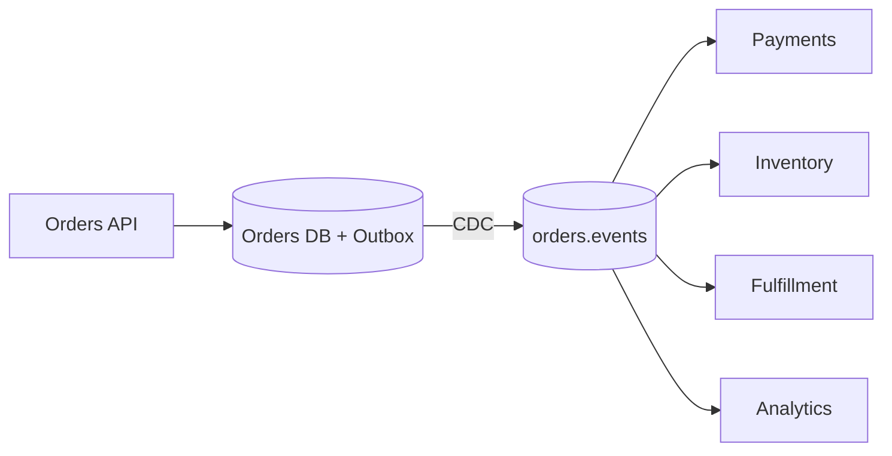

## Overview
These concise case studies show how to apply messaging and streaming concepts in production: sizing partitions, choosing delivery semantics, applying idempotency, and planning operations.

## What, Why, When (and when-not)
What
- Practical end-to-end designs for common domains: e‑commerce orders, CDC pipelines, IoT telemetry, and search indexing.

Why
- Concrete numbers and deployment details make trade-offs tangible and reusable.

When
- Use these patterns as starting points for design docs, SLOs, and capacity plans.

When-not
- Don’t cargo-cult numbers; redo capacity math for your workloads and SLOs.

## Case Study A — E‑commerce Orders: Outbox + Log + Idempotent Sinks
Scenario
- Orders service (OLTP) needs to notify payments, inventory, and fulfillment. Requires replay for recovery and analytics.

Architecture
- Outbox pattern in orders DB; CDC to Kafka topic orders.events (key=order_id). Consumers: payments, inventory, fulfillment, and analytics.

Quantitative example
- Peak 5k orders/s; avg event 1.2 KB.
- Throughput ≈ 6 MB/s; with RF=3 and ~10% index → ~19.8 MB/s write.
- Consumer threads: if 2k msgs/s/thread → ceil(5k/2k)=3 threads per group; with 12 partitions → headroom for bursts.

Operational notes
- Producer: acks=all, min.insync.replicas=2 for no-loss. Compaction disabled (events are immutable). Retention 14 days for replay.
- Consumers: idempotent upserts (order_id, version); DLQ for schema errors; replay runbook defined.

Edge cases
- Hot sellers cause per-key bursts; use sticky partitioning and small producer linger/batch to smooth.

## Case Study B — CDC → Search Indexing (Materialized View)
Scenario
- Product catalog changes must reflect in search with < 1 minute freshness and safe reindex after schema changes.

Architecture
- Logical CDC from Postgres to Kafka topic catalog.cdc (key=product_id). A consumer materializes documents into search index with idempotent upsert and version checks.

Quantitative example
- 50M products; steady 1k updates/s; occasional 10x spikes during imports.
- Consumer capacity 5k msgs/s/thread → 1 active thread per 5 partitions at steady-state; provision 20 partitions for spikes and parallel reindex.

Operational notes
- Retry tiers: 1m, 10m, 30m with DLQ after 5 attempts. Schema registry enforces backward compatibility; reindex procedure drains DLQ after fixes.

Edge cases
- Deleted products: emit tombstones; search consumer deletes docs. Validate idempotency on deletes.

## Case Study C — IoT Telemetry: Managed Streaming + Tiered Storage
Scenario
- Millions of devices send telemetry; needs real-time alerts and 30-day replay for investigations. Minimal ops team.

Architecture
- Cloud Pub/Sub (or Kinesis) with ordering keys per device_id. Alerts pipeline consumes and triggers rules; batch ETL loads data into a warehouse.

Quantitative example
- 200k devices × 1 msg/s × 500 B ≈ 100 MB/s. Pub/Sub partitions scale automatically; Kinesis would need ~100 shards (1 MB/s write per shard) with headroom.

Operational notes
- Exactly-once to alerts sink via idempotent upserts; batch to warehouse via Dataflow/Firehose. Per-subscription retention 7 days; cold data in object storage.

Edge cases
- Device clock skew: use event-time windows with allowed lateness. Large payloads: upload blobs to object storage and send pointers.

## Case Study D — Search Indexing from Event Log (Fan-out)
Scenario
- Social app emits activity events (likes, posts, follows). Needs timelines, notifications, and search indexing.

Architecture
- Single append-only log activities (key=user_id). Multiple groups: timelines (stateful processor → Redis), notifications (queue workers), search (Elasticsearch indexer), analytics (warehouse).

Quantitative example
- 40k events/s, 1 KB → 40 MB/s; RF=3 → ~120 MB/s cluster write. 24 partitions sized for 2k msgs/s/thread with 2× headroom.

Operational notes
- Compaction disabled; 14-day retention; tier old segments to object storage. Consumers keep independent offsets; lag SLOs per group.

Edge cases
- Hot users create skew; salt on hot keys for search indexer; for timelines, local-first aggregation with periodic global merges.

## Interactions with adjacent topics
- See [Databases & Storage](../06-databases-and-storage/) for CDC and materialized views.
- See [Rate Limiting & Backpressure](../08-rate-limiting-and-backpressure/) for retry pressure control.
- See [Consistency & CAP](../05-consistency-and-cap/) for ordering and idempotency techniques.

## Production checklist
- Define per-pipeline SLOs (freshness, loss tolerance) and delivery semantics.
- Compute partition/shard counts and consumer group sizes with ≥25% headroom.
- Enforce idempotent sinks and DLQ/retry policies; document replay.
- Establish dashboards for lag, throughput, p99 latencies, DLQ rate; rehearse runbooks.

## Interview framing checklist
- How would you apply the outbox pattern to orders and guarantee no-double-charging in payments?
- How do you size partitions and threads for a 100 MB/s telemetry pipeline with 60s freshness SLO?

## References
- Outbox pattern, Debezium CDC docs; Kafka/Pulsar ops guides; Cloud Pub/Sub and Kinesis limits; Elasticsearch indexing best practices
