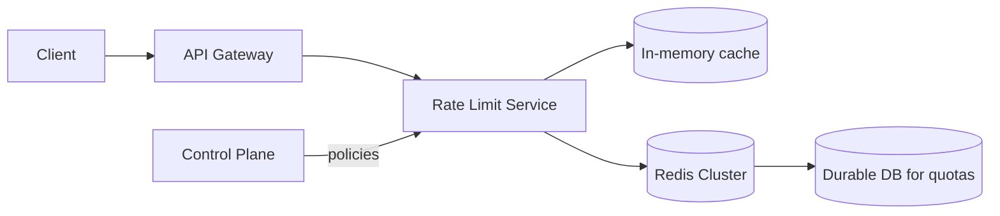

## Overview
At scale, rate limits must be enforced across many instances and regions. Distributed enforcement balances accuracy, latency, and resilience while avoiding hot keys and single points of failure.

## What, Why, When (and when-not)
What
- Architectures to share limiter state across instances: centralized stores (e.g., Redis), dedicated rate-limit services, or decentralized/local with periodic reconciliation.

Why
- Maintain global fairness and consistent enforcement for a key observed on multiple edges or app pods; prevent per-instance bypass.

When
- Multi-instance/API gateway deployments; multi-AZ/multi-region front doors; shared keys (tenant, IP) seen by many ingress nodes.

When-not
- Single instance or sticky routing where a key hashes to one pod and local limits suffice.

## Core concepts and variants
- Centralized store
  - Redis/KeyDB/Memcache: atomic incr/decr + TTL or Lua scripts for token bucket/GCRA.
  - Strong DB (Spanner/Dynamo with transactions): durable quotas and long-window accounting.
- Dedicated rate-limit service
  - Stateless proxies query a tiered RL service (L1 in-memory, L2 Redis, L3 DB) via gRPC for admits; pushes policies via control plane.
- Decentralized/local-first
  - Each instance enforces local limits; eventual convergence via CRDT-like counters or periodic reconciliation; good for high QPS, weaker global accuracy.
- Sharding and routing
  - Hash key→shard; consistent hashing to balance and minimize churn; co-locate shards with ingress nodes to cut latency.

## Design decisions and trade-offs
- Latency vs accuracy: local-first is fastest but risks over-admit under skew; centralized is accurate but adds network RTT and a dependency.
- Hot keys: large tenants can hotspot a shard; mitigate with sub-keying (tenant+endpoint), key-splitting (virtual shards), or weighted routing.
- Durability: Redis is fast but volatile; add AOF/RDB or persistent DB for quotas and audits.
- Multi-region: choose active-active with per-region budgets and spillover, or region-local enforcement with geo affinity.

## Algorithms and policies (conceptual)
- Redis Lua token bucket: atomic read/refill/consume in a script; set TTL to auto-expire idle keys.
- Sharded GCRA: route to owning shard by hash(key); store TAT per key; edge caches last decision for a short TTL to reduce calls.
- Token reservation: prefetch tokens to edge (lease N tokens for Δt) then reconcile; reduces chattiness at slight over-admit risk.

## Architecture and components
Mermaid: tiered rate limit service

## Operational considerations
- Capacity plan Redis/DB for peak QPS of check calls; enable pipelining/batching and connection pooling.
- Circuit breaking and fallback: on store failure, fall back to local approximate limits for safety-critical paths (fail closed) or fail open for low-risk.
- Observe p50/p95 decision latency; keep under a few ms at the edge. Track key cardinality and memory usage.

## Examples
Example A (quantitative): Hot-key split
- Tenant X peaks at 20k rps; single key causes 10% shard CPU. Split into 10 virtual keys X#0..X#9 with consistent sub-hash; aggregate admits still cap at X’s budget while smoothing shard load.

Example B (architectural): Token leasing to the edge
- Edge leases 500 tokens for tenant T for 1s from Redis. For each admit, edge decrements local counter; on lease expiry or low-watermark, refreshes. Short Redis outage causes only temporary over-admit bounded by lease size.

## Edge cases and anti-patterns
- Non-atomic multi-key updates across hierarchy lead to over-charging or under-enforcement; use transactions/Lua or compensate.
- Region-agnostic global counters increase cross-region latency and fragility; prefer region-local budgets with spillover.

## Interactions with adjacent topics
- [Fairness & Quotas](./02-fairness-scoping-and-quotas.md): storage strategy influences how you enforce hierarchies and long-window quotas.
- [Operations](./07-operations-observability-and-runbooks.md): monitor store health, decision latency, and hot key distributions.

## Production checklist
- Choose enforcement architecture (centralized, dedicated service, or local-first with reconciliation).
- Implement sharding and hot-key mitigation; size connection pools and enable pipelining.
- Define fallback behavior per risk class; test failover and partition scenarios.

## Interview framing checklist
- How would you design a globally consistent per-tenant limiter at 1M rps? What’s the fallback plan if Redis is down?
- How do you handle a single hot tenant without impacting others?

## References
- Envoy rate limit service (RLS) API; Redis Lua scripts for token buckets; Consistent hashing patterns
