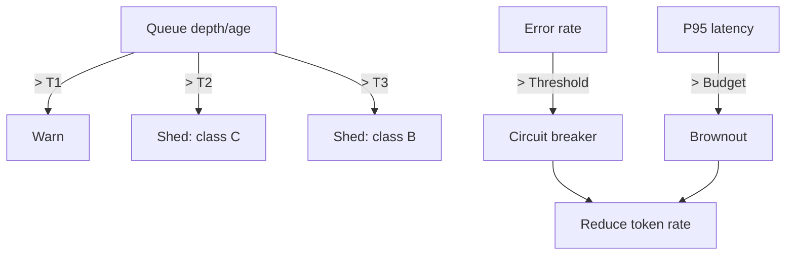

## Overview
Backpressure tells upstream components to slow down or stop sending work when a service or dependency is saturated. Load shedding intentionally drops lower-value work to protect critical traffic and latency SLOs.

## What, Why, When (and when-not)
What
- Signals (HTTP 429, gRPC UNAVAILABLE, Retry-After), implicit signals (increasing queue time), and automated policies (shed, brownout, breaker) that align incoming load with effective capacity.

Why
- Prevent queue buildup, timeouts, and cascading failures; keep critical user flows within latency budgets; avoid retry storms.

When
- Any fan-in service, dependency under variable load (DB, cache, third-party API), or streaming consumer that can fall behind.

When-not
- In batch-only systems where temporary lag is acceptable and SLOs do not require aggressive shedding.

## Core concepts and variants
- Signals: 429 with Retry-After, gRPC status, queue depth and age, in-flight count, CPU/CPU steal, GC pressure.
- Shedding policy: drop class C first (e.g., background), then B, never A (critical). Bypass health/auth.
- Brownout: degrade optional features (e.g., recommendations) to reduce dependency calls at high load.
- Circuit breaker: open on high error/latency; integrate with limiter to stop new calls while allowing probes.

## Design decisions and trade-offs
- Hard-fail vs slow-down: 429 is immediate and safe but may trigger retries; dynamic throttling (token accrual reduction) smooths but is slower to effect.
- Central vs local signals: central controller sees systemwide state but adds latency; local control is fast but can be myopic.
- Shed granularity: class-based is simple; per-endpoint/per-tenant offers precision at cost of policy complexity.

## Algorithms and policies (conceptual)
- Queue-time admission: admit only if projected queue wait < budget; else 429.
- Multi-threshold shedding: T1 warn; T2 shed class C; T3 shed class B; T4 brownout on; T5 breaker open.
- Token rate adaptation: decrease token accrual when P95 latency exceeds budget; increase when healthy (AIMD-like).

Mermaid: overload control policy

## Operational considerations
- Define measurable budgets: max queue age, max in-flight, P95/P99 latency. Tie thresholds to autoscaling policies.
- Prefer jittered health probes to avoid synchronization when reopening breakers.
- Make Retry-After meaningful (seconds or HTTP-date) and publish client guidance.

## Examples
Example A (quantitative): Queue-time admission
- SLO: P95 end-to-end ≤ 200 ms. Service processing time p95 = 120 ms, network = 30 ms budget, leaves 50 ms for queue wait.
- If Little’s Law estimates queue wait > 50 ms (e.g., queue_depth/inflow_rate), return 429 immediately with Retry-After = 0.2–0.5s.

Example B (architectural): Brownout to protect a database
- Under high load, disable non-critical joins (recommendations) and serve cached placeholders. DB QPS drops 25%; critical checkout path stays within SLO while non-critical UX degrades gracefully.

## Edge cases and anti-patterns
- Shedding without telemetry makes incidents opaque; always log dropped class and reason.
- Opening breakers on transient spikes without hysteresis causes flapping; add cooldowns and rolling windows.

## Interactions with adjacent topics
- [Retries & Idempotency](./05-retries-idempotency-and-client-behavior.md): define client backoff on 429/breaker open.
- [Concurrency Limits](./06-concurrency-limits-queues-and-admission-control.md): cap in-flight work to avoid queuing collapse.

## Production checklist
- Establish class map and shedding order; bypass health/auth.
- Define thresholds and hysteresis; wire into alerting.
- Emit Retry-After consistently and document client backoff behavior.

## Interview framing checklist
- How do you prevent cascading failures when a core DB slows down?
- When would you choose brownout versus hard shedding?

## References
- Google SRE “Overload” and brownout patterns; Netflix Hystrix/Circuit Breaker patterns; RFC 6585/9110 Retry-After
