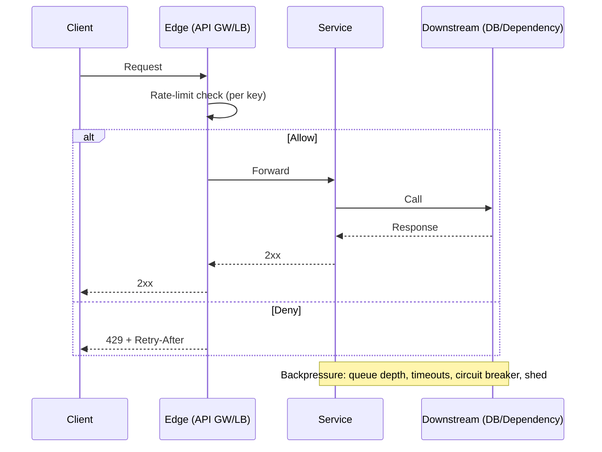

# Rate Limiting & Backpressure

## Overview
Rate limiting constrains how fast clients or components can make requests; backpressure communicates when a downstream cannot keep up. Together, they protect latency SLOs, prevent overload cascades, and ensure fair usage across tenants and endpoints.

## What, Why, When (and when-not)
What
- Rate limiting: policy that caps request admits over time (rate r and optional burst b) per key (tenant, token, endpoint, IP, user, etc.).
- Backpressure: signals (e.g., HTTP 429, gRPC UNAVAILABLE, queue depth) and mechanisms (shed, pause, slow-start) that propagate capacity constraints upstream.

Why
- Protect critical paths and shared resources from overload; maintain tail latency; isolate noisy neighbors; enforce contracts/SLOs; reduce retry storms.

When
- Any shared service with external or multi-tenant access; fan-in services; downstreams with bounded concurrency/IO; streaming consumers with variable workloads.

When-not
- Tiny internal tools without fan-in or blast radius; ultra-low-latency in-process operations where limits would dominate cost (prefer concurrency bounds only).

## Core concepts and variants
- Keys and scopes: per-tenant, per-user, per-IP, per-endpoint/method, global, hierarchical (tenant→endpoint), and composite (tenant+region).
- Rate models: fixed window, sliding window, token bucket, leaky bucket, Generalized Cell Rate Algorithm (GCRA/credit-based).
- Units: requests/sec, requests/min, bytes/sec (bandwidth), tokens for expensive ops, concurrency limits (permits) vs throughput limits (rate).
- Fairness: weighted shares per tenant; priority tiers (gold/silver/bronze); isolation pools; admission control vs preemption.
- Enforcement locus: client-side, edge (CDN/LB/API GW), service-side (middleware), distributed cache (Redis/Memcache), or fully decentralized per-shard.
- State form: exact counters, approximate structures (Count-Min Sketch, Bloom filters for uniqueness), monotonic clocks vs event time.

## Design decisions and trade-offs
- Accuracy vs cost: fixed/sliding windows are simple but bursty; token bucket smooths with controlled burst; GCRA offers precise spacing with low state. Higher accuracy often means higher per-request CPU and state churn.
- Centralized vs decentralized: centralized (e.g., Redis) eases global fairness but adds latency and a single dependency; decentralized scales and reduces latency but complicates global fairness and idempotency.
- Per-tenant vs per-endpoint: tenant-wide prevents total abuse but may starve critical endpoints; endpoint-scoped ensures critical-path protection but needs more keys and storage.
- Throughput vs concurrency: rate limits bound volume; concurrency/semaphore bounds protect immediate resources (threads, DB connections). Most systems need both.
- Backpressure style: hard fail (429) protects downstreams but shifts load/retries; soft backoff (retry-after, jitter, token introspection) reduces thrash at cost of slower recovery.

## Algorithms and policies (conceptual)
- Fixed window: count requests in [t, t+W). Simple; suffers from boundary effects (bursty at edges).
- Sliding window: maintain recent events (or counter buckets) over a moving window; smoother but heavier state.
- Token bucket (rate r, burst b): tokens accrue at r up to capacity b; a request consumes tokens, admits only if available. Allows short bursts while capping long-term rate.
- Leaky bucket: queue with constant drain rate; enforces steady egress; overflow drops.
- GCRA (credit-based): track theoretical arrival time (TAT); admit if now >= TAT - τ where τ encodes burst tolerance. Minimal state per key, precise spacing.
- Concurrency limiter: N permits (e.g., semaphore); in-flight admission only; pairs well with rate limit to cap both depth and width.

Pseudocode: token bucket (≤ 20 lines)
```pseudo
state: tokens, last_ts
params: rate_r (tokens/sec), burst_b (capacity)
function admit(now, cost=1):
  # Refill
  elapsed = max(0, now - last_ts)
  tokens = min(burst_b, tokens + elapsed * rate_r)
  last_ts = now
  if tokens >= cost:
    tokens -= cost
    return ALLOW
  return DENY  # caller may queue or 429
```

## Architecture and components
- Edge/Ingress: API gateway, Envoy/Nginx/LB plugins for coarse-grained, high-QPS enforcement; optionally with per-tenant keys and headers.
- Limiter store: centralized counters (Redis, DynamoDB, Spanner) with atomic ops/LUA; or in-memory + probabilistic sync across instances; or per-shard local limits.
- Control plane: policy distribution, key derivation rules, quotas per plan, runtime overrides, hot config.
- Telemetry: per-key admits/denies, saturation, queue depth, retry-after, downstream capacity metrics.

Mermaid: request flow with admission control and backpressure


### Subpages and deep dives
- [Models and Algorithms](./01-models-and-algorithms.md)
- [Fairness, Scoping, and Quotas](./02-fairness-scoping-and-quotas.md)
- [Distributed Enforcement and Storage](./03-distributed-enforcement-and-storage.md)
- [Backpressure Signals and Load Shedding](./04-backpressure-signals-and-load-shedding.md)
- [Retries, Idempotency, and Client Behavior](./05-retries-idempotency-and-client-behavior.md)
- [Concurrency Limits, Queues, and Admission Control](./06-concurrency-limits-queues-and-admission-control.md)
- [Operations, Observability, and Runbooks](./07-operations-observability-and-runbooks.md)
- [Selection Guide and Comparisons](./08-selection-guide-and-comparisons.md)
- [Rate Limiting & Backpressure Case Studies](./09-case-studies.md)

## Operational considerations
Capacity and SLOs
- Size r and b from SLOs and downstream capacity. Reserve headroom for retries (typically 20–30%) and burst absorption at the edge.
- Enforce both rate and concurrency: e.g., 100 rps with 200 burst and 200 max in-flight per tenant.

Observability
- Dashboards: per-tenant admits/denies, 429/5xx, queue depth/latency, in-flight, token deficits, limiter store latency/error.
- Alerts: sustained denies > X%, limiter backend errors, queue depth > budget, retry storms (correlated 429→5xx), breaker open rate.

Runbooks
- Hot reduce limits for runaway tenants; apply temporary plan overrides.
- Activate shed policies: drop non-critical classes first; protect health checks and idempotent endpoints.
- Tune retry-after/backoff, enable jitter in clients, cap total retries.
- Fall back to local approximate limits if central store fails; bias toward protecting downstreams (fail closed) for critical paths.

Failure modes
- Limiter backend outage causing unlimited admits; mitigate with local caches and default-deny for high-risk paths.
- Clock skew impacts window-based/GCRA calculations; use monotonic time where possible, or tolerate skew via burst parameter.
- Thundering herd on window boundaries or synchronized retries; add jitter and stagger token accrual.

## Examples
Example A (quantitative): Sizing token bucket for an API tier
- Downstream can sustain 5,000 rps steady with P95 latency budget 100 ms; we target 70% steady utilization (3,500 rps) with 30% headroom.
- Choose per-tenant rate r_tenant = min(plan_cap, 3,500 / active_tenants). For a “Gold” tenant: r = 300 rps.
- Set burst b to absorb 2 seconds of bursts: b = r × 2 = 600 tokens. This allows short spikes to 900 rps for ~0.66s, while keeping long-term ≤ 300 rps.
- If average request cost differs (e.g., writes cost 2 tokens), compute effective r by weighted mix and size b accordingly.

Example B (architectural): Edge + service dual enforcement with Redis
- Edge (Envoy) enforces coarse per-tenant token bucket using a Redis cell filter (centralized). Service enforces fine per-endpoint limits locally (in-memory) with periodic sync.
- Redis outage: edge falls back to last-known quotas with local GCRA; service limits remain active. Circuit breaker opens for a noisy endpoint; non-critical traffic is shed while health checks bypass limits.

## Edge cases and anti-patterns
- Counting 5xx toward tenant rate limits can amplify outages; prefer excluding 5xx from limits but applying global shed to protect the tier.
- Only global limit without tenant isolation leads to noisy-neighbor starvation; always include scoped keys for fairness.
- Unlimited retries on 429 create retry storms; require exponential backoff with jitter and total cap.
- Treating concurrency limits as rate limits: they solve different problems; use both.

## Interactions with adjacent topics
- [Load Balancing](../02-load-balancing/): per-connection/concurrency limits, outlier detection, queueing at LB.
- [Messaging & Streaming](../07-messaging-and-streaming/): consumer backpressure, max in-flight messages, DLQ and retry policies.
- [Availability & Fault Tolerance](../09-availability-and-fault-tolerance/): circuit breakers, shed load, brownout modes.
- [Consistency & CAP](../05-consistency-and-cap/): retries, idempotency keys, session guarantees during throttling.

## Production checklist
- Define keys and scopes (tenant, endpoint) and select algorithms (token bucket/GCRA) per scope.
- Size r and b from downstream capacity with headroom; enforce both rate and concurrency.
- Choose enforcement locus (edge, service, centralized store) and fallback behavior (fail open/closed per path).
- Emit telemetry: admits/denies, queue depth, in-flight, limiter backend latency/errors; alert on sustained denies and retry storms.
- Provide Retry-After headers and publish client backoff/jitter guidance.
- Validate resilience via load tests and “noisy neighbor” game days; document runbooks.

## Interview framing checklist
- How would you design per-tenant fairness and protect critical endpoints under bursty load?
- Token bucket vs leaky bucket vs sliding window—when do you choose each? What about GCRA?
- Where do you enforce limits (edge vs service) and how do you handle limiter store failure?
- How do you propagate backpressure and avoid retry storms?

## References
- RFC 6585 (HTTP 429) and RFC 9110 (Retry-After semantics)
- Envoy rate limit filter and Redis-cell/GCRA references
- Nginx/HAProxy rate limiting docs; Stripe and GitHub API rate limit guides
- “Finite-State Machine of Overload” (Brownout patterns), “Load Shedding” (Netflix/Google SRE)
