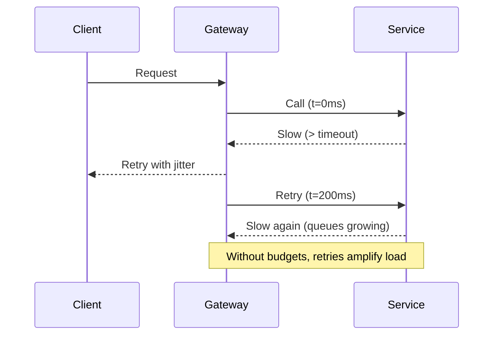

# Failure modes and taxonomy

Know how systems actually fail so you can detect early, contain blast radius, and recover fast.

## What / Why / When
- What: A practical taxonomy of outages: blackouts, brownouts, partial failures, overload, and corruptions.
- Why: Different failure modes require different mitigations (timeouts vs hedging vs fencing vs rollback).
- When: During design reviews, incident postmortems, and SLO definition.

## Core concepts and variants
- Blackout: Hard down. No traffic served (power/network loss, process crash). Detection via health checks.
- Brownout: Service is “up” but degraded (high tail latency, timeouts). Harder to detect; needs percentile SLIs.
- Partial failure: Only some shards/tenants/paths fail (e.g., a single AZ, one partition, one feature flag).
- Overload: Resource exhaustion (CPU, memory, file descriptors, connection pool saturation) leads to queue buildup and timeouts.
- Cascading failure: Upstream retries amplify downstream latency/errors, spreading impact.
- Network partition: Split between components or regions; can trigger CAP trade-offs.
- Data corruption / split-brain: Conflicting writers or stale leaders cause divergence.
- Control-plane failure: DNS, service discovery, feature flagging, CI/CD pipeline outages.

## Design decisions and trade-offs
- “Up/Down” checks vs percentile SLIs: Binary checks miss brownouts; add p95/p99 latency SLIs and success-rate SLIs.
- Global vs cell-based isolation: Global services simplify operations but increase blast radius; cells localize impact.
- Admission control vs queueing: Reject early with clear errors vs deep queues with high tail latencies.
- Retry policies: Prevent retry storms with budgets and jitter; consider token buckets per client or per route.

## Detection patterns (algorithms/policies)
- Multi-window burn-rate alerts: Fast (5m/1h) + slow (1h/6h) windows for error budget.
- Tail-latency alarms: Alert on p99 latency increases with minimum throughput guardrails.
- Outlier detection: Automatically eject statistically bad backends from pools.
- Canary and slow start: Limit exposure of new versions until SLIs stabilize.

## Architecture and components
- Health checking and outlier ejection in L7/L4 LBs.
- Bulkheads: Pool isolation per dependency/tenant.
- Backpressure: Queues with limits, rate limiting, load shedding.
- Safe defaults: Timeouts everywhere, idempotency for retriable ops.

## Examples
Quantitative example (brownout detection)
- Service target: p99 ≤ 300 ms. During incident: median 40 ms, p99 1500 ms, success 99.8%.
- “Uptime” is 99.8%, but UX is bad (timeouts at clients with 1s total budget). Add p99 SLO and per-try timeouts of 200 ms.

Architectural example (partial failure containment)
- One AZ loses connectivity. With cell-based routing plus N+1 headroom per cell, the remaining AZs absorb traffic. Feature-flag optional calls off to keep core paths green.

## Diagram: cascading retries

## Edge cases and anti-patterns
- Health check storms: Aggressive health polling during incidents adds load.
- Infinite queues: Unbounded buffers increase latency then timeouts; set limits and shed load.
- Global feature flags: Single control-plane outage degrades all tenants simultaneously—prefer scoped rollout.

## Interactions with adjacent topics
- Retries, circuit breaking, and hedging: 04-timeouts-retries-circuit-breakers-and-hedging.md
- Backpressure and load shedding: ../08-rate-limiting-and-backpressure/04-backpressure-signals-and-load-shedding.md
- Consistency under partitions: ../05-consistency-and-cap/02-cap-and-pacelc.md

## Production checklist
- Define SLIs for success rate and p95/p99 latency per critical endpoint.
- Implement multi-window error-budget burn alerts.
- Set maximum queue sizes and overload responses (429/503) with Retry-After.
- Enable outlier detection and slow start in load balancers.

## Interview framing checklist
- Differentiate blackout vs brownout; propose detection for each.
- Explain cascading failures via retries; suggest mitigations.
- Discuss cell-based isolation vs global services.

## References
- Google SRE Workbook: Alerting on SLOs and burn-rate
- Envoy/NGINX docs: outlier detection, circuit breaking
- Netflix: cell-based architectures, chaos engineering
