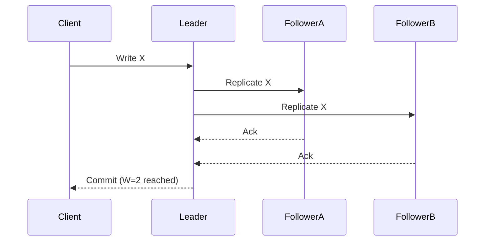

# Redundancy (N+K) and quorums

Design for continued operation when components fail by adding redundancy and, for state, using quorum policies.

## Overview
Redundancy duplicates capacity or state so that a single failure does not cause outage. For stateless compute, N+K keeps extra instances. For stateful systems, replication and quorum reads/writes preserve availability and correctness during failures.

## What / Why / When
- What: N+K redundancy for compute; replication factor (RF) and quorum rules (W, R) for data.
- Why: Minimize single points of failure, maintain service during AZ/node loss, and bound MTTR impact.
- When: Any tier in the critical path, especially stateful stores and gateways.

## Core concepts and variants
- N+1 / N+K: Run K additional instances beyond needed N capacity. Headroom also absorbs failover spikes.
- Fault domains: Place replicas across independent failure domains (racks, AZs, regions).
- Replication factor (RF): Number of copies. Common RF=3 across AZs.
- Quorum rules: R + W > RF prevents stale reads of uncommitted data; W > RF/2 elects a majority for writes.
- Read vs write quorums: Tunable (e.g., W=2,R=1 vs W=1,R=2) depending on write/read criticality.
- Consistency knobs: Strong (majority) vs eventual (async, read-repair/anti-entropy) based on workload.

## Design decisions and trade-offs
- Capacity vs cost: Higher K and RF increase cost. Often K=1 and RF=3 suffice for most tiers.
- Latency vs availability: Majority writes add latency; local leader with async followers is faster but risks RPO.
- AZ vs region placement: Cross-region improves disaster resilience but increases latency and cost.
- Hot vs cold redundancy: Active-active (all serve) vs active-passive (standby). Active-active improves RTO, adds conflict risk.

## Algorithms/policies (conceptual)
- Quorum safety: Choose R and W so R + W > RF.
- Failure budget for capacity: Maintain headroom H ≥ peak_load_after_failover − steady_state_capacity.
- Replica promotion policy: Use fencing tokens/epochs to avoid split-brain on leader change.

## Architecture and components
- Compute: Autoscaled groups with K spares distributed per AZ, health-checked via LBs.
- Storage: Replicated log (Raft/Paxos) or Dynamo-style quorum. Commit/write-ahead logs for durability.
- Routing: Zone-aware load balancing; prefer same-AZ to reduce cross-zone cost until failover.

## Examples
Quantitative example (N+1 headroom)
- Steady RPS: 10k; each instance handles 1k at p99=200ms. N=10. AZ failure removes 1/3 capacity (≈3-4 instances). With N+1 per AZ (e.g., 4+1 per AZ across 3 AZs = 15 total), remaining capacity ≈10 instances → sustained 10k RPS without overload.

Quantitative example (quorum math)
- RF=3. Choose W=2, R=1. Under one node failure, writes still succeed (2/3), and reads succeed from any node. Safety holds since R+W=3>3? Exactly 3. If a second node fails, writes fail, reads may still return stale but consistent with last committed.

Architectural example (zone-aware routing)
- Clients prefer same-AZ backends under normal ops; on AZ failure, LB shifts traffic to healthy AZs using outlier detection and slow start to avoid thundering herds.

## Diagram: RF=3 quorum write

## Operational considerations
- Continuously test instance and AZ failover; verify autoscaling recovers capacity within SLO.
- Monitor quorum failures, leader changes, replication lag, and cross-zone traffic share.
- Capacity planning includes failover spikes and retry overhead.

## Edge cases and anti-patterns
- Correlated failures: Instances on same rack/AZ or same VM host; spread fault domains.
- Misconfigured quorums: R+W ≤ RF risks stale or lost writes.
- Over-optimistic headroom: Forgetting retry amplification during incidents.

## Interactions with adjacent topics
- Quorums and consistency: ../05-consistency-and-cap/03-quorums-and-read-policies.md
- Failover and promotion: ../04-replication/05-failover-promotion-and-fencing.md
- Rate limiting/backpressure to protect during failover: ../08-rate-limiting-and-backpressure/README.md

## Production checklist
- Ensure K≥1 per fault domain and RF≥3 for critical data.
- Validate R+W>RF and configure fencing for leader promotion.
- Practice AZ evacuation drills; instrument replication lag and success rates.

## Interview framing checklist
- Compute availability for N+1 vs N+2; discuss cost/benefit.
- Explain quorum trade-offs (W=2,R=1 vs W=1,R=2) for latency vs safety.
- Describe fencing and why it prevents split-brain.

## References
- Lamport Paxos; Ongaro & Ousterhout Raft
- Amazon Dynamo paper (quorum, vector clocks)
- PostgreSQL, MySQL HA docs (sync/async replicas)
