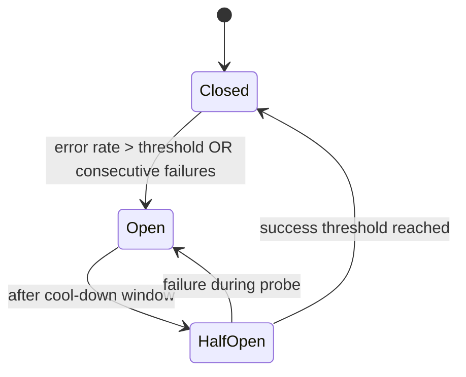

# Timeouts, retries, circuit breakers, and hedging

Protect callers and dependencies from cascading failures with disciplined client-side policies.

## What / Why / When
- What: Controls to bound latency, cap retry amplification, shed load, and quarantine unhealthy backends.
- Why: Most production incidents are amplified by bad client behavior (infinite waits, retry storms). These controls limit blast radius.
- When: For every remote call (service-to-service, DB, cache, external APIs). Defaults should be on, tuned per route.

## Core concepts and variants
- Timeouts: Always set both per-try and overall time budgets. Keep per-try < overall to leave room for limited retries.
- Retries with budgets: Limit retries as a fraction of original RPS (e.g., ≤10%) and add exponential backoff with jitter.
- Idempotency: Safe retries require idempotent operations or idempotency keys (for at-least-once semantics).
- Circuit breakers: Open when error rate/timeouts exceed thresholds; half-open to probe recovery; close on sustained success.
- Hedging: Issue a limited second attempt to a different backend when a request is unusually slow; count against budgets.
- Pool isolation: Separate connection/concurrency pools per dependency to avoid head-of-line blocking across services.

## Design decisions and trade-offs
- Aggressive timeouts vs success rate: Short timeouts protect tail latency but may drop success under transient jitter. Tune per endpoint.
- Retry count vs backoff: More retries help transient errors but risk overload; prefer 1–2 retries max with jitter and budgets.
- Hedging benefits vs cost: Improves tail latency for long-tail distributions but can double load; hedge only beyond p95 with tokens.
- Per-route vs global policy: Per-route configs provide precision; maintain sane global caps to avoid misconfig.

## Algorithms/policies (conceptual)
Retry policy with per-try timeout, exponential backoff, jitter, and global retry budget:
```pseudo
max_overall = 500ms
per_try = 150ms
max_retries = 1
jitter = [0, 50]ms
retry_budget = 0.10 * incoming_rps  # tokens per second

def call_with_retry(req):
  start = now()
  for attempt in range(0, max_retries + 1):
    if attempt > 0:
      if !budget.try_consume():
        break
      sleep(backoff(attempt) + random(jitter))
    resp = upstream.call(req, timeout=per_try)
    if resp.success:
      return resp
    if now() - start > max_overall:
      break
  return failure(timeout_or_last_error)
```

Circuit breaker state machine:


Hedging guardrails:
- Only hedge after a percentile threshold (e.g., p95) and when pool utilization < X%.
- Send hedged request to a different backend/zone; cancel the slower response.
- Charge hedges to a separate small token bucket.

## Architecture and components
- Gateways/LBs: Implement per-route timeouts, retry budgets, outlier ejection, and circuit breaking (e.g., Envoy/NGINX).
- Clients/SDKs: Provide safe defaults; expose per-endpoint overrides.
- Observability: Emit attempt_count, budget_tokens, breaker_state, and per-try latency histograms.

## Examples
Quantitative example (retry amplification)
- Baseline: 5% transient errors at 10k RPS. With 1 retry on all failures, extra load ≈ 0.05 × 10k = 500 RPS, total 10.5k RPS.
- If incident raises failures to 30%, extra load becomes 3k RPS (total 13k), potentially tipping the system. Mitigation: retry budget 10% (cap at +1k RPS) and backoff.

Architectural example (per-route policies)
- Checkout service calls: inventory (strict p99), payment (idempotency keys), recommendations (optional).
- Configure: inventory (per-try 100ms, 1 retry, breaker on p99>200ms); payment (per-try 300ms, 1 retry, idempotency-key header); recommendations (per-try 80ms, no retries, fallback cache).

## Operational considerations
- Slow start after instance recovery to avoid overload on cold caches.
- Outlier detection to temporarily eject flapping instances.
- Canary + auto-rollback when error rate spikes or breaker opens abnormally.

## Edge cases and anti-patterns
- Global retries without budgets → cascading failures.
- Missing idempotency on payment/order writes → duplicates on retries.
- Per-try timeout ≥ overall timeout → no room to retry.

## Interactions with adjacent topics
- Load balancer resilience: ../02-load-balancing/03-health-and-resilience.md
- Messaging delivery semantics and retries: ../07-messaging-and-streaming/04-delivery-semantics-retries-and-dlq.md
- Backpressure and load shedding: ../08-rate-limiting-and-backpressure/04-backpressure-signals-and-load-shedding.md

## Production checklist
- Set per-try and overall timeouts for every remote call.
- Enforce retry budgets with jittered backoff; default ≤1 retry.
- Implement circuit breakers with sensible thresholds and cool-downs.
- Add idempotency keys or make operations idempotent where retried.
- Expose breaker state and retry metrics; alert on abnormal patterns.

## Interview framing checklist
- Propose safe defaults for timeouts/retries per endpoint.
- Explain circuit breaker states and when to trip/open.
- Discuss hedging triggers and guardrails.

## References
- Nygard, Release It! (circuit breakers, bulkheads)
- Envoy and NGINX docs (timeouts, retries, outlier detection)
- Google SRE (latency budgets, error budgets)
