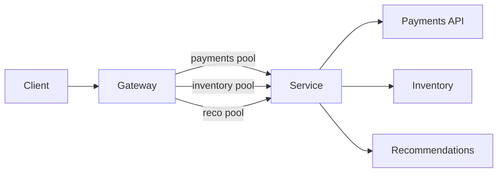

# Bulkheads, graceful degradation, and SLOs

Design to contain incidents and preserve core functionality under stress, guided by measurable service objectives.

## What / Why / When
- What: Bulkheads isolate resources to limit blast radius; graceful degradation preserves critical paths when optional features fail; SLOs and error budgets align engineering priorities with user expectations.
- Why: Most incidents are amplified by shared pools and all-or-nothing UX. Isolation and fallbacks keep the business running while SREs remediate.
- When: From the first production launch; retrofit during incident-driven hardening.

## Core concepts and variants
- Bulkheads: Partition concurrency/threads/connection pools by dependency, tenant, or feature path. Prevents a noisy neighbor from starving others.
- Graceful degradation: Disable or approximate non-critical features (e.g., recommendations, personalization, secondary analytics) while core flows continue.
- Fallbacks: Stale cache, static defaults, last-known-good data, UI skeletons.
- Error budgets: Monthly allowance of SLO violations; governs risk (releases, experiments) vs reliability work.
- SLO/SLI: Define user-centric targets (success rate, p95/p99 latency) and measure precisely.

## Design decisions and trade-offs
- Coarse vs fine isolation: Per-service pools are simple; per-endpoint or per-tenant pools better contain blast radius at higher complexity.
- Degrade vs fail fast: Returning partial results keeps UX responsive but can hide systemic issues; ensure clear telemetry and user messaging.
- Budget policy strictness: Aggressive freezes improve reliability but slow feature velocity; adjust by product criticality.

## Algorithms/policies (conceptual)
Concurrency bulkhead with fair sharing and shed on overload:
```pseudo
pools = {
  "payments": semaphore(50),
  "inventory": semaphore(100),
  "reco": semaphore(20)
}

def call(name, fn):
  if !pools[name].try_acquire(timeout=5ms):
    return fail(503, "bulkhead_shed")
  try:
    return fn()
  finally:
    pools[name].release()
```

Error budget multi-window alerting (example thresholds):
- Fast burn: (5m/1h) consumption > 2x budget/hour → page on-call.
- Slow burn: (1h/6h) consumption > 1x budget/hour → high-priority ticket.

## Architecture and components
- Gateway: Per-route concurrency/connection limits; outlier ejection and circuit breaking.
- Service: Thread/concurrency pools per dependency; queue limits; prioritized work queues.
- UI: Feature flags to hide optional components quickly; user messaging for degraded state.
- Observability: Separate SLIs per critical endpoint and per degraded-mode.

## Examples
Quantitative example (pool sizing)
- Baseline: payment calls p95=150 ms, steady 500 RPS. Concurrency ≈ RPS × latency = 500 × 0.15 = 75. With spikes 2×, target pool ~ 150 with 20% headroom → 180. Split across 3 instances → 60 per instance.

Architectural example (feature fallback)
- Recommendations timeout or return 5xx. The page renders without them and uses a cached bestseller list. A banner notes “Some features temporarily unavailable.” Core checkout remains within SLO.

## Diagram: bulkhead isolation


## Operational considerations
- Establish “degraded modes” with explicit toggles and runbooks.
- Track percent-of-traffic in degraded mode; alert if sustained beyond threshold.
- Tie release rollouts to budget burn; auto-pause on breach.

## Edge cases and anti-patterns
- Shared global thread pools: One slow dependency stalls all endpoints.
- Silent degradation: Hiding failures without telemetry hinders incident response.
- Overly strict budgets on non-critical features: Unnecessarily slow delivery.

## Interactions with adjacent topics
- Timeouts/retries/breakers: 04-timeouts-retries-circuit-breakers-and-hedging.md
- Observability and error budgets: ../11-observability/README.md (see SLOs)
- Load shedding and backpressure: ../08-rate-limiting-and-backpressure/04-backpressure-signals-and-load-shedding.md

## Production checklist
- Define degraded modes and their activation criteria per endpoint.
- Implement per-dependency concurrency limits with queue caps.
- Instrument SLIs for normal vs degraded mode; create burn-rate alerts.
- Document user-visible behavior under degradation; add feature flags.

## Interview framing checklist
- Propose bulkhead boundaries for a service with 3 dependencies.
- Define degraded behavior for optional features and communicate UX.
- Explain error budgets and release gating.

## References
- Google SRE (SLOs and error budgets)
- Nygard, Release It! (bulkheads, stability patterns)
- AWS Well-Architected Reliability Pillar
