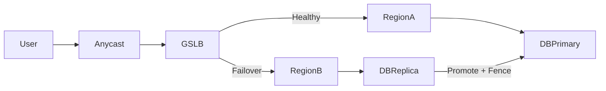

# Failover, promotion, and disaster recovery

Keep services available across instance, zone, region, and provider failures. Design promotion safely and set realistic RTO/RPO.

## What / Why / When
- What: Techniques to move traffic away from failed components (failover), elect/advance leaders (promotion), and survive regional disasters (DR).
- Why: Most downtime is repair time. Fast, safe failover plus practiced runbooks minimizes MTTR and overall error-budget burn.
- When: Any tier serving critical user flows, especially stateful systems and global-facing endpoints.

## Core concepts and variants
- Scope of failover: Instance → node → AZ/zone → region → provider. Broader scope increases complexity and recovery time.
- RTO/RPO: Recovery Time Objective (how quickly you recover) and Recovery Point Objective (tolerable data loss).
- Active-active vs active-passive: Active-active routes production traffic to multiple sites; active-passive keeps a warm/cold standby.
- Promotion and fencing: On leader loss, promote a follower and fence off the old leader to prevent split-brain.
- DR tiers: Backup/restore (cold), warm standby (async replicas), hot standby/active-active (sync or near-sync).

## Design decisions and trade-offs
- Active-active (low RTO, potentially 0) vs active-passive (higher RTO, simpler, cheaper).
- Synchronous vs asynchronous replication: Sync lowers RPO but raises write latency and coupling.
- DNS/GSLB vs Anycast vs L7 failover: DNS is coarse and cached; L7 is fast and granular but requires global control-plane resilience.
- Configuration and state drift: Keep infra declarative and rehearse cutovers to avoid surprises.

## Algorithms/policies (conceptual)
Leader promotion with fencing tokens:
```pseudo
epoch = kv.get("cluster_epoch")
candidate = self.id
if kv.compare_and_swap("leader", old=null, new=candidate, cond=epoch==kv.get("cluster_epoch")):
  kv.put("fence_token", epoch+1)
  start_leadership(epoch+1)
else:
  standby()
```

Failover policy levels:
- Instance: replace pod/VM; slow start; rejoin pools after N healthy checks.
- AZ: shift traffic using zone-aware LB; autoscale to absorb load.
- Region: GSLB or DNS weight to healthy region; ensure capacity headroom and config parity.

## Architecture and components
- Routing layer: Health-aware GSLB/DNS with low TTL; L7 gateways with outlier ejection, slow start.
- Control plane: Highly available service discovery and config distribution.
- Data plane: Replicated storage with clear promotion protocol and fencing (e.g., Raft leader election; database failover tooling).
- Backups: Versioned, encrypted, tested restores; PITR for databases.

## Examples
Quantitative example (RTO capacity planning)
- Normal: Region A handles 100% traffic at 60% utilization; Region B handles 0% (active-passive warm).
- Target RTO: 5 minutes. Region B must scale from 0% to ≥70% within 5 minutes. If autoscaling adds 10 instances/min, and 50 instances are needed, pre-warm 20 instances to meet RTO.

Architectural example (cross-region failover)
- Anycast→regional LB; health checks per region. On Region A blackout, GSLB shifts to Region B. Datastore: primary in A, sync replica in B with automatic promotion using fencing tokens. Write throughput reduced during promotion window; read-only mode optional for some endpoints until promotion completes.

## Diagram: region failover flow


## Operational considerations
- Runbooks: Document per-scope steps (instance/AZ/region) with decision trees and rollback.
- Game days: Rehearse AZ evacuation and regional failover quarterly; measure RTO/RPO achieved.
- Observability: Track promotion latency, replication lag, GSLB decisions, and error rates per region.
- Change control: Freeze risky releases during DR events; audit infra drift.

## Edge cases and anti-patterns
- Split-brain during promotion without fencing → data corruption.
- DNS TTL too high → long tail of users stuck on failed region.
- Configuration drift between regions → failover works but features break.

## Interactions with adjacent topics
- Replication and promotion details: ../04-replication/05-failover-promotion-and-fencing.md
- Quorums and consistency: ../05-consistency-and-cap/03-quorums-and-read-policies.md
- Backpressure and load shedding to protect during failover: ../08-rate-limiting-and-backpressure/README.md

## Production checklist
- Define RTO/RPO and test against them with scheduled drills.
- Ensure fencing during promotion; validate idempotent promotion scripts.
- Keep DNS/GSLB TTLs reasonable (e.g., 30–60s) and cache-busting strategies ready.
- Verify capacity headroom and autoscaling rates for failover loads.
- Test backup restore and PITR regularly; document recovery steps.

## Interview framing checklist
- Propose failover strategy for a 3-AZ region and for cross-region.
- Explain fencing and why it’s required during leader promotion.
- Discuss RTO/RPO trade-offs for sync vs async replication.

## References
- Google SRE (Handling Overload, Emergency Response)
- PostgreSQL/MySQL HA and promotion tooling
- Cloud provider GSLB/DNS and cross-region patterns (AWS/GCP/Azure)
