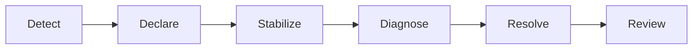

# Operations, observability, error budgets, and chaos

Reliability is an operational property. Define the right signals, automate responses, and continuously rehearse failures.

## What / Why / When
- What: Practical SRE operations for availability—SLIs/SLOs and error budgets, alerting, on-call, incident response, and chaos experiments.
- Why: You can’t improve what you can’t see. Good signals reduce MTTR and prevent alert fatigue; rehearsals keep teams sharp.
- When: From day one in production; evolve as services mature.

## Core concepts and variants
- SLIs: User-centric metrics such as success rate, availability, and latency percentiles per critical endpoint.
- SLOs: Targets for SLIs over a window (e.g., 99.9% success over 30 days).
- Error budgets: Allowed fraction of SLO misses; govern launch velocity vs reliability work.
- Alerting: Budget burn-rate alerts (fast + slow windows), saturation/queue depth, and breaker state changes.
- Blackbox vs whitebox: External probes (synthetic) vs internal metrics/traces/logs.
- Incident response: Roles (incident commander, communications), severities, status pages, postmortems with actions.
- Chaos engineering: Controlled fault injection to validate assumptions and runbooks.

## Design decisions and trade-offs
- Too many vs too few alerts: Page only on actionable, user-impacting conditions; route informational signals to dashboards.
- Percentiles vs averages: Averages hide pain; use p95/p99 across SLIs and dashboards.
- Synthetic probes vs internal: Synthetic catches end-to-end regressions; internal is higher fidelity for diagnosis. Use both.
- Chaos frequency: Frequent small drills vs rare big events. Choose cadence that avoids fatigue but maintains readiness.

## Algorithms/policies (conceptual)
Burn-rate alerting (example thresholds for 99.9% SLO):
```text
Fast burn (5m/1h): page if burn_rate > 14.4x  # empties 30-day budget in ~2h
Slow burn (1h/6h): ticket if burn_rate > 6x   # empties 30-day budget in ~5h
```

Incident lifecycle policy:
1) Detect (SLO burn or synthetic failure) → declare severity & assign roles.
2) Stabilize (roll back, shed load, degrade non-critical features).
3) Diagnose (narrow blast radius with bulkheads, breakers; inspect change diffs).
4) Resolve (permanent fix, gradual restore, observe).
5) Review (blameless postmortem, actions with owners and due dates).

Chaos experiment template:
 - Hypothesis: “If AZ-2 fails, service maintains `p99<400ms` and ≥99.5% success for 10 minutes.”
- Method: Drain AZ-2 via LB, then kill remaining pods in AZ-2; measure SLIs.
- Success: SLOs within bounds; autoscaling kicks in; no retry storm.
- Artifacts: Runbook updates; automation gaps logged.

## Architecture and components
- Telemetry: Metrics (SLIs, resource), traces (critical paths), logs (errors with context), exemplars tying them together.
- Dashboards: Per endpoint and dependency; latency histograms; saturation; breaker states; retry budgets.
- Alerting: Multi-window budget burn; saturation thresholds; anomaly detection for tail-latency.
- Automation: Canary analysis, auto-rollback, safe deploy guards linked to SLOs.

## Examples
Quantitative example (budget math)
- 99.9% SLO over 30 days → 43m 12s budget. If during a deploy p99 spikes and success drops to 98% for 15 minutes, burn ≈ (0.02/0.001) × (15m/30d) ≈ 20× fast burn. Auto-rollback triggers; release freezes for the service for 24h.

Architectural example (observability for retries)
- Add metrics: attempts_total, retries_total, retry_budget_tokens, and per-try latency histograms. During an incident, dashboards show retries hitting the 10% cap, protecting downstreams while breakers open on two dependencies.

## Diagram: incident response flow


## Operational considerations
- Keep runbooks current; link them in alerts. Store ready-to-run commands and rollbacks.
- Rotate on-call fairly; invest in tooling to reduce toil and paging frequency.
- Track MTTD/MTTR and change-failure-rate; use them to prioritize reliability work.

## Edge cases and anti-patterns
- Paging on non-actionable metrics (CPU>80%) → alert fatigue.
- Relying solely on uptime SLIs; brownouts slip through—add p95/p99 SLIs.
- Chaos without guardrails; inject faults only in controlled windows with rollback paths.

## Interactions with adjacent topics
- Error budgets inform release process: ../11-observability/README.md
- Retry/circuit-breaking signals: 04-timeouts-retries-circuit-breakers-and-hedging.md
- Load shedding during incidents: ../08-rate-limiting-and-backpressure/04-backpressure-signals-and-load-shedding.md

## Production checklist
- Define SLIs/SLOs for all critical endpoints; publish error budgets.
- Implement dual-window burn-rate paging and link to runbooks.
- Add synthetic probes for user journeys (login, checkout).
- Schedule chaos drills; record outcomes and actions.

## Interview framing checklist
- Propose SLIs for a read API and a write API.
- Describe burn-rate alert thresholds and why two windows.
- Outline a chaos experiment for AZ failure and expected outcomes.

## References
- Google SRE Book/Workbook (SLIs/SLOs, alerting)
- Principles of Chaos Engineering (Basiri et al.)
- Honeycomb/Lightstep blogs (tracing and exemplars)
