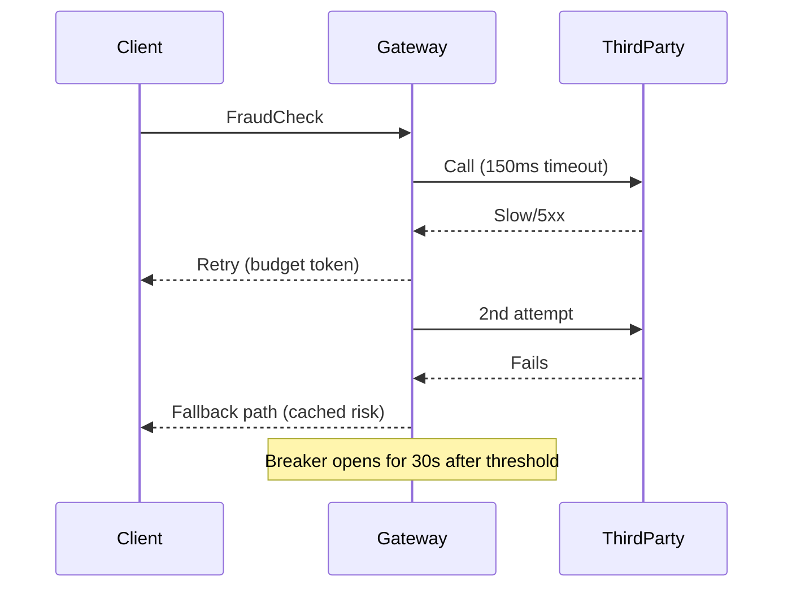

# Case studies

Real-world scenarios combining redundancy, client controls, failover, and operations.

## What / Why / When
- What: Concrete architectures and incidents illustrating availability and fault-tolerance choices.
- Why: Patterns become clearer when applied to real constraints and data.
- When: During design reviews and post-incident learning.

## Case study 1: E-commerce checkout under AZ failure
Context
- Traffic: 12k RPS steady, 20k RPS peak. SLO: 99.9% success, `p99<300ms`.
- Tiers: API (stateless), Payments (stateful primary), Inventory (stateful), Recommendations (optional).

Architecture
- API: N+1 per AZ with 30% headroom; zone-aware LB; per-route timeouts/retries.
- Payments DB: RF=3 across AZs; majority writes; fencing on promotion.
- Inventory: RF=3; read replicas for queries; write quorum W=2.
- Recommendations: Optional; 80ms timeout; no retries; stale cache fallback.

Incident
- AZ-2 loses networking. API reroutes using zone-aware LB + outlier ejection. Headroom absorbs spike; slow start avoids herd.
- Payments leader in AZ-2 fails; follower in AZ-1 promotes with fencing; brief write slowdown; RPO=0 maintained.
- Observability shows retry budget hitting 8%; breakers remain closed. SLOs met; no user-visible outage.

Lessons
- Headroom + zone awareness prevent overload.
- Fencing during promotion avoids split-brain.
- Optional features must degrade cleanly with tight timeouts.

## Case study 2: Third-party API brownout and retry storm
Context
- Service calls a 3rd-party fraud API. Normal error rate 0.5%; p95=200ms; SLO 99.9% success.

Incident
- 3rd-party experiences brownout; `p99>2s`, intermittent 5xx. Our clients had 3 retries, no budget. Queues grew; downstream saturated; cascading failures.

Remediation
- Set per-try=150ms; overall=500ms; max_retries=1; jittered backoff; retry_budget=10%.
- Add circuit breaker (open on consecutive failures or 20% error fraction for 30s) and bulkhead pool limit for fraud calls.
- Provide cached risk score fallback with risk-based UI messaging.

Outcome
- During future brownouts, success dips slightly but system stays within SLO; breaker opens briefly; backlog cleared.

## Case study 3: Regional failover drill and DNS TTL
Context
- Two regions, active-passive; RTO target 5 minutes; DNS-based GSLB with 300s TTL.

Drill
- Simulate Region A outage. GSLB shifts, but long-tail users keep hitting Region A due to DNS caching beyond TTL.

Fixes
- Reduce TTL to 60s; implement negative caching controls; add L7 global gateway layer capable of faster health-based routing.
- Rehearse quarterly; document residual risks.

## Diagram: brownout and breaker interaction

## Production checklist
- Recreate a representative case study for your domain; codify defaults and exceptions.
- Capture SLI/SLO outcomes during drills; update runbooks and configs.

## References
- Public postmortems from cloud providers and large SaaS vendors
- Google SRE Book/Workbook
- Nygard, Release It!
