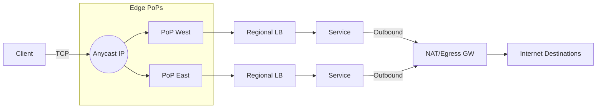

# IP Routing, Anycast, and Egress Control

Overview
IP addressing and routing determine how packets traverse networks; anycast shortens paths by advertising the same IP from multiple locations; egress control shapes what can exit your network and how. Together, they impact latency, resiliency, and security.

What / Why / When
- What: Addressing (CIDR), routing (IGP/BGP), NAT, and policy enforcement at the network boundary. Anycast advertises a single IP from many PoPs so clients reach the nearest instance.
- Why: Achieve low latency, local failover, and predictable exits; constrain data exfiltration; centralize security controls.
- When: Global services, CDNs, public DNS, multi-region APIs, regulated environments with strict egress.

Core concepts and variants
- CIDR and subnets: Aggregation reduces routing table size; VPC/VNet IPAM matters to avoid overlap.
- Routing: IGP (OSPF/IS-IS) inside domains; BGP between ASes; MED/local-pref/AS-path selection.
- Anycast: One IP announced from many edge PoPs; route selection is control-plane driven and path-dependent.
- NAT: SNAT/DNAT; PAT (NAPT) multiplexes many flows behind few public IPs; 5‑tuple uniqueness.
- Egress control: Allow/Deny lists, egress gateways/NAT, private endpoints, TLS inspection (where legal), proxy chains.
- Path MTU Discovery (PMTUD)/PLPMTUD: Avoid fragmentation; blackholes if ICMP is filtered.

Design decisions and trade-offs
- Anycast vs unicast: Anycast gives nearest PoP and quick failover, but can flap during partial outages and complicate stateful sessions without global stores.
- NAT scale: Port exhaustion under high outbound concurrency; prefer many egress IPs or scale-out gateways.
- Centralized vs distributed egress: Central improves audit/control; adds hairpin latency and a single choke point.
- IP overlap: Multi-cloud or B2B peering needs careful IPAM to avoid conflicts.
- MTU: Larger MTU improves throughput but risks blackholes across the Internet path; 1500 is safest common denominator; 1400–1450 typical for tunnels.

Algorithms/policies (conceptual)
NAT port allocation policy:
```
function allocate_snat_port(egress_ip, src):
  # hash for stickiness; random within bucket to spread
  bucket = hash(src.five_tuple) mod PORT_BUCKETS
  return random_free_port(egress_ip, bucket)
```
Egress policy evaluation:
```
allow if dst in allowlist and protocol in {TCP, UDP} and port in approved_ports
else block and log
```

Architecture and components


Operational considerations
- Capacity: BGP session scaling; NAT table size (concurrent connections × timeouts). Monitor ephemeral port usage.
- Failure modes: Path changes from upstreams; asymmetric routing; PMTUD blackholes; SNAT collisions.
- Observability: BGP announcements/withdrawals, NAT utilization, retransmits, RTT distributions by PoP.
- Runbooks: Drain anycast PoP by withdrawing the route; rotate egress IPs; mitigate PMTUD by lowering MSS at edge.
- Security: Egress allowlists, DNS-based policies, TLS SNI classification; avoid TLS interception unless mandated.

Examples
1) Quantitative — NAT port capacity
- With 64k ports per egress IP and 8 egress IPs, theoretical max ~512k concurrent TCP connections. With 20% reserved and 10% TIME_WAIT overhead, safe budget ≈ 512k × 0.7 ≈ 358k concurrent.

2) Architectural — Anycast API front door
- Announce 203.0.113.10 from 20 PoPs. Each PoP has stateless L7 proxies that route to the nearest healthy region. During a regional incident, withdraw region’s BGP advertisements or set lower local-pref so traffic shifts automatically without DNS changes.

Edge cases and anti-patterns
- Single egress IP for all workloads (port exhaustion, noisy neighbor). IP overlap breaking private peering. Filtering ICMP “frag needed” causing PMTUD failures.

Interactions with adjacent topics
- Load balancing: Anycast pairs well with global L7 routing.
- Security & Auth: Egress policies and private endpoints.
- Availability: Fast path shifts via BGP vs DNS TTLs.

Production checklist
- [ ] Documented IPAM; no overlapping CIDRs for peering
- [ ] Sufficient NAT capacity; monitor port exhaustion
- [ ] Anycast withdraw/drain procedures rehearsed
- [ ] MSS clamping configured where tunnels exist
- [ ] Egress allowlists with logging and alerting

Interview framing checklist
- How would you avoid NAT port exhaustion in a high QPS outbound service?
- What are the trade‑offs of anycast for a stateful service?

References
- RFC 4271 (BGP-4), RFC 1519 (CIDR), RFC 4821 (PLPMTUD)
- Cloud NAT/Gateway docs (AWS NAT GW, GCP Cloud NAT, Azure NAT Gateway)
