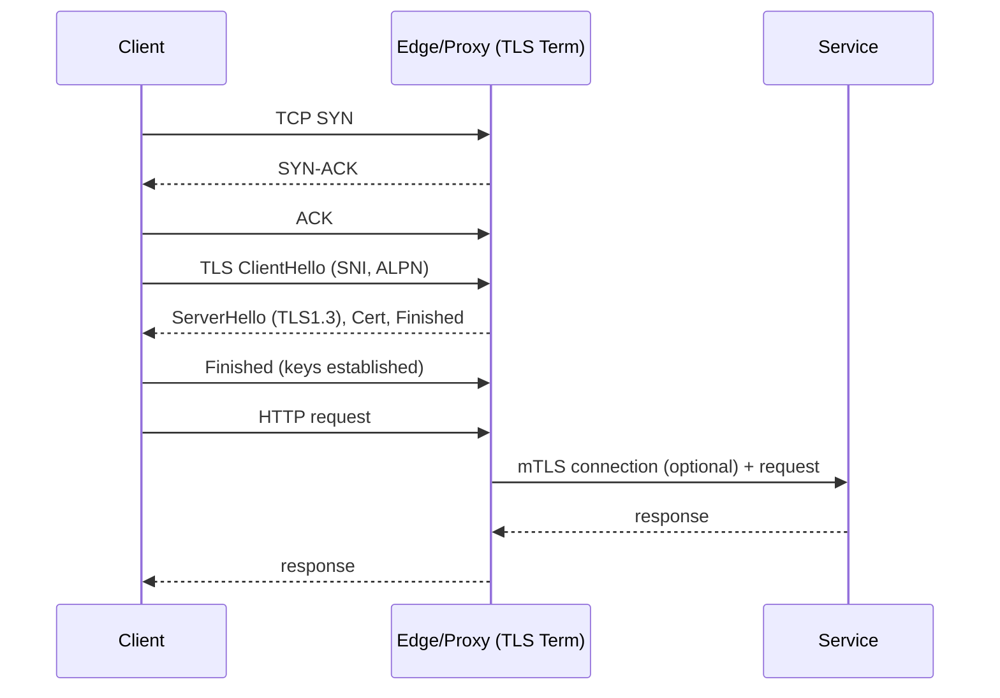

# TLS and Transport Fundamentals (TCP vs QUIC)

Overview
Transport and security layers determine handshake latency, throughput, loss sensitivity, and how connections behave through middleboxes. TLS 1.3 reduced round trips; QUIC moved congestion control and streams into user space over UDP to avoid TCP head‑of‑line (HoL) blocking.

What / Why / When
- What: TCP (3‑way handshake, congestion control), TLS 1.3 (1‑RTT handshake, session resumption, 0‑RTT), QUIC (TLS 1.3 over UDP, multiplexed streams without TCP HoL).
- Why: Improve time‑to‑first‑byte (TTFB), resilience under loss, and mobility (connection migration) while maintaining confidentiality and integrity.
- When: Internet‑facing APIs and UIs (TLS 1.3 baseline). Choose QUIC/HTTP/3 for loss‑prone/mobile networks, or where multiplexing is key under loss.

Core concepts and variants
- TCP basics: SYN/SYN‑ACK/ACK; slow start; congestion control (CUBIC, BBR). Nagle’s algorithm vs TCP_NODELAY; delayed ACKs.
- TLS 1.3: 1‑RTT handshake; 0‑RTT (replay‑prone) for idempotent requests; session tickets and resumption PSKs; SNI and ALPN negotiation.
- QUIC: Encrypted transport with built‑in TLS 1.3; stream‑level flow control; no TCP HoL across streams; connection IDs for migration; loss recovery independent from kernel TCP.
- Path MTU and MSS: Avoid fragmentation; MSS clamping at edges; QUIC amplifies PMTUD issues if ICMP filtered.
- Termination patterns: Edge termination with re‑encryption or passthrough; mTLS for east‑west within mesh.

Design decisions and trade‑offs
- QUIC vs TCP: QUIC improves under loss and supports 0‑RTT, but UDP may be blocked/mapped oddly in legacy networks; server CPU may increase.
- TLS termination at edge: Simplifies certs and offloads CPU, but reduces end‑to‑end visibility unless re‑encrypted; secure trust boundaries carefully.
- 0‑RTT: Great for latency, risky for replay—restrict to GET/Idempotent and protect with anti‑replay windows.
- Cipher suites and PFS: Prefer TLS 1.3 defaults (AEAD + PFS). Avoid legacy.
- Certificate lifecycle: Short‑lived certs + automated rotation reduce risk; require OCSP stapling for better handshake latency.

Algorithms/policies (conceptual)
Latency budget policy for client RPC:
```
ttfb_budget = 300ms
tls_handshake_rtt = rtt_estimate()           # 1 RTT (TLS 1.3)
app_deadline = 500ms
per_try_timeout = min(app_deadline - tls_handshake_rtt, 300ms)
retries = 2 if idempotent else 0
```
MSS clamping heuristic:
```
if tunnels_present: set_mss(min(1450, path_mtu - 50))
else: set_mss(1460)  # for MTU 1500
```

Architecture and components


Operational considerations
- Capacity: TLS/QUIC CPU; enable session resumption and TLS offload where appropriate. Monitor handshake rates.
- Failure modes: SNI/ALPN mismatch -> 421/failed negotiation; cert expiry; PMTUD blackholes; 0‑RTT replayed writes.
- Observability: Handshake counts, resumption ratio, cipher distribution, RTT, loss, retransmits, QUIC stream resets.
- Runbooks: Cert rotation validation; disable 0‑RTT on incident; enforce MSS clamp if blackholes suspected; fallback to HTTP/2 over TLS if HTTP/3 blocked.

Examples
1) Quantitative — Handshake latency impact
- Region RTT=70ms. TLS 1.2 (2‑RTT) adds ~140ms; TLS 1.3 adds ~70ms; with resumption or 0‑RTT, added latency approaches 0–10ms. For a 500ms SLO, TLS 1.3 frees ~70ms budget vs TLS 1.2.

2) Architectural — Edge termination with east‑west mTLS
- Terminate TLS at Envoy at the edge, re‑encrypt to gateway/API mesh with mTLS using SPIFFE IDs. Rotate certs via ACME at edge and mesh CA for east‑west. Use ALPN to negotiate h2/h3 with clients; HTTP/1.1 to legacy backends where necessary.

Edge cases and anti‑patterns
- Allowing 0‑RTT for non‑idempotent operations; leaving legacy ciphers enabled; forgetting OCSP stapling; mixed h2/h3 without consistent alt‑svc adverts.

Interactions with adjacent topics
- Security & Auth: Cert rotation, mTLS policy, key management.
- Availability: Retries and hedging must account for handshake costs.
- Load Balancing: Connection reuse affects LB effectiveness; L7 LBs need ALPN awareness.

Production checklist
- [ ] Enforce TLS 1.2+ (prefer 1.3) with modern ciphers; disable legacy
- [ ] Automate certificate issuance/renewal; enable OCSP stapling
- [ ] Configure ALPN for h2 and h3; provide alt‑svc
- [ ] Consider QUIC for high‑loss/mobile networks; measure CPU impact
- [ ] MSS clamp at edges where tunnels exist; monitor MTU issues

Interview framing checklist
- When would you prefer QUIC/HTTP/3 over TCP/TLS/HTTP/2?
- How do you budget timeouts considering TLS handshake costs?

References
- RFC 8446 (TLS 1.3), RFC 9000/9001 (QUIC), ALPN (RFC 7301)
- IETF BBR drafts, Cloudflare/Google blogs on QUIC performance
