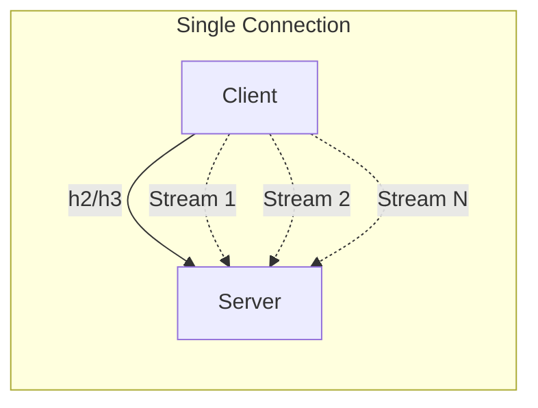

# HTTP/1.1 vs HTTP/2 vs HTTP/3 — Performance and Trade-offs

Overview
HTTP evolved from sequential requests on multiple TCP connections (1.1) to multiplexed streams over one connection (2), and then to multiplexing over QUIC to avoid TCP head‑of‑line (HoL) blocking (3). Choosing the right version affects latency, throughput, connection counts, and behavior under loss.

What / Why / When
- What: Application protocols for request/response over secure transports (TLS/QUIC) with different connection and stream semantics.
- Why: Reduce latency (fewer handshakes, multiplexing), improve loss resilience, simplify connection management.
- When: Default to HTTP/2 for APIs and browsers; enable HTTP/3 where networks are lossy or mobile; retain HTTP/1.1 for legacy/backends.

Core concepts and variants
- HTTP/1.1: Keep‑alive, pipelining (rare in practice), ~6 connections per origin in browsers.
- HTTP/2: One TLS connection, many streams; HPACK header compression; server push (deprecated in most stacks); stream prioritization.
- HTTP/3: Same semantics as HTTP/2 over QUIC; QPACK header compression; avoids TCP HoL between streams.
- Alt‑Svc and Upgrade: Advertise h3 via Alt‑Svc; fallback to h2/h1.
- Prioritization: Modern browsers use simplified schemes; server‑side prioritization may be limited.

Design decisions and trade‑offs
- h2 HoL: Loss on a single TCP connection stalls all streams; mitigations include multiple connections or moving to h3.
- h3 deployability: Some enterprises block UDP/443; need robust fallback.
- Proxies and LBs: Ensure ALPN and stream handling; some proxies downgrade to h1.
- Server push: Often disabled; cache pollution risks; prefer prefetch hints.
- Connection coalescing: h2 can reuse connection across domains with same cert; improves efficiency but complicates routing.

Algorithms/policies (conceptual)
Client pooling for APIs:
```
pool = h2_pool(max_concurrent_streams=100)
function send(req):
  if pool.streams_available():
    return pool.open_stream(req)
  else:
    if pool.can_open_additional_connection():
      pool.open_connection()
    return pool.queue(req)
```
Backoff on h3 failure:
```
if h3_handshake_failures > threshold:
  disable_h3(duration=30m)
```

Architecture and components


Operational considerations
- Capacity: Max concurrent streams, HEADERS compression CPU, memory per stream.
- Failure modes: h2 stream resets; h3 blocked UDP; mis‑prioritization; stale alt‑svc.
- Observability: Version split (h1/h2/h3), stream resets, header sizes, retransmits/loss for h3.
- Runbooks: Disable h3 if middleboxes misbehave; increase stream limits; pin to h1 for legacy backends.

Examples
1) Quantitative — Loss sensitivity
- With 1% packet loss: h2 on one TCP stalls multiplexed streams, TTFB p95 may double; h3 isolates loss to affected streams, reducing tail latency 20–40% in field studies.

2) Architectural — API gateway strategy
- Internet edge supports h2+h3. Gateway talks h2 to services capable of it and falls back to h1 for legacy ones. Connection reuse and stream limits tuned per service. Alt‑Svc configured; dashboards track adoption.

Edge cases and anti‑patterns
- Treating h2 as infinite concurrency (overwhelms server); disabling h1 entirely; enabling server push without measuring cache effects.

Interactions with adjacent topics
- TLS/QUIC: ALPN, cipher selection, handshake costs.
- Load balancing: L7 LBs must understand stream/connection limits.
- Availability: Retry/hedge across streams and connections.

Production checklist
- [ ] Enable h2 everywhere; enable h3 with fallback and monitoring
- [ ] Tune max concurrent streams and flow control windows
- [ ] Configure Alt‑Svc; monitor version adoption and errors
- [ ] Test middlebox compatibility; provide h1 fallback paths

Interview framing checklist
- When would HTTP/3 materially improve user experience?
- How do you avoid HoL blocking on HTTP/2?

References
- RFC 7540 (HTTP/2), RFC 9114 (HTTP/3)
- HPACK/QPACK RFCs, browser vendor performance posts
