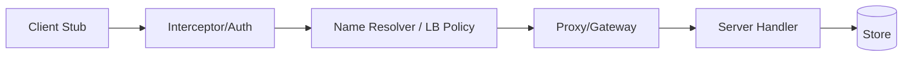

# gRPC and Binary RPC

Overview
gRPC provides schema‑first, high‑performance RPC over HTTP/2 (and increasingly HTTP/3) with support for unary and streaming calls. It standardizes deadlines, cancellations, metadata, and status codes for robust microservice communication.

What / Why / When
- What: Protocol Buffers IDL + codegen + HTTP/2 transport; supports client/server/bidirectional streaming.
- Why: Strong typing, efficient serialization, multiplexing, consistent retries/hedging, cross‑language.
- When: Service‑to‑service communication, high QPS, low latency, or complex contracts; expose REST via gateway when needed.

Core concepts and variants
- Service definitions and messages (proto3); backward‑compatible field evolution.
- Deadlines and cancellations: Propagate time budgets; avoid stuck calls.
- Interceptors/middleware: Auth, metrics, tracing.
- Name resolution and xDS: Service config, LB policy (pick_first, round_robin), retry/hedge settings.
- gRPC‑Web: Browser compatibility via proxy translation.
- Transcoding: REST/JSON gateway mapping to gRPC services.

Design decisions and trade-offs
- Binary vs JSON: Smaller, faster, but less debuggable without tooling.
- Streaming vs unary: Streaming reduces overhead for chat/feeds but complicates backpressure and timeouts.
- Gateways: Add latency and complexity but enable public REST exposure.
- Deadlines: Too aggressive increases errors; too lax harms tail latency and resource usage.

Algorithms/policies (conceptual)
Service config for retries/hedging (conceptual YAML):
```
methodConfig:
  name: [{service: example.Users, method: GetUser}]
  timeout: 300ms
  retryPolicy:
    maxAttempts: 3
    initialBackoff: 50ms
    maxBackoff: 500ms
    backoffMultiplier: 2
    retryableStatusCodes: [UNAVAILABLE, DEADLINE_EXCEEDED]
  hedgingPolicy:
    hedgingDelay: 100ms
    maxAttempts: 2
```

Architecture and components


Operational considerations
- Capacity: Max concurrent streams per connection; CPU for (de)serialization; keepalive pings to detect dead peers.
- Failure modes: Intermediaries downgrading h2; oversized messages; mis‑propagated deadlines; missing service config in clients.
- Observability: Status codes, deadline exceeded rates, message sizes, retries/hedges, per‑method latency.
- Runbooks: Enforce max message size; tune keepalive timeouts; validate ALPN and h2 across proxies.

Examples
1) Quantitative — Payload and CPU
- JSON payload 20 KB vs protobuf 8 KB; at 5k RPS, bandwidth drops from ~800 Mbps to ~320 Mbps; CPU decode time per request drops ~30–50% depending on language/runtime.

2) Architectural — Public REST + internal gRPC
- External API: REST/JSON via gateway; internal hop: gRPC to services. Deadlines propagated from edge. Auth at gateway, identity/authorization enforced via interceptors in mesh. Canary via LB policy changes in service config.

Edge cases and anti-patterns
- No deadlines (infinite calls), missing cancellation; retrying non‑idempotent methods; large streaming windows without backpressure; schema breaking changes.

Interactions with adjacent topics
- Observability: Per‑method metrics; tracing propagation via metadata (see ../11-observability/README.md).
- Security: mTLS in mesh; auth at edge/gateway (see ../12-security-and-auth/README.md).
- Availability: Retries and hedging; circuit breaking at proxy (see ../09-availability-and-fault-tolerance/README.md).

Production checklist
- [ ] Define deadlines for all methods; propagate and enforce
- [ ] Right‑size max message sizes and streaming windows
- [ ] Validate h2/h3 support through all intermediaries
- [ ] Centralize service config/xDS; version control policies

Interview framing checklist
- How do you set deadlines and retries for a read vs write gRPC call?
- When would you expose gRPC directly to clients vs via REST gateway?

References
- gRPC docs, A6/xDS, Envoy/Linkerd/NGINX gRPC guides
