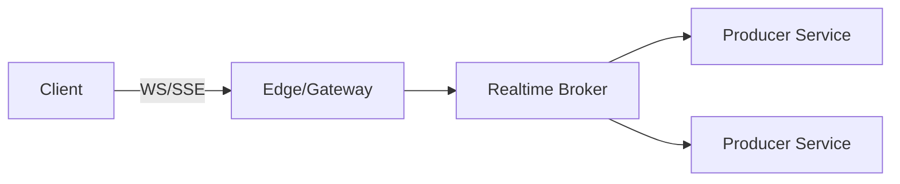

# Realtime Protocols — WebSockets, SSE, and Long‑Polling

Overview
Realtime delivery spans fully bidirectional channels (WebSockets), server‑to‑client unidirectional streams (SSE), and polling fallbacks. The right choice depends on directionality, scale, middleboxes, and delivery guarantees.

What / Why / When
- What: Mechanisms to push updates promptly to clients over the web.
- Why: Reduce latency and server work vs tight polling; enable interactive apps.
- When: WebSockets for bidirectional (chat, multiplayer); SSE for push‑only updates; long‑polling as compatibility fallback.

Core concepts and variants
- WebSockets: Upgrade from HTTP; full‑duplex over a single connection.
- SSE: Text/event‑stream over HTTP; auto‑reconnect; simple semantics.
- Long‑polling: Client holds request open; server responds on event or timeout.
- Backpressure and fan‑out: Pub/sub brokers; shard by user/topic; per‑connection buffers.
- Timeouts/keepalives: Proxies may close idle connections; periodic pings required.

Design decisions and trade‑offs
- WS vs SSE: WS supports client‑to‑server messages and binary frames; SSE simpler, works over proxies, but text‑only and one‑way.
- Horizontal scale: Millions of idle sockets need memory‑efficient brokers and sticky routing or global state.
- Delivery semantics: At‑least‑once via sequence IDs and client ack/replay; exactly‑once generally impractical.
- Security: Auth on connect, token rotation, per‑message auth if needed.

Algorithms/policies (conceptual)
Heartbeat and reconnect policy:
```
send_ping_every = 20s
if no_pong_within 10s: reconnect with backoff = min(60s, 2^attempt * 1s)
```
Replay window using sequence IDs:
```
client stores last_seq
on reconnect: send last_seq
server replays events (last_seq, last_seq+N]
```

Architecture and components


Operational considerations
- Capacity: Memory per connection; kernel limits (file descriptors), TCP settings; broker fan‑out cost.
- Failure modes: Idle timeout closes; thundering reconnects; token expiry mid‑stream; partial message drops.
- Observability: Active connections, reconnect rates, bytes/sec per topic, lag from producer to client.
- Runbooks: Stagger reconnects; clamp send buffers; drop or backpressure noisy publishers; rotate tokens gracefully.

Examples
1) Quantitative — Memory budgeting
- If each connection costs 20 KB (socket + buffers + app state), 100k concurrent clients require ~2 GB just for connections; with spikes, budget 3–4 GB and shard across nodes.

2) Architectural — Global chat
- Clients connect via anycast to nearest PoP, upgraded to WebSocket, forwarded to regional brokers (Kafka/NATS). Presence and typing events on WS; media via separate services. Reconnect logic with jitter; sequence IDs for replay after brief disconnects.

Edge cases and anti‑patterns
- Broadcasting to all clients from a single node; no backpressure; not handling token rotation; treating WS like RPC without framing/contracts.

Interactions with adjacent topics
- Load balancing: Sticky routing or consistent hashing by connection key.
- Messaging: Use durable logs for replay and fan‑out.
- Security: AuthN on connect; per‑message signing for sensitive traffic (see ../12-security-and-auth/README.md).

Production checklist
- [ ] Capacity plan memory and file descriptors per node
- [ ] Heartbeats, idle timeouts, and reconnect backoff configured
- [ ] Replay/sequence strategy defined; idempotent handlers
- [ ] Per‑topic backpressure and quotas enforced

Interview framing checklist
- When would you choose SSE over WebSockets?
- How do you design reconnect logic to avoid storms?

References
- WHATWG WebSocket and EventSource specs; scale posts from Slack/Twitter/Cloudflare
