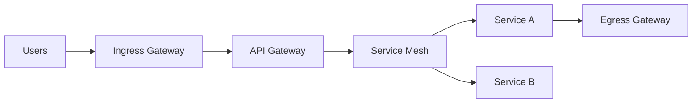

# Proxies, API Gateways, Termination, and Service Mesh

Overview
L4/L7 proxies, API gateways, and service meshes provide routing, auth, observability, and resilience. Decide where to terminate TLS, enforce policies, and how to split north‑south vs east‑west concerns.

What / Why / When
- What: Reverse proxies (NGINX/Envoy/HAProxy), API gateways (rate limit, auth, transforms), meshes (sidecars/ambient) for mTLS, discovery, retries.
- Why: Centralize cross‑cutting concerns, standardize telemetry, enable gradual rollout and resilience.
- When: Multi‑service architectures; public APIs; compliance requiring consistent policy.

Core concepts and variants
- L4 vs L7: TCP/UDP vs HTTP aware features.
- Termination patterns: Edge TLS termination; re‑encrypt to backends; passthrough for end‑to‑end TLS; mTLS in mesh.
- Service discovery: DNS, xDS, or mesh control planes.
- Policies: Rate limits, circuit breakers, retries, timeouts, request/response transforms.
- Topologies: Ingress, egress, and internal gateways; sidecar vs ambient (no per‑pod proxy) meshes.

Design decisions and trade-offs
- Sidecar mesh: Strong isolation/observability but adds overhead and complexity.
- Central gateway: Simplifies external exposure; risk of choke point if not scaled.
- Policy location: Edge vs service; closer to client reduces wasted backend work; closer to service increases accuracy.
- Termination: Edge offload improves performance but reduces e2e crypto; re‑encrypt east‑west.

Algorithms/policies (conceptual)
Circuit breaker and retry budgets (pseudo‑config):
```
outlier_detection:
  consecutive_5xx: 5
  interval: 10s
  base_ejection_time: 30s
retry_policy:
  num_retries: 2
  per_try_timeout: 200ms
  retry_on: 5xx,connect-failure,refused-stream
```

Architecture and components


Operational considerations
- Capacity: Connection counts, header sizes, TLS offload, per‑route limits.
- Failure modes: Config drift, invalid routes, policy misapplied, cascading timeouts.
- Observability: Per‑route latency, 4xx/5xx, retries, circuit ejections, mTLS cert status.
- Runbooks: Safe rollout via canaries; revert config; rotate certs; drain nodes.

Examples
1) Quantitative — Added latency per hop
- Edge proxy adds ~1–3 ms; gateway adds 2–5 ms; sidecar adds 1–2 ms/hop under load. Three hops may add 5–10 ms median; budget accordingly.

2) Architectural — North‑south vs east‑west split
- Internet traffic hits ingress and API gateway (auth, quotas). Internal calls go through mesh with retries and circuit breaking. TLS terminated at edge and re‑encrypted with mTLS inside.

Edge cases and anti‑patterns
- Duplicating policies at edge and mesh (double retries). Global circuit breaker for unrelated services. Over‑transforming payloads at gateway.

Interactions with adjacent topics
- Security: Central auth at gateway; mTLS in mesh (../12-security-and-auth/README.md).
- Availability: Retry/circuit breaking; bulkheads by route (../09-availability-and-fault-tolerance/README.md).
- Observability: Unified traces and metrics across hops (../11-observability/README.md).

Production checklist
- [ ] Define policy ownership (edge vs mesh) and avoid duplication
- [ ] Automate TLS cert issuance for edge and mesh
- [ ] Canary and rollback plans for routing/policy changes
- [ ] Per‑route SLOs and dashboards

Interview framing checklist
- Where do you enforce retries—client, gateway, or service? Why?
- How do you structure gateway vs mesh responsibilities?

References
- Envoy, Istio, Linkerd, NGINX, HAProxy docs; xDS APIs
