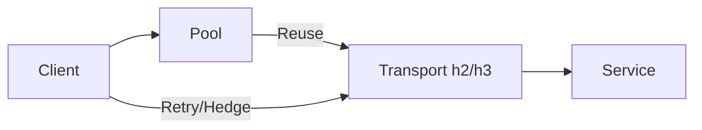

# Connection Management, Timeouts, Retries, and Budgets

Overview
Connections are scarce shared resources. Correct pooling, keep‑alives, timeouts, and retry/hedging budgets prevent overload and improve tail latency without amplifying incidents.

What / Why / When
- What: Policies for connection reuse, idle timeouts, per‑try vs overall deadlines, retry and hedging strategies.
- Why: Reduce handshake overhead, control concurrency, and limit blast radius during degradations.
- When: All networked services; tune per path and workload.

Core concepts and variants
- Keep‑alive vs idle timeout: Keep connections warm, but close idle ones to free resources.
- Flow control: h2/h3 window sizes; backpressure.
- Budgets: Overall deadline split into per‑try timeouts and limits on retry count.
- Hedging: Parallel attempts after a delay to cut tails on idempotent reads.
- Connection coalescing and warm‑up: Pre‑establish to critical dependencies.

Design decisions and trade-offs
- Aggressive retries increase load during incidents; use token buckets and server hints.
- Large pools waste memory and file descriptors; small pools cause queuing delays.
- Hedging reduces p99 but increases average load; bound by budgets.

Algorithms/policies (conceptual)
Timeout budget apportioning:
```
overall_deadline = 800ms
network_rtt = p50_rtt(dep)
per_try = min(300ms, overall_deadline - network_rtt)
max_retries = 1 if idempotent else 0
hedge_delay = 100ms if p95>500ms else disabled
```
Retry token bucket:
```
tokens = 100 per_sec
if tokens_available():
  retry()
else:
  fail_fast()
```

Architecture and components


Operational considerations
- Capacity: Max concurrent streams/connections; FD limits; TLS offload; monitor queueing time.
- Failure modes: Retry storms; idle connection resets; SYN backlog overflow; half‑open connections after network blips.
- Observability: Connection counts, pool hit ratio, retry rates, hedging rates, per‑try vs overall latency.
- Runbooks: Reduce retries globally during incidents; increase per‑try timeouts temporarily; drain and re‑warm pools after deploys.

Examples
1) Quantitative — Retry load amplification
- If base QPS=10k and retry rate=10% with one retry, peak load can jump to ~11k; during a 20% error spike, retries can push load to ~14k if uncontrolled. Token buckets cap amplification.

2) Architectural — Client policy package
- Provide a shared client library that enforces defaults: per‑try 250ms, overall deadline from caller, 1 retry idempotent only, hedge after 100ms when enabled, exponential backoff with jitter, and circuit breaker integration.

Edge cases and anti‑patterns
- Infinite timeouts; retries on non‑idempotent ops; shared global pools across unrelated tenants; closing connections too aggressively leading to handshake storms.

Interactions with adjacent topics
- Availability: Ties directly to timeouts, retries, and circuit breakers (../09-availability-and-fault-tolerance/README.md).
- Load balancing: Pool sizing affects LB distribution (../02-load-balancing/README.md).
- Observability: Split metrics by try vs overall (../11-observability/README.md).

Production checklist
- [ ] Standard client defaults documented and enforced
- [ ] Retry token bucket to cap amplification
- [ ] Hedging limited to idempotent reads with budgets
- [ ] Pool sizing tuned; idle/keep‑alive set appropriately

Interview framing checklist
- How do you set retry and timeout policies to reduce p99 without overload?
- When should hedging be enabled?

References
- Google SRE (request hedging, overload), Envoy/Finagle client policies
