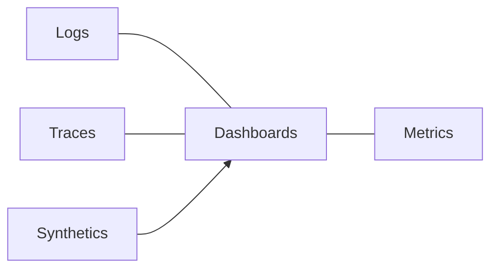

# Operations, Observability, and Troubleshooting

Overview
Networking issues manifest as latency, loss, resets, and protocol negotiation failures. Effective operations require layered telemetry, targeted active tests, and well‑rehearsed runbooks.

What / Why / When
- What: Metrics, logs, traces, and active probes across DNS, TLS, transport, and application layers.
- Why: Shorten MTTR, prevent regression, and localize faults across regions and providers.
- When: Always‑on dashboards + on‑demand deep diagnostics during incidents.

Core concepts and variants
- Metrics: DNS NXDOMAIN/SERVFAIL, TLS handshake/resumption, version split (h1/h2/h3), connection counts, retransmits/loss (QUIC stats), per‑route latency/errors.
- Logs: Access logs with version, ALPN, SNI; error logs with reason phrases; gRPC status codes.
- Tracing: Propagate IDs across proxies; annotate retries/hedges.
- Active probes: ping/mtr, traceroute, TLS s_client/QUIC tools, synthetic API checks from multiple regions.

Design decisions and trade-offs
- Cardinality vs cost: Limit label explosion (e.g., user IDs). Sample high‑QPS logs.
- Synthetic checks: External vs internal vantage points; both are necessary to catch egress/dns issues.
- Packet capture: Powerful but expensive; turn on narrowly with filters.

Algorithms/policies (conceptual)
SLO alerting on tail latency with burn rates:
```
alert if (p95_latency > target_95 for 10m) and (error_budget_burn_rate_1h > 2)
```
Progressive diagnostics playbook:
```
1. Scope: client-only? region? global?
2. DNS: dig @resolver + provider checks
3. TLS: s_client/ocsp/expiry; ALPN negotiation
4. Transport: loss/RTT via mtr; PMTUD suspects -> MSS clamp test
5. App: version split, 4xx/5xx spikes, retries/hedges
```

Architecture and components


Operational considerations
- Capacity: Metrics retention and scrape overhead; log sampling; trace head/tail sampling knobs.
- Failure modes: Cert expiry, DNS provider outage, UDP/443 blocked, asymmetric routing, MTU blackholes.
- Runbooks: Cert rotation drill; DNS cutover via TTL roll‑down; disable h3 under UDP block; clamp MSS; move traffic via weights or anycast withdrawals.

Examples
1) Quantitative — Loss vs tail latency
- 0.5% packet loss can push h2 p99 from 500ms to 900ms under multiplexing; h3 p99 increases modestly (e.g., 500→650ms) due to per‑stream loss isolation.

2) Architectural — Troubleshooting tree
- Build a runbook that starts with SLO breaches, branches by symptom (handshake failures vs high RTT vs resets), and lists per‑layer diagnostics with sample commands and dashboards.

Edge cases and anti‑patterns
- Alerting only on averages; ignoring version splits; unbounded log cardinality; packet captures without privacy controls.

Interactions with adjacent topics
- Availability: Error budgets and incident response (../09-availability-and-fault-tolerance/README.md).
- Security: Certificate/key management; WAF logs (../12-security-and-auth/README.md).
- Load Balancing: Health checks and failover signals (../02-load-balancing/README.md).

Production checklist
- [ ] Version split dashboards (h1/h2/h3, TLS versions)
- [ ] DNS/TLS/Transport/App metrics with SLOs
- [ ] Synthetic checks from multiple regions/providers
- [ ] Practiced runbooks for common failures (cert, DNS, MTU, UDP blocks)

Interview framing checklist
- How would you localize a latency spike affecting only HTTP/2 traffic?
- What steps confirm an MTU blackhole?

References
- Google SRE, vendor posts (Cloudflare/Fastly), mtr/tcpdump/wireshark, QUIC tooling
