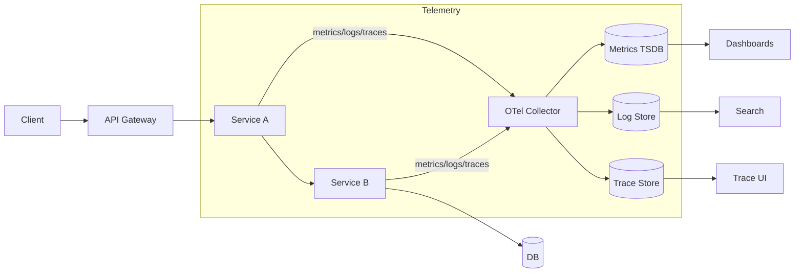

# Signals, Models, and Definitions

Overview
Observability is evidence-driven understanding of system behavior in production. It relies on three primary telemetry signals—metrics, logs, and traces—organized with clear mental models (Golden Signals, RED/USE) and aligned to user-centric outcomes (SLIs/SLOs and error budgets).

What / Why / When
- What: Collect and relate telemetry that answers new, unanticipated questions about your system without adding new code. Core signals: metrics (aggregations over time), logs (structured events), traces (causal request flows).
- Why: Faster incident resolution (lower MTTR), higher availability and performance, and safer iteration under error budgets.
- When: From the first service in development; retrofits are costlier. Expand depth (sampling, exemplars) as traffic and complexity grow.

Core concepts and variants
- Golden Signals: latency, traffic, errors, saturation. Broad operational health.
- RED (for microservices): Rate, Errors, Duration. Focus on request/handler performance.
- USE (for resources): Utilization, Saturation, Errors. Focus on hosts, CPUs, queues, disks.
- Metrics: counters, gauges, histograms. Prefer histograms for latency/size distributions. Beware label cardinality explosions.
- Logs: structured (JSON) with stable keys, contextual identifiers, and privacy controls (PII/PHI redaction).
- Traces: spans with parent/child relationships, W3C Trace Context, baggage for small, low-cardinality attributes only.
- Exemplars: links from metric histogram buckets to example trace IDs for rapid pivoting.
- Blackbox vs. whitebox: external probes vs. internal instrumentation; use both.

Design decisions and trade-offs
- Pull vs. push metrics: Pull (Prometheus) eases auth and discovery; push suits transient jobs. Gateways can bridge.
- Head vs. tail-based sampling: Head is cheap and simple; tail keeps the interesting traces (errors/p99) but needs central processing.
- Structured logs vs. unstructured: Structured costs more upfront, pays back in searchability and automation.
- Cardinality vs. detail: High-cardinality labels (user_id, request_id) explode costs; prefer coarser labels and exemplars/traces for detail.

Architecture and components
- App SDKs emit metrics/logs/traces with context propagation (traceparent, tracestate).
- Sidecars/agents collect and forward; OTel Collector pipelines process, sample, and export.
- Storage: TSDB for metrics, columnar/LSM for logs, trace stores (Tempo/Jaeger/ClickHouse-backed).
- Visualization: dashboards (Grafana), search (Loki/Elastic), trace UIs (Jaeger/Tempo).

Operational considerations
- SLO alignment: instrument SLIs directly (availability, latency, quality).
- Cost governance: control cardinality, retention tiers, downsampling, log sampling by level/source.
- Privacy/compliance: redact at source, classify fields, enforce data residency.
- Runbooks and alert hygiene: multilevel severity, quiet hours policy, auto-ticket for non-paging issues.

Examples
1) Quantitative (latency buckets for a 300 ms p99 SLO)
   - Target: 99% of requests under 300 ms.
   - Choose histogram buckets (ms): [10, 25, 50, 100, 150, 200, 250, 300, 400, 600, 1000].
   - With 50k RPS, per-minute samples ~3M. Storage with 11 buckets, 10 labels/cardinality groups: 3M × 11 × 10 ≈ 330M samples/min. Apply relabeling to keep cardinality ≤ 200 label combinations; downsample 1/10 for non-critical paths.

2) Architectural (request lifecycle with signals)
   - A client hits API-GW → service A → service B + DB. A trace spans the path; A emits RED metrics, B emits DB latency histogram. Logs at WARN/ERROR include the trace_id. Dashboards pivot from a p99 latency spike in A’s histogram to an exemplar trace, revealing B’s DB saturation.

Edge cases and anti-patterns
- Per-user labels in metrics; high-cardinality free-form strings as labels.
- Excessive INFO logs at peak traffic; log storms during incidents.
- Sampling off by default; then no exemplars and hard-to-debug p99s.

Interactions with adjacent topics
- Timeouts/retries/circuit breakers: ../09-availability-and-fault-tolerance/04-timeouts-retries-circuit-breakers-and-hedging.md
- Backpressure/rate limiting: ../08-rate-limiting-and-backpressure/README.md
- Networking request path and errors: ../10-networking-and-protocols/README.md

Production checklist
- Instrument RED for every service and USE for key resources.
- Emit latency as histograms with SLO-aligned buckets and exemplars.
- Adopt W3C Trace Context; propagate across all services, gateways, and jobs.
- Enforce label cardinality budgets and retention tiers.
- Ship structured JSON logs with correlation IDs; redact PII at source.

Interview framing checklist
- Define observability vs. monitoring; explain Golden Signals and RED/USE.
- Discuss histogram vs. summary; cardinality trade-offs; sampling strategies.
- Outline an end-to-end telemetry pipeline with OTel Collector.

Diagram: Signals and flow

References
- Google SRE Book/Workbook; OpenTelemetry Spec; Prometheus/Grafana; Loki/Tempo/Jaeger; Nygard Release It!
