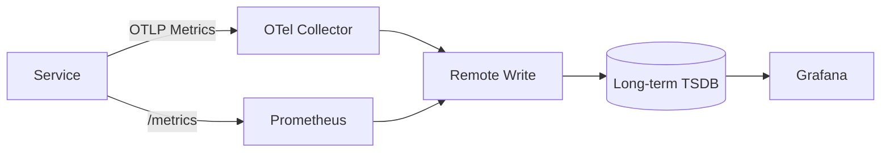

# Metrics, Histograms, and Cardinality

Overview
Metrics are compact time-series measurements for answering questions about rates, counts, and distributions. Getting histograms and labels right is the difference between actionable signals and unusable, expensive noise.

What / Why / When
- What: Counters (monotonic), gauges (instantaneous), and histograms (distributions). Scraped (pull) or pushed (gateway/remote_write).
- Why: Low-latency, low-cost signals for SLOs, dashboards, and alerts. Histograms reveal outliers (p95/p99) that averages hide.
- When: Always-on for every service; deepen histogram fidelity as traffic and SLO precision demand.

Core concepts and variants
- Counters: increase only; reset on restart. Use for requests_total, errors_total.
- Gauges: go up/down; use for in-flight requests, queue length.
- Histograms: bucketed distributions for latency/size. Prefer SLO-aligned buckets and exemplars.
- Summaries: client-side quantiles; avoid for aggregations across instances; prefer histograms.
- Native histograms: dynamic buckets in modern Prometheus; good for wide, evolving ranges.
- Labels (dimensions): small, stable sets (method, route_template, status). Avoid user_id, free-form strings.
- Cardinality: number of unique time series = product of label value counts. Keep budgets per metric family.

Design decisions and trade-offs
- Histogram vs. summary: choose histograms for global aggregations and exemplars.
- Bucket design: too few hides issues; too many increases cost. Align buckets with SLOs and operational thresholds.
- Scrape interval: shorter means faster detection but higher cost. Typical: 10–30s.
- Pull vs. push: Pull simplifies auth and discovery; push needed for short-lived batch jobs.
- Recording rules: precompute heavy queries (e.g., rate, error_ratio) to speed dashboards/alerts.

Algorithms/policies (conceptual)
- Bucket heuristic: choose upper bounds around SLO and on a near-log scale. Example (ms): [10, 25, 50, 100, 150, 200, 250, 300, 400, 600, 1000].
- Cardinality budget: set per-metric limits (e.g., 500 series). Drop/replace offending labels at scrape or in Collector.
- Counter reset handling (PromQL): use rate()/increase() which handle resets; avoid irate() for SLOs.

Architecture and components
- Prometheus scrapes service endpoints (Kubernetes service monitors). OTel Collector can receive, relabel, sample, and export to TSDB (Prometheus/Cortex/Mimir/Thanos).
- Exemplars connect histogram buckets to trace IDs for root cause pivots.

Operational considerations
- Retention tiers: high-res 7–14 days; downsampled 90 days+. Remote storage for long retention.
- Cost control: enforce label allow/deny lists; sanitize path → route_template; cap dynamic label values.
- Multi-tenancy: segregate tenants via separate TSDB, org labels, or query fences.

Examples
1) Quantitative — estimating time series count and storage
   - Metric: http_server_duration_seconds_bucket
   - Labels: method (3), route_template (50), status (6), instance (20). Buckets: 11.
   - Series ≈ 3×50×6×20×11 = 198,000. At 15s scrape, 4 samples/min → 792k samples/min. With 32 bytes/sample rough, ≈ 25 MB/min raw before compression. Apply: remove instance from SLO queries; route_template reduce to 20; series → 3×20×6×11 = 3,960 per job (aggregated), slashing cost.

2) Architectural — metrics pipeline with OTel Collector

Edge cases and anti-patterns
- Labels with unbounded cardinality (user_id, UUID, URL raw path).
- Quantiles from summaries across instances (mathematically invalid).
- Using averages for latency; hides tail issues.

Interactions with adjacent topics
- Timeouts/retries affect error ratios and request duration distributions: ../09-availability-and-fault-tolerance/04-timeouts-retries-circuit-breakers-and-hedging.md
- Backpressure/queues impact USE metrics: ../08-rate-limiting-and-backpressure/README.md

Production checklist
- Publish RED metrics per handler with route_template.
- Use histograms with SLO-aligned buckets and exemplars.
- Define and enforce per-metric cardinality budgets.
- Add recording rules for error_ratio and SLO windows.

Interview framing checklist
- Explain histogram vs. summary, bucket choices, and cardinality trade-offs.
- Outline a Prometheus→remote TSDB architecture and exemplar usage.

Snippets
- PromQL (p99 latency):
  - histogram_quantile(0.99, sum by (le) (rate(http_server_duration_seconds_bucket[5m])))
- PromQL (error ratio):
  - sum(rate(http_requests_total{status=~"5.."}[5m])) / sum(rate(http_requests_total[5m]))

References
- Prometheus Docs (histograms, recording rules), Mimir/Cortex/Thanos; Google SRE Workbook (SLIs), OpenTelemetry Metrics spec.
