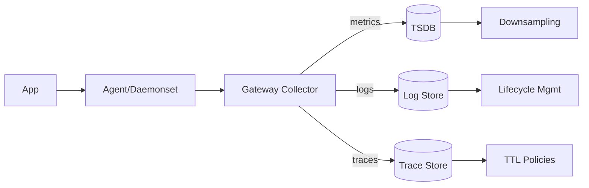

# Telemetry Storage, Pipeline, and Costs

Overview
Telemetry pipelines move high-volume data reliably and cheaply from apps to backends. Cost governance is a first-class requirement.

What / Why / When
- What: Collectors/agents, processors (redact, relabel, sample), exporters to metrics/logs/traces stores, retention tiers.
- Why: Control cost and risk while preserving signals that matter for users.
- When: Establish baselines early; mature with scale.

Core concepts and variants
- Topologies: per-node agents + central gateways; edge buffering; multi-cluster federation.
- Backends: TSDB (Prometheus/Mimir/Thanos), logs (Loki/OpenSearch), traces (Tempo/Jaeger/ClickHouse).
- Retention/tiering: hot vs. warm vs. archive; downsampling for metrics; log sampling; trace TTLs.
- Governance: label allow-lists, field redaction, tenant quotas, query limits.

Design decisions and trade-offs
- Single-vendor vs. OSS mix: velocity vs. lock-in/cost.
- Long retention vs. rehydrate on demand: object storage + query engines.
- Regional data residency vs. global aggregation.

Architecture and components

Operational considerations
- Backpressure: disk buffers; drop policies by severity; health SLOs for pipeline.
- Egress: prefer in-region backends; compress exports; batch exporters.
- Multi-tenancy: per-tenant orgs, limits, and authz boundaries.

Examples
1) Quantitative — retention costing
   - Metrics: 250k samples/s at 2B/hour; with 1 byte/sample compressed ≈ 2 GB/hour; hot 14 days ≈ 672 GB; downsample 10× after 3 days → save ~50%.
   - Logs: 200 GB/day hot 3 days; warm 30 days at 1/3 cost with infrequent search; archive to object store after.

2) Architectural — multi-region
   - Collectors per region exporting to regional stores; optionally aggregate metrics globally via Thanos/Mimir; keep logs/traces regional for residency.

Edge cases and anti-patterns
- Central collector as SPOF; no quotas; alerting on pipeline health absent.

Interactions with adjacent topics
- Security and compliance: ../12-security-and-auth/README.md

Production checklist
- Define retention tiers and budgets; enforce label/field policies; test backpressure and failure drills.

Interview framing checklist
- Describe pipeline topology; cost levers (sampling, buckets, retention); multi-region/residency approach.

References
- Mimir/Thanos; Loki ILM; Tempo/Jaeger; OTel Collector processors/exporters.
