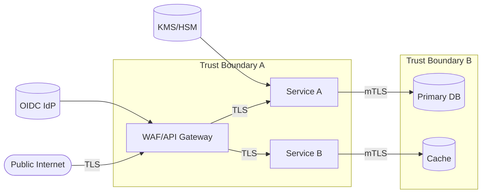

# Foundations and Threat Modeling

## Overview
Security starts with clear objectives and an explicit model of what you are protecting and from whom. Threat modeling identifies assets, trust boundaries, and likely attack paths, then maps mitigations and residual risk. This page provides a lightweight, repeatable method that scales from single services to multi‑region platforms.

## What, Why, When (and when‑not)
What
- A structured activity to uncover threats (spoofing, tampering, repudiation, information disclosure, DoS, elevation of privilege), document trust boundaries, and select mitigations.

Why
- Prevents design regressions and “bolt‑on” security. Aligns controls with real risks and compliance duties. Reduces incident impact via least privilege and segmentation.

When
- New systems, material changes (internet exposure, data sensitivity, new integrations), and periodically during security reviews.

When‑not
- Never “skip”; instead right‑size the effort. For trivial, non‑exposed utilities, capture a minimal threat note and reuse org baselines.

## Core concepts and variants
- Asset inventory: what data, compute, credentials, and privileges exist (and their sensitivity/classification).
- Attack surface: entry points (APIs, queues, admin consoles), third‑party dependencies, and implicit channels (logs, backups).
- Trust boundaries: where identity, crypto, or network assumptions change (public internet → edge; edge → services; services → data stores).
- STRIDE taxonomy: Spoofing, Tampering, Repudiation, Information disclosure, Denial of service, Elevation of privilege.
- Mitigation patterns: authentication (OIDC/mTLS), authorization (RBAC/ABAC/ReBAC), input validation, encryption, rate limiting, isolation.

## Design decisions and trade‑offs
- Depth vs speed: high‑risk systems warrant deeper analysis, red teaming, and formal DFDs; others can use a checklist‑driven pass.
- Centralized vs embedded security: platform controls (IdP, KMS, WAF) reduce duplication; embedded controls (service‑local PEPs) reduce latency and single‑point failures.
- Prevention vs detection: some threats are best handled by detection/response (e.g., credential stuffing) combined with friction (CAPTCHA, velocity checks).

## Architecture and components
- Baseline controls: TLS 1.2+/1.3, HSTS, secure headers, OIDC for humans, mTLS for services, KMS‑backed secrets, centralized audit logging.
- Perimeter and internal choke points: WAF, schema validation, rate limits at edge; service‑local validation and authorization for resource‑level decisions.

Mermaid: example data flow with trust boundaries

## Operational considerations
- Documentation: store models with code; update on architecture changes.
- Observability: security logs (auth, authz, admin actions), anomaly detection (velocity, geo patterns), and alerting playbooks.
- Validation: integrate threat checks into design reviews and CI (e.g., required checklists, policy tests for critical routes).

## Examples
Example A (quantitative): Estimating DoS headroom at the edge
- Given average 2,000 rps with p99=5,000 rps, design for 5× surge from botnet bursts. Edge must sustain 25,000 rps with basic WAF rules and return 429/403 within 25 ms for rejects.
- With 10 edge instances, target 2,500 rps/instance allow capacity and 20,000 rps/instance reject capacity. Ensure autoscaling reacts within 60s and pre‑scale during known events.

Example B (architectural): Segmentation to reduce blast radius
- Place admin APIs behind separate subdomain and conditional access (device posture + MFA). Enforce mTLS between services. Use per‑service KMS keys and deny‑by‑default IAM. A compromised service cannot call peer services directly without valid cert + policy.

## Edge cases and anti‑patterns
- “Secure by secrecy”: undocumented endpoints or hidden paths; rely on authz, not obscurity.
- Single trust zone: no segmentation between edge and data stores; always introduce internal boundaries and least privilege.
- One‑time threat modeling: never revisited; maintain as living documentation.

## Interactions with adjacent topics
- [Transport Security](./07-transport-security-tls-mtls.md): boundary protection via TLS/mTLS.
- [Edge Security](./08-edge-security-waf-rate-limits-bot-detection.md): traffic filtering and anti‑automation.
- [Authorization Models](./04-authorization-models-rbac-abac-rebac.md): resource‑level controls from the model.

## Production checklist
- Enumerate assets and classify data; draw a simple DFD with trust boundaries.
- Identify STRIDE threats per flow and map to mitigations; record residual risks and owners.
- Validate identity establishment at boundaries (OIDC/mTLS) and encrypt data in motion and at rest.
- Define logging points and detections for abuse paths.

## Interview framing checklist
- How do you identify and prioritize threats for a new internet‑facing API?
- Where would you put trust boundaries and which controls live at each?

## References
- Microsoft STRIDE, OWASP Threat Modeling Cheat Sheet
- NIST SP 800‑30 (Risk Management), 800‑53 (Security Controls)
