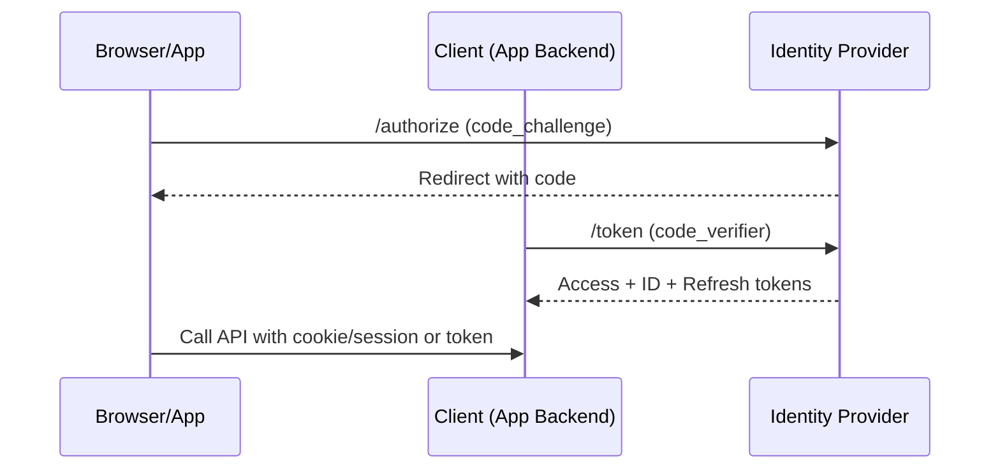

title: "Identity: OAuth 2.1 and OpenID Connect"
description: Designing user and service authentication with OAuth 2.1 and OIDC.
---

# Identity: OAuth 2.1 and OpenID Connect

## Overview
OAuth provides delegated authorization; OIDC layers identity on top via ID tokens and a userinfo endpoint. Choose client‑appropriate flows, standardize token issuance, and publish JWKS for verification.

## What, Why, When (and when‑not)
What
- Human authentication via OIDC (ID token) and delegated API access via OAuth (access token).

Why
- Secure, interoperable identity across web, mobile, CLI, and service‑to‑service.

When
- Any user‑facing app, public API, or microservice mesh that needs principal identity.

When‑not
- For purely internal jobs with no cross‑boundary auth, OS‑level identities may suffice, but prefer consistency.

## Core concepts and variants
- Authorization Code + PKCE: for SPAs/native apps; mitigates code interception.
- Device Flow: constrained input devices; user authorizes on a secondary device.
- Client Credentials: server‑to‑server without a user; issue narrow scopes.
- Refresh tokens: rotate on use; use sender‑constrained tokens (DPoP or mTLS) when feasible.
- JWKS and key rotation: publish signing keys; enforce `kid` and rotation cadence.

## Design decisions and trade‑offs
- Central IdP vs per‑app auth: central reduces duplication and enables SSO; per‑app increases drift and risk.
- Long‑lived vs short‑lived access tokens: short‑lived reduce revocation burden but increase refresh churn.
- Proof‑of‑possession (DPoP/mTLS) vs bearer tokens: PoP thwarts token theft replay but increases complexity.

## Architecture and components
- IdP: authorization endpoint, token endpoint, discovery (`.well-known/openid-configuration`), JWKS.
- RPs/clients: web SPA, native mobile, backend servers.
- Token validators: API gateways/services verifying `iss`, `aud`, `exp`, signature, and claims.

Mermaid: Authorization Code with PKCE

## Operational considerations
- Token clock skew: accept ±5 min drift; prefer monotonic time in validators.
- Rotation: automate JWKS roll and key retirement; alert on missing `kid` or unknown keys.
- MFA and conditional access: enforce per app risk; protect admin scopes.

## Examples
Example A (quantitative): Token TTLs and refresh load
- If access tokens are 10 min TTL and average session is 60 min, expect ~5 refreshes per session (with jitter). At 50k concurrent sessions, plan ~4–6 refresh rps steady, spiking at cohort boundaries. Size IdP accordingly.

Example B (architectural): SPA + API
- SPA uses Auth Code + PKCE; backend stores session cookie (HttpOnly, Secure, SameSite=Lax). Backend exchanges code for tokens, stores refresh token server‑side, and fetches userinfo to hydrate session. APIs validate access token `aud` and scopes.

## Edge cases and anti‑patterns
- Using implicit/hybrid flows for SPAs: deprecated; use Auth Code + PKCE.
- Accepting tokens without audience/issuer validation: enables token confusion attacks.
- Long‑lived bearer tokens in mobile apps: high theft risk; use short TTL + refresh + device binding.

## Interactions with adjacent topics
- [Tokens & Sessions](./03-tokens-and-session-management.md) for format/rotation/revocation.
- [Edge Security](./08-edge-security-waf-rate-limits-bot-detection.md) for bot defenses on login.

## Production checklist
- Standardize supported flows per client type; document redirect URIs and PKCE requirements.
- Publish discovery and JWKS endpoints; monitor key rotation.
- Enforce MFA for privileged scopes; add risk‑based prompts.

## Interview framing checklist
- When do you choose Device Flow, and how do you protect against code phishing?
- How do you rotate signing keys without breaking clients?

## References
- OAuth 2.1 draft, RFC 7636 (PKCE), OpenID Connect Core 1.0
- IETF DPoP, mTLS PoP drafts/specs
