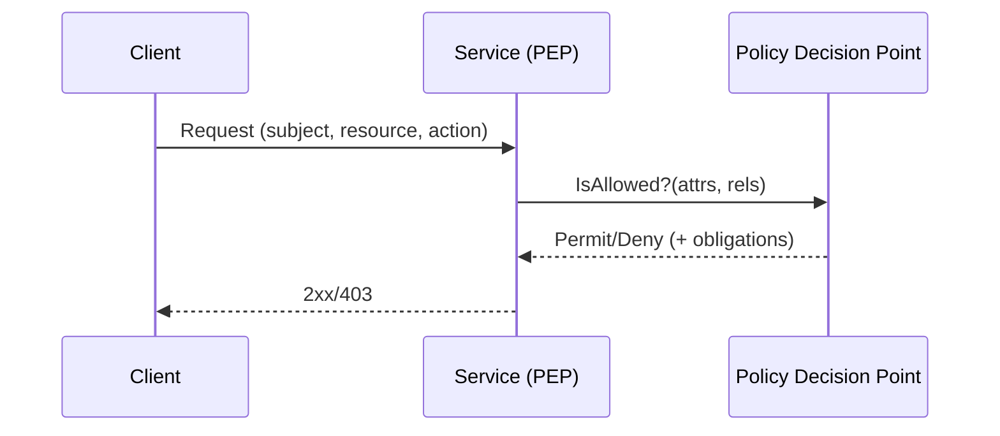

# Authorization Models: RBAC, ABAC, ReBAC

## Overview
Authorization answers “can this principal perform this action on this resource now?” Choose a model that balances expressiveness, performance, and operability. Separate decision (PDP) from enforcement (PEP) and cache safely.

## What, Why, When (and when‑not)
What
- RBAC: roles grant permissions.
- ABAC: rules over attributes (principal, resource, environment).
- ReBAC: relationships (graph/ACL) determine access.

Why
- Least privilege, auditability, policy reuse, and consistent enforcement across services.

When
- RBAC for coarse enterprise roles; ABAC for context‑aware SaaS; ReBAC for collaborative apps (docs, repos, org trees).

When‑not
- Avoid over‑engineering: a simple, well‑managed RBAC may beat a complex ABAC with poor data quality.

## Core concepts and variants
- PDP/PEP: policy decision point vs enforcement point; push vs pull decisions.
- Policies: DSLs (Rego for OPA), rule engines, or service code with tests.
- Caching: positive/negative decision caching with short TTL and invalidation hooks.
- Tenancy scoping: subject and resource carry `tenant_id`; cross‑tenant access forbidden by default.

## Design decisions and trade‑offs
- Centralized PDP: consistent, auditable; adds latency, requires HA. Local PEP logic: fast; risks drift.
- Expressiveness vs performance: ABAC/ReBAC can be expensive; pre‑compute or denormalize where safe.
- Data freshness: decisions depend on up‑to‑date attributes/graphs; design invalidation pathways.

## Architecture and components
- Policy store and compiler; PDP service; sidecar/library PEPs in services and gateways.
- Audit trails: decision logs with subject, resource, policy, and effect.

Mermaid: PDP/PEP decision flow

## Operational considerations
- Policy rollout: staged deploys, dry‑run mode, shadow decisions, and fast rollback.
- Cardinality: avoid unbounded roles per tenant; cap and automate lifecycle.
- Graph changes: batch and stream updates; snapshot for disaster recovery.

## Examples
Example A (quantitative): Caching PDP results
- With 5 ms PDP latency and 1,000 rps per service, adding a local 30 s cache with 90% hit‑rate cuts average to ~1.5 ms effective overhead; ensure cache is tenant‑keyed and respects invalidation.

Example B (architectural): ReBAC for a docs app
- Resources are nodes in a graph with edges (owner, editor, viewer). PDP walks relationships up to depth N with caveats (link‑sharing TTL). PEP includes correlation IDs and logs denials with reason for supportability.

## Edge cases and anti‑patterns
- Granting tenant‑admin roles cross‑tenant; always scope roles to tenant.
- Hardcoding authorization checks deep in business logic; centralize and test policies.

## Interactions with adjacent topics
- [Identity](./02-identity-oauth2-oidc.md) for subject attributes; [Tokens](./03-tokens-and-session-management.md) for scopes/claims.

## Production checklist
- Choose model(s) per product needs; define PDP/PEP locations and caches.
- Establish policy testing, dry‑run, and rollout processes.
- Emit decision logs; alert on deny spikes for critical actions.

## Interview framing checklist
- When would you choose ReBAC over ABAC? How do you keep decisions fast at scale?
- How do you roll out a breaking policy change safely?

## References
- NIST RBAC model, Google Zanzibar paper (ReBAC), OPA/Rego docs
